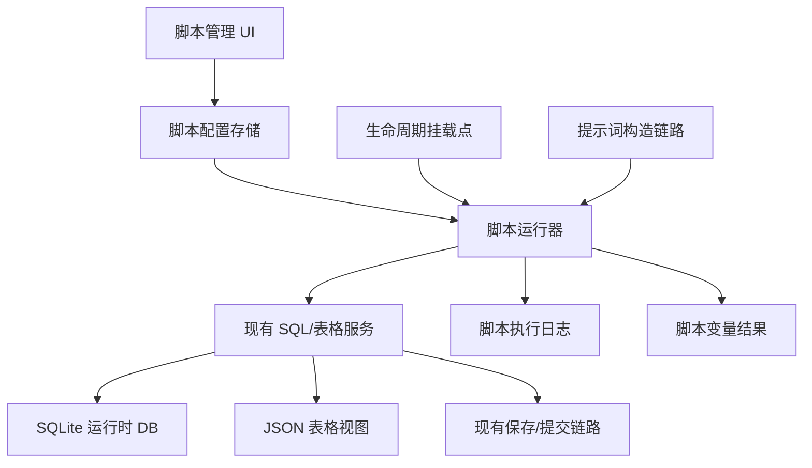

# 脚本执行模块设计草案

## 结论

脚本模块的核心不是“另起一套数据库 API”或“另起一套并发机制”，而是在现有系统链路上增加一个可编排的用户逻辑层。

脚本模块应采用统一脚本模型，不按“数据脚本 / 提示词脚本 / 生命周期脚本”强制拆分。

同一个脚本在一次执行中可以同时完成：

- 接收输入，通常是 JSON。
- 读取数据库。
- 执行业务计算。
- 写回数据库。
- 产出文本内容，由用户通过脚本变量放到任意提示词位置。

挂载点只决定脚本什么时候运行。脚本输出插入哪里不由脚本绑定决定，而由用户在酒馆世界书、预设、剧情推进、填表提示词等文本中放置脚本变量决定。

设计原则：

- 复用现有公共 SQL API、标准 mutation commit、`applyEditsBatch()`、快照 SQL 应用、模板变量替换和统一保存链路。
- 脚本模块只做执行编排、上下文构造、结果收集、日志记录、导入导出和 UI 管理。
- 不在脚本模块里重新实现数据库锁、事务、同步、checkpoint、WAL 或保存机制。
- 当前版本的脚本执行不是安全沙箱。系统只把 `ctx.api` / `ctx.tavern` 作为推荐和受支持的访问入口，并通过文档、UI 和审核约束脚本作者不要绕过现有服务；但主线程 ESM Blob 模型不能技术性阻止脚本访问 `window` / `globalThis` 或宿主对象。需要强隔离时必须另行设计 Worker 或 sandboxed iframe 执行模型。
- 全局脚本和角色卡绑定脚本都属于同一个脚本系统，只是作用域不同。
- 导入脚本必须作为配置导入，不应导入后自动执行。

## 一、需求范围

### 1.1 背景

当前系统已经有表格数据、SQLite 运行时数据库、严格 JSON 填表、世界书注入、SQL 查询模板和剧情推进能力，但缺少用户自定义逻辑层。

现有缺口：

- 有数据，但用户不能稳定地写脚本做派生计算、统计、修正和清洗。
- 有 SQL 能力，但缺少把 SQL/计算逻辑挂到生命周期事件上的机制。
- 有提示词构造链路，但缺少“脚本输入 JSON，输出内容，再通过变量插入用户指定文本位置”的能力。
- 复杂规则仍然依赖 AI 自觉执行，确定性不足。

### 1.2 脚本能做什么

脚本模块需要支持：

- 从数据库读取数据。
- 对数据进行计算、清洗、派生、校验。
- 将结果写回数据库。
- 接收事件输入，例如 AI 回复文本、填表结果、推进结果、用户提供的 JSON 参数。
- 输出内容到脚本变量所在的文本位置。
- 按挂载点自动执行。
- 按全局或角色卡作用域生效。
- 通过管理界面新增、修改、导入、导出、删除、启用、禁用、排序和查看日志。

## 二、总体架构



脚本模块的边界：

- `ScriptRunner` 负责筛选脚本、排序、构造上下文、执行脚本、收集返回值、记录日志。
- `ctx.api` 直接指向现有前端公共 API 对象，例如 `AutoCardUpdaterAPI`，脚本不再自建数据库门面。
- `ScriptVariableResolver` 负责在现有变量替换链路中识别脚本变量、执行脚本并替换为脚本输出。
- `ScriptStore` 负责脚本定义的保存、导入、导出和运行时读取；当前脚本功能尚未上线，不存在需要兼容的旧脚本配置，不设计旧配置迁移层。

## 业务流与数据流

脚本模块必须嵌入现有业务流，而不是凭空定义“事件”。每个挂载点都来自一个真实链路中的稳定时刻。

核心规则：

- 事件载荷只传最小元信息，不传聊天记录、prompt 草稿、AI 返回全文这类大对象。脚本需要非数据库数据时，通过封装后的酒馆/宿主接口显式读取。
- 脚本输出不是直接塞进 prompt 的，而是先由 `ScriptRunner` 保存为返回值或命名输出。
- prompt 里真正消费脚本输出的是变量替换链路：`{[script ...]}` 即时执行，`{[script_output ...]}` 读取挂载点输出。
- 写数据库不是脚本模块直接改内存对象，而是脚本调用现有公共 API，例如 `ctx.api.executeSqlMutation(...)` / `ctx.api.executeSqlBatch(...)`。
- 挂载点脚本必须和当前业务流程同步串行：业务链路调用 `ScriptRunner.runHook(...)` 后必须等待该挂载点下所有脚本执行完成，再进入下一步。前置挂载点脚本没跑完，不能继续构造 prompt 或发送 AI 请求；提交后挂载点脚本没跑完，不能把该挂载点视为处理完成。

### 填表请求前

现有链路：

```text
update-orchestrator.ts
→ collectGroupFillResponse_ACU(...)
→ prepareAIInput_ACU(...)
→ callCustomOpenAI_ACU(dynamicContent, ...)
→ replaceDbSqlVariables(...)
→ AI API
```

数据从哪里来：

- `messagesForContext`：由填表任务组装的聊天上下文。
- `currentJsonTableData_ACU` 或 SQLite provider 的 `getCurrentData()`：当前表格数据。
- `getCombinedWorldbookContent_ACU(...)`：填表 prompt 用的世界书内容。
- `manualExtraHint_ACU`：用户手动补充提示。
- `targetSheetKeys` / `updateMode`：本次填表目标和模式。

谁构造事件：

- `collectGroupFillResponse_ACU(...)` 在 `prepareAIInput_ACU(...)` 之前构造并等待 `table_fill.before_request` 事件；随后 `prepareAIInput_ACU(...)` 和 `callCustomOpenAI_ACU(...)` 共用同一个 `scriptRequestContext`，使 hook 的 `outputKey` 可在同一轮填表 prompt 变量替换阶段读取。

事件载荷示例：

```ts
{
  hook: 'table_fill.before_request',
  timestamp,
  requestId,
  targetSheetKeys,
  updateMode,
}
```

谁执行脚本：

```text
collectGroupFillResponse_ACU
→ await ScriptRunner.runHook('table_fill.before_request', eventPayload)
→ prepareAIInput_ACU(..., { scriptRequestContext })
→ callCustomOpenAI_ACU(..., { scriptRequestContext })
```

谁输出：

- 脚本通过 `return value` 输出。
- 如果脚本绑定配置了 `outputKey`，`ScriptRunner` 把返回值写入 `ScriptOutputContext.request[outputKey]`。

谁消费输出：

- `callCustomOpenAI_ACU(...)` 渲染填表 prompt segments。
- 渲染过程中调用现有变量替换链路。
- 变量替换链路遇到 `{[script_output "xxx"]}` 时，由 `ScriptVariableResolver` 从 `ScriptOutputContext.request` 取值并替换。
- 变量替换链路遇到 `{[script "xxx" {...}]}` 时，直接调用 `ScriptRunner.runVariable(...)` 即时执行脚本并替换。

完整数据流：

```text
聊天上下文/表格数据/世界书/填表配置
→ prepareAIInput_ACU 形成 dynamicContent
→ table_fill.before_request eventPayload
→ await ScriptRunner 自动运行挂载点脚本
→ ScriptOutputContext 保存 outputKey
→ callCustomOpenAI_ACU 渲染用户填表提示词
→ ScriptVariableResolver 替换 {[script_output ...]}
→ AI API
```

### 填表提交后

现有链路：

```text
AI 返回
→ collectGroupFillResponse_ACU(...)
→ parseAndApplyTableEditsToData_ACU(...) 或 SqlTableService.applyEditsBatch(...)
→ runTableUpdateCommit_ACU(...)
→ persistTablesToChatMessage_ACU(...)
→ currentJsonTableData_ACU
→ updateReadableLorebookEntry_ACU(...)
```

数据从哪里来：

- AI 返回的 `<tableEdit>` 或严格 JSON `sql`。
- 解析/提交结果中的 `modifiedKeys`、`appliedEdits`、`tableData`。
- 提交成功后的最新表格快照。

谁构造事件：

- `executeCardUpdateCore_ACU(...)` 或 `applyUnifiedGroupFillResponses_ACU(...)` 在 `runTableUpdateCommit_ACU(...)` 成功后构造 `table_fill.after_commit` 事件。

事件载荷示例：

```ts
{
  hook: 'table_fill.after_commit',
  timestamp,
  requestId,
  changedSheets: commitResult.modifiedKeys,
  appliedEdits: commitResult.appliedEdits, // number | null
  success: true,
}
```

`appliedEdits` 表示本次提交链路能可靠计算出的编辑操作数或 SQL changes 数；当当前路径无法可靠计算时为 `null`，不得用表数量、修改表数量等猜测值冒充。

谁输出：

- 这个挂载点通常用于二次校验、派生字段、额外写库。
- 如果脚本返回值配置了 `outputKey`，也可以保存到 `ScriptOutputContext.chat` 或 `session`，供后续请求变量读取。
- `chat` 输出按当前聊天和当前角色隔离；切换聊天或清理聊天输出后不可读。
- `session` 输出在当前页面会话内按角色卡名称隔离、跨聊天可读；缺少当前角色卡名称时不可读；关闭/刷新页面后不承诺保留。
- 默认不参与当前已经结束的填表 prompt，因为 prompt 已经发出并提交完成。

### 正文请求前

现有链路：

```text
SillyTavern GENERATION_AFTER_COMMANDS
→ init.ts
→ plot-orchestrator.ts
→ runOptimizationLogic_ACU(...)
→ runPlotTasksRuntime_ACU(...)
→ buildFinalPlotInjectionMessage_ACU(...)
→ params.prompt / 输入框 / 用户消息
→ 酒馆正文生成
```

当前项目里正文请求前主要被剧情推进链路改写：剧情推进先生成 `finalMessage`，再写回 `params.prompt` 或输入框，让酒馆继续正文生成。

数据从哪里来：

- 用户输入：最新用户消息或输入框文本。
- 聊天上下文：`getChatArray_ACU()`。
- 角色和用户设定：`getCharDescription_ACU()` / `getPersonaDescription_ACU()`。
- 上轮剧情规划：`getPlotFromHistory_ACU(...)`。
- 世界书：`getWorldbookContentForPlot_ACU(...)`。
- 数据库变量：`replaceDbSqlVariables(...)` 在剧情推进 prompt 渲染中执行。

谁构造事件：

- 如果没有开启剧情推进，正文请求前挂载点应在 `init.ts` 的 `GENERATION_AFTER_COMMANDS` 拦截处构造。
- 如果开启剧情推进，`plot-task-engine.ts` 在最终 `finalMessage` 生成前后都可以构造事件，但必须明确是“推进请求前”还是“正文请求前”。

建议拆开：

- `plot.before_task_request`：单个剧情推进任务 API 请求前。
- `main_reply.before_generation`：最终要交给酒馆正文生成的 `params.prompt` 就绪前。

正文请求前事件载荷只传最小元信息：

```ts
{
  hook: 'main_reply.before_generation',
  timestamp,
  requestId,
  phase: 'before_generation',
  source: plotEnabled ? 'plot_rewritten' : 'normal',
}
```

脚本如果需要具体内容，显式调用宿主接口获取：

```js
const originalUserInput = ctx.tavern.getCurrentUserInput({ kind: 'original' });
const effectiveUserInput = ctx.tavern.getCurrentUserInput({ kind: 'effective' });
const recentMessages = ctx.tavern.getRecentMessages({ count: 10 });
const promptDraft = ctx.tavern.getPromptDraft();

return `本轮实际输入：${effectiveUserInput}`;
```

含义：

- `original`：用户原始输入。
- `effective`：经过剧情推进、正文替换等流程后，实际将交给正文 AI 的输入。
- `getRecentMessages({ count })`：按需读取最近 N 层，不默认全量传入。
- `getPromptDraft()`：只在当前链路已经构造出 prompt 草稿时可用。

谁消费输出：

- 如果用户在酒馆预设、世界书、正文相关模板中写了 `{[script_output ...]}`，必须保证这些文本在发给 AI 前会经过 `ScriptVariableResolver`。
- 当前项目已经在多处调用 `replaceDbSqlVariables(...)`，脚本变量应接入同一层统一变量替换函数，避免只在某一条 prompt 链路生效。

### 剧情推进请求前和响应后

现有链路：

```text
init.ts
→ orchestrateAfterCommandsStrategy*_ACU(...)
→ runOptimizationLogic_ACU(...)
→ runPlotTasksRuntime_ACU(...)
→ executeSinglePlotTask_ACU(...)
→ renderPlotTaskMessages_ACU(...)
→ callApiWithPlotPreset_ACU(...)
→ extractPlotTagsFromResponse_ACU(...)
→ buildFinalPlotInjectionMessage_ACU(...)
```

剧情推进请求前数据从哪里来：

- `plotSettings.tasks[]`：推进任务定义。
- `userMessage`：本轮用户输入。
- `sharedContext`：`$5`、`$6`、`$7`、`$8`、`$U`、`$C` 等替换上下文。
- 任务级世界书内容：`getWorldbookContentForPlot_ACU(...)`。

谁构造事件：

- `executeSinglePlotTask_ACU(...)` 在 `renderPlotTaskMessages_ACU(...)` 前构造 `plot.before_task_request`。

事件载荷示例，只传最小元信息：

```ts
{
  hook: 'plot.before_task_request',
  timestamp,
  requestId,
  taskId,
  phase: 'before_request',
}
```

脚本需要推进相关文本时显式获取：

```js
const originalUserInput = ctx.tavern.getCurrentUserInput({ kind: 'original' });
const plotEffectiveInput = ctx.tavern.getCurrentUserInput({ kind: 'plot_effective' });
const plotPromptDraft = ctx.tavern.getPromptDraft({ kind: 'plot_task', taskId: ctx.event.taskId });
```

谁消费输出：

- 用户在剧情推进任务 prompt 中写 `{[script_output "plotHint"]}`。
- `renderPlotTaskMessages_ACU(...)` 渲染 prompt 时，统一变量替换链路读取 `ScriptOutputContext.request.plotHint`。

剧情推进响应后数据从哪里来：

- `callApiWithPlotPreset_ACU(...)` 返回的任务响应。
- `extractPlotTagsFromResponse_ACU(...)` 抽取出的 tags。
- `successfulResults` 和聚合后的最终推进内容。

谁构造事件：

- `executeSinglePlotTask_ACU(...)` 在单任务响应解析后构造任务级 `plot.after_task_response`。
- `runPlotTasksRuntime_ACU(...)` 在所有任务结束、`buildFinalPlotInjectionMessage_ACU(...)` 前后可构造总结果事件。

事件载荷示例：

```ts
{
  hook: 'plot.after_task_response',
  timestamp,
  requestId,
  taskId,
  success: true,
}
```

脚本需要推进响应内容时显式获取：

```js
const plotResponse = ctx.tavern.getPlotResponse({ taskId: ctx.event.taskId });
const extractedTags = ctx.tavern.getPlotExtractedTags({ taskId: ctx.event.taskId });
```

### 世界书变量替换

现有链路：

```text
getCombinedWorldbookContent_ACU(...) 或 getWorldbookContentForPlot_ACU(...)
→ buildCombinedWorldbookContentByStrategy_ACU(...)
→ 世界书条目 content 拼接
→ replaceDbSqlVariables(...)
→ prompt 的 $4 或剧情推进 $1
```

数据从哪里来：

- 世界书条目来自角色绑定世界书或手动选择世界书。
- 扫描文本来自最近对话、本轮用户输入、任务 tag 内容或填表 messagesText。
- 条目 content 是用户可编辑文本。

谁消费脚本输出：

- 用户在世界书条目 content 中写 `{[script ...]}` 或 `{[script_output ...]}`。
- 世界书内容拼接完成后，在进入 prompt 前统一走变量替换链路。
- `ScriptVariableResolver` 替换脚本变量。

关键点：

- 世界书链路不是脚本主动“插入世界书”。
- 世界书条目文本中变量所在的位置，就是脚本输出进入 prompt 的位置。

### SQL 查询和写入数据流

脚本读数据库：

```text
ctx.api.querySql({ sql, params })
→ AutoCardUpdaterAPI.querySql
→ getStorageProvider().executeQuery(sql, params)
→ SqliteEngine.query(sql, params)
→ rowsToObjects(columns, values)
→ 脚本拿到对象数组
```

脚本写数据库：

```text
ctx.api.executeSqlMutation({ sql, params })
→ AutoCardUpdaterAPI.executeSqlMutation
→ runSqliteRuntimeMutationCommit_ACU(...)
→ 内部调用 SqlTableService.executeMutation(sql, params)
→ _syncToJson()
→ runTableUpdateCommit_ACU / persistTablesToChatMessage_ACU
→ currentJsonTableData_ACU
→ 聊天消息持久化
```

因此：

- 脚本拿到的数据来自当前 SQLite runtime provider。
- 脚本写出的数据进入现有表格提交链路。
- 脚本输出的文本进入 `ScriptOutputContext` 或变量替换结果。
- 最终谁把文本发给 AI，是现有 prompt 构造链路：填表 `callCustomOpenAI_ACU`、剧情推进 `callApiWithPlotPreset_ACU`、正文酒馆生成参数 `params.prompt`。

## 三、统一脚本模型

### 3.1 一个脚本，一条执行链

脚本不是按用途拆成不同类型，而是一个统一的 `run(ctx)` 执行单元。

它可以根据当前挂载点和输入自行决定做什么：

- 只查库并输出提示词。
- 只查库并写库。
- 先接收输入，再查库，再计算，再写库，最后输出可被变量替换链路使用的文本。
- 根据 `ctx.hook` 在不同挂载点执行不同逻辑。

完整示例：

```js
const input = ctx.input || {};
const hpThreshold = Number(input.hpThreshold ?? 0);
const eventLimit = Number(input.eventLimit ?? 5);

const statusResult = ctx.api.querySql({
  sql:
  'SELECT name, hp, status FROM character_status WHERE hp <= ?',
  params: [hpThreshold]
});
const statusRows = statusResult?.rows || [];

for (const row of statusRows) {
  if (row.status !== '昏迷') {
    await ctx.api.executeSqlMutation({
      sql:
      'UPDATE character_status SET status = ? WHERE name = ?',
      params: ['昏迷', row.name]
    });
  }
}

const eventResult = ctx.api.querySql({
  sql:
  'SELECT event_time, content FROM chronicle ORDER BY row_id DESC LIMIT ?',
  params: [eventLimit]
});
const events = eventResult?.rows || [];

return [
  statusRows.length > 0 ? `状态修正：${statusRows.map(row => row.name).join('、')} 已进入昏迷。` : '',
  '最近事件：',
  ...events.map(row => `- ${row.event_time}: ${row.content}`),
].filter(Boolean).join('\n');
```

这个示例同时完成了输入读取、数据库查询、业务计算、数据库写回和文本输出。系统不要求用户把它拆成多个脚本。

### 3.2 用户怎么给脚本参数

不能把每轮会变化的数据写死在绑定配置里。自动挂载脚本的动态数据应该来自当前事件 `ctx.event` 和数据库查询，用户配置只放稳定的参数。

下面直接按“用户怎么设置、系统怎么传、脚本怎么读”说明。

#### 例子 A：用户想把本轮用户输入传给自动挂载脚本

用户设置脚本绑定：

```json
{
  "hook": "main_reply.before_generation",
  "enabled": true,
  "config": {
    "maxChars": 200
  },
  "outputKey": "userInputSummary",
  "outputTtl": "request"
}
```

业务链路传入数据，不是用户手填：

```ts
// init.ts / 正文生成前拦截处
await scriptRunner.runHook('main_reply.before_generation', {
  eventPayload: {
    hook: 'main_reply.before_generation',
    timestamp: Date.now(),
    requestId,
    phase: 'before_generation',
    source: plotEnabled ? 'plot_rewritten' : 'normal',
  },
});
```

脚本收到的上下文等价于：

```js
ctx.config = {
  maxChars: 200
};

ctx.event = {
  hook: 'main_reply.before_generation',
  timestamp: 1780000000000,
  requestId: 'req_xxx',
  phase: 'before_generation',
  source: 'plot_rewritten'
};

ctx.input = {}; // 自动挂载脚本没有额外用户参数时为空

ctx.callType = 'hook';
ctx.source = {}; // 自动挂载脚本没有文本来源时为空
```

脚本这样读：

```js
const maxChars = Number(ctx.config.maxChars || 200);
const userInput = ctx.tavern.getCurrentUserInput({ kind: 'effective' });

return userInput.length > maxChars
  ? userInput.slice(0, maxChars) + '...'
  : userInput;
```

用户在预设或世界书里取自动运行结果：

```text
本轮用户输入摘要：
{[script_output "userInputSummary"]}
```

这个例子里，事件只告诉脚本“现在处于正文请求前”。真正的大文本不是传进 `ctx.event`，而是脚本通过 `ctx.tavern.getCurrentUserInput({ kind: 'effective' })` 显式获取。用户只配置了 `maxChars` 这种稳定参数。

#### 例子 B：用户想把变量里的参数传给即时脚本

用户在世界书、预设、推进提示词或填表提示词里写：

```text
{[script "最近事件摘要" {"limit":3,"table":"chronicle"}]}
```

变量解析器传入数据：

```ts
// ScriptVariableResolver 解析变量后
await scriptRunner.runVariable({
  raw: '{[script "最近事件摘要" {"limit":3,"table":"chronicle"}]}',
  kind: 'execute',
  scriptName: '最近事件摘要',
  input: {
    limit: 3,
    table: 'chronicle',
  },
}, {
  sourceContext: {
    promptType: 'worldbook',
    sourceType: 'lorebook_entry',
  },
});
```

脚本收到的上下文等价于：

```js
ctx.variable = {
  raw: '{[script "最近事件摘要" {"limit":3,"table":"chronicle"}]}',
  kind: 'execute',
  scriptName: '最近事件摘要',
  input: {
    limit: 3,
    table: 'chronicle'
  }
};

ctx.input = {
  limit: 3,
  table: 'chronicle'
};

ctx.source = {
  promptType: 'worldbook',
  sourceType: 'lorebook_entry'
};
```

脚本这样读：

```js
const limit = Number(ctx.input.limit || 5);
const table = String(ctx.input.table || 'chronicle');

const result = ctx.api.querySql({
  sql: `SELECT content FROM ${table} ORDER BY row_id DESC LIMIT ?`,
  params: [limit],
});
const rows = result?.rows || [];

return rows.map(row => `- ${row.content}`).join('\n');
```

这个例子里，真正传进脚本的用户参数是 `{[script ...]}` 里的 JSON。

#### 例子 C：用户想把填表结果传给提交后脚本

用户设置脚本绑定：

```json
{
  "hook": "table_fill.after_commit",
  "enabled": true,
  "config": {
    "recalculateRelation": true
  }
}
```

填表提交链路传入数据：

```ts
// executeCardUpdateCore_ACU / applyUnifiedGroupFillResponses_ACU 提交成功后
await scriptRunner.runHook('table_fill.after_commit', {
  eventPayload: {
    hook: 'table_fill.after_commit',
    timestamp: Date.now(),
    requestId,
    changedSheets: commitResult.modifiedKeys,
    appliedEdits: commitResult.appliedEdits,
    success: true,
  },
});
```

脚本收到的上下文等价于：

```js
ctx.config = {
  recalculateRelation: true
};

ctx.event = {
  hook: 'table_fill.after_commit',
  timestamp: 1780000000000,
  requestId: 'req_xxx',
  changedSheets: ['sheet_important_characters'],
  appliedEdits: 4,
  success: true
};
```

脚本这样读：

```js
if (!ctx.config.recalculateRelation) return;
if (!ctx.event.changedSheets.includes('sheet_important_characters')) return;

await ctx.api.executeSqlBatch(`
  UPDATE relationship
  SET updated_at = datetime('now')
  WHERE character_name IN (SELECT name FROM important_characters);
`);
```

这个例子里，真正传进脚本的动态数据是提交链路产生的 `commitResult.modifiedKeys`、`commitResult.appliedEdits`、`commitResult.tableData`。

脚本可用数据分三类：

| 类型 | 谁提供 | 脚本怎么读 | 适合放什么 |
|---|---|---|---|
| 静态配置 | 用户在脚本绑定里配置 | `ctx.config.xxx` | 开关、阈值、默认数量、格式选项 |
| 事件数据 | 当前业务链路自动传入 | `ctx.event.xxx` | 本轮用户输入、AI 回复文本、目标表、修改结果、prompt 草稿 |
| 变量参数 | `{[script ...]}` 变量里传入 | `ctx.input.xxx` | 这一次变量调用专用的参数 |

#### 自动挂载脚本

自动挂载脚本不要把 `city: "青石城"` 这种动态业务值写死在配置里。它应该从事件或数据库里拿。

用户在脚本管理 UI 中只配置稳定参数：

```json
{
  "hook": "main_reply.before_generation",
  "enabled": true,
  "config": {
    "limit": 5,
    "format": "summary"
  },
  "outputKey": "beforeMainSummary",
  "outputTtl": "request"
}
```

脚本里这样读取：

```js
const limit = Number(ctx.config.limit || 5);
const format = String(ctx.config.format || 'summary');

// 动态值从当前事件拿，比如本轮用户输入。
const userInput = String(ctx.event.userInput || '');

// 动态值也可以从数据库拿，比如当前地点。
const stateResult = ctx.api.querySql('SELECT current_location FROM global_state LIMIT 1');
const state = stateResult?.rows || [];
const currentLocation = state[0]?.current_location || '';

const eventResult = ctx.api.querySql({
  sql: 'SELECT content FROM city_events WHERE city = ? ORDER BY row_id DESC LIMIT ?',
  params: [currentLocation, limit],
});
const rows = eventResult?.rows || [];

if (format === 'json') return rows;
return [`当前地点：${currentLocation}`, `本轮输入：${userInput}`, ...rows.map(row => `- ${row.content}`)].join('\n');
```

如果用户想把这个自动运行结果放进提示词，就在任意文本位置写：

```text
{[script_output "beforeMainSummary"]}
```

这时：

- `limit/format` 来自用户配置的 `ctx.config`。
- `userInput` 来自业务链路传入的 `ctx.event`。
- `currentLocation` 来自脚本自己查数据库。
- 脚本在 `main_reply.before_generation` 自动运行。
- 返回值保存成 `beforeMainSummary`。
- `{[script_output "beforeMainSummary"]}` 只读取结果，不重新执行脚本。

#### 即时变量脚本

如果用户就是想在变量位置临时传参数，可以写在 `{[script ...]}` 里：

```text
{[script "最近事件摘要" {"limit":3,"format":"summary"}]}
```

脚本里读取：

```js
const limit = Number(ctx.input.limit || 3);
const format = ctx.input.format || 'summary';

const result = ctx.api.querySql({
  sql: 'SELECT content FROM chronicle ORDER BY row_id DESC LIMIT ?',
  params: [limit],
});
const rows = result?.rows || [];

return format === 'json' ? rows : rows.map(row => `- ${row.content}`).join('\n');
```

这时：

- `limit/format` 来自 `{[script ...]}` 里的 JSON。
- 变量替换走到这里时才执行脚本。
- 脚本返回值直接替换变量本身。

关键规则：

```text
固定配置读 ctx.config。
当前事件读 ctx.event。
变量调用参数读 ctx.input。
动态业务数据优先从 ctx.event 或数据库拿，不要写死在绑定配置里。
```

### 3.3 脚本返回值处理

脚本返回值不要求固定格式。当脚本通过变量调用时，系统把返回值转成字符串并替换变量本身；当脚本通过事件挂载点调用时，返回值进入脚本运行结果；如果绑定配置了 `outputKey`，返回值会保存到脚本输出上下文，供 `{[script_output ...]}` 读取。

```ts
type ScriptPromptOutput = string | number | boolean | null | Record<string, unknown> | unknown[];

function stringifyPromptOutput(value: ScriptPromptOutput): string {
  if (value == null) return '';
  if (typeof value === 'string') return value;
  if (typeof value === 'number' || typeof value === 'boolean') return String(value);
  return JSON.stringify(value);
}
```

脚本输出进入 prompt 时主要给 AI 消费。对象或数组默认转成紧凑 JSON，减少无意义空白；如果脚本作者需要更自然的提示词格式，应在脚本里自己拼好字符串并返回字符串。

### 3.4 变量决定输出位置

同一份脚本源码可以同时被事件挂载点调用，也可以被脚本变量调用。

示例：

- 在正文预设中写 `{[script "最近事件摘要" {"limit":5}]}`：输出插入正文 prompt 的当前位置。
- 在世界书条目中写 `{[script "动态世界状态"]}`：输出插入该世界书条目的当前位置。
- 在剧情推进提示词中写 `{[script "推进前状态" {"mode":"plot"}]}`：输出插入剧情推进提示词的当前位置。
- 在填表提示词中写 `{[script "填表约束" {"target":"inventory"}]}`：输出插入填表提示词的当前位置。
- 绑定到 `table_fill.after_commit`：执行后主要用于二次校验和写库，不依赖返回值插入提示词。

因此，脚本什么时候自动执行由挂载点决定；脚本输出放在哪里由用户写变量的位置决定。二者互不强绑。

## 四、脚本实体模型

```ts
interface UserScriptDefinition {
  id: string;
  name: string;
  description?: string;
  enabled: boolean;
  version: number;
  language: 'javascript';
  source: string;
  bindings: ScriptBinding[];
  scope: ScriptScope;
  order: number;
  timeoutSeconds: number;
  createdAt: number;
  updatedAt: number;
  lastRunAt?: number;
  lastError?: string;
}

interface ScriptBinding {
  hook: ScriptHookName;
  enabled: boolean;
  order?: number;
  config?: unknown;
  outputKey?: string;
  outputTtl?: 'request' | 'chat' | 'session';
  filter?: ScriptHookFilter;
  failurePolicy?: 'continue' | 'block';
}

interface ScriptScope {
  type: 'global' | 'character';
  characterNames?: string[];
}

```

说明：

- `bindings` 表示脚本会在哪些生命周期事件中自动执行。
- `source` 保存用户在编辑器中填写的脚本函数体，不包含固定外壳。系统运行时自动包成 `async function run(ctx) { ... }` 并执行。
- `config` 是用户给脚本的静态配置，只适合放开关、阈值、默认值，不应该放每轮会变化的业务数据。
- `outputKey` 表示挂载点自动运行后把返回值保存成哪个命名输出，供后续变量读取。
- `outputTtl` 表示命名输出的生命周期，默认 `request`，即只在当前 AI 请求构造流程中有效。
- `failurePolicy` 表示该绑定脚本失败时是否阻断当前流程。默认 `continue`，只记录错误并继续；用户明确配置为 `block` 时，前置挂载点脚本失败可以中断对应业务流程。
- `timeoutSeconds` 是运行器级保护，单位为秒，用于避免脚本卡住主流程。

## 五、挂载点设计

### 5.1 生命周期挂载点

| 内部名 | 中文名 | 精确定义 | 典型用途 | 是否由变量控制输出位置 |
|---|---|---|---|---|
| `chat.loaded` | 聊天加载后 | 当前聊天切换完成，聊天元数据可读后 | 初始化、检查数据 | 否 |
| `db.loaded` | 数据库加载后 | 运行时表格服务就绪，可查询当前数据库后 | 补数据、校验数据 | 否 |
| `plot.before_task_request` | 推进任务请求前 | 单个剧情推进任务的 prompt 已经准备发送给 AI 前 | 写入推进前状态、准备变量可读取的数据 | 是，用户在推进提示词中放变量 |
| `plot.after_task_response` | 推进任务响应后 | 单个剧情推进任务成功拿到响应并完成现有落地动作后 | 根据成功推进结果写库 | 否 |
| `main_reply.before_generation` | 正文生成前 | 酒馆正文生成即将开始前，插件可在 `GENERATION_AFTER_COMMANDS` 阶段改写最终用户输入 | 修正状态、准备变量可读取的数据 | 是，用户在预设/正文提示词中放变量 |
| `main_reply.after_response` | 正文响应后 | 正文内容写入聊天或可被稳定读取后 | 根据正文内容写库 | 否 |
| `table_fill.before_request` | 填表请求前 | 本轮填表 AI 请求尚未发送、填表 prompt 即将渲染前 | 生成填表约束、预处理数据 | 是，用户在填表提示词中放变量 |
| `table_fill.after_commit` | 填表完成后 | 本轮所有填表结果已经通过现有链路成功写入数据库后 | 派生字段、二次校验 | 否 |
| `plot_worldbook.before_render` | 推进世界书渲染前 | 剧情推进链路读取并渲染任务世界书前 | 准备剧情推进用动态世界书内容 | 是，用户在剧情推进世界书文本中放变量 |
| `table_fill_worldbook.before_render` | 填表世界书渲染前 | 填表链路读取并渲染填表世界书前 | 准备填表用动态世界书内容 | 是，用户在填表世界书文本中放变量 |
| `manual_table_save.after_commit` | 手动保存表格后 | 用户手动编辑表格并完成保存后 | 派生计算、校验 | 否 |

命名强调请求前、响应后、提交后，避免“前/后”语义模糊。这里的世界书挂载点只指插件自己控制的剧情推进世界书和填表世界书，不承诺覆盖酒馆原生世界书注入流程。

### 5.2 脚本变量

脚本变量是脚本输出进入 prompt 的唯一推荐方式。用户在任意支持变量替换的文本里放置脚本变量，变量所在位置就是输出插入位置。

脚本变量有两种读取模式：

- 即时执行：变量出现时执行脚本，并把本次返回值替换到变量位置。
- 读取挂载点输出：脚本已经在某个挂载点自动执行过，变量只读取该次自动运行保存的命名输出，不重复执行脚本。

变量语法建议与现有 `{[sql ...]}` / `{[db ...]}` 保持同一风格：

```text
{[script "脚本名称"]}
{[script "脚本名称" {"limit":5,"mode":"summary"}]}
{[script id="script_abc123" input={"limit":5}]}
{[script_output "beforeMainSummary"]}
{[script_output key="summary" ttl="request" error="EMPTY"]}
```

`script_output` 不支持 `script="..."` 分流。`outputKey` 在有效脚本集合和对应保存期内必须唯一；重复 key 是配置错误，运行时重复写入同一输出 bucket 也会被拒绝，不做覆盖或按脚本来源兼容。

可使用位置：

- 酒馆世界书条目正文。
- 酒馆预设中用户可编辑的提示词片段。
- 正文 AI 请求相关模板。
- 剧情推进提示词。
- 填表提示词。
- 表注入内容模板。
- 任何已经接入通用变量替换链路的文本位置。

设计含义：

- 脚本只生成输出内容。
- 用户通过变量放置位置控制输出进入哪里。
- 系统不维护预设插入位置清单。
- 不需要为正文、推进、填表、世界书分别设计硬编码插入点。
- 当前代码里变量替换分散在多条链路中，后续应收口为通用变量替换入口。某个文本位置还没有接入时，应接入通用变量替换，而不是为脚本单独开硬编码插入点。

### 5.3 挂载点输出上下文

挂载点自动运行脚本时，如果脚本绑定配置了 `outputKey`，系统会把脚本返回值保存到当前作用域的“脚本输出上下文”。后续变量可以通过输出 key 读取它。

`outputKey` 必须在同一个作用域内唯一。保存脚本配置时应校验重复 key；如果同一作用域内出现重复 `outputKey`，应拒绝保存或要求用户改名，而不是运行时互相覆盖。

示例配置：

```json
{
  "hook": "main_reply.before_generation",
  "enabled": true,
  "config": { "limit": 5 },
  "outputKey": "beforeMainSummary",
  "outputTtl": "request",
  "order": 100
}
```

正文预设中引用：

```text
本轮动态摘要：
{[script_output "beforeMainSummary"]}
```

执行顺序：

```text
1. 进入正文生成前流程。
2. 触发 `main_reply.before_generation` 挂载点。
3. 自动运行绑定脚本。
4. 脚本返回值保存为 `beforeMainSummary`。
5. prompt 构造链路处理用户预设文本。
6. 变量替换链路遇到 `{[script_output "beforeMainSummary"]}`。
7. 读取第 4 步保存的结果，替换到变量位置。
```

这样可以同时满足：

- 挂载点脚本自动运行。
- 自动运行脚本可以查库、计算、写库。
- 自动运行脚本的输出仍然由用户通过变量决定插入位置。
- 变量读取自动运行结果时不会重复执行脚本。

输出上下文结构建议：

```ts
interface ScriptOutputContext {
  request: Map<string, ScriptStoredOutput>;
  chat: Map<string, ScriptStoredOutput>;
  session: Map<string, ScriptStoredOutput>;
}

interface ScriptStoredOutput {
  key: string;
  scriptId: string;
  scriptName: string;
  hook: ScriptHookName;
  value: unknown;
  createdAt: number;
  scope: {
    chatId?: string;
    characterId?: string;
  };
}
```

生命周期：

- `request`：只在当前请求构造流程有效，适合正文、推进、填表前动态输出。
- `chat`：当前聊天内有效，切换聊天后清除，适合聊天级缓存。
- `session`：当前浏览器会话有效，刷新或重启后清除。

默认使用 `request`，避免旧输出污染后续请求。

这里的 `request` 可以按“每个 AI 楼的一次发送周期”理解：用户点击发送后，到当前楼相关的正文生成、剧情推进、填表、变量替换等流程处理完为止，都读写同一份本轮脚本输出缓存。用户下一次点击发送前，清空上一轮 `request` 缓存。`{[script_output ...]}` 读取的就是本轮前置挂载点已经保存的输出。

`chat` 和 `session` 按需求实现生命周期：`chat` 跟随当前聊天，切换聊天时清空；`session` 跟随当前浏览器页面会话，刷新或重启后清空。

### 5.4 变量调用规则

脚本变量解析时执行对应脚本，并将返回值转成字符串替换变量本身。

规则：

- 通过脚本名称查找时，名称必须唯一；重名时报错并输出空字符串或错误占位。
- 推荐支持通过脚本 ID 调用，避免改名影响变量。
- 第二个参数是输入 JSON，作为 `variableInput` 放入 `ctx.input`。
- `{[script ...]}` 默认即时执行脚本。
- `{[script_output ...]}` 只读取挂载点已经保存的命名输出，不执行脚本。
- 如果 `{[script_output ...]}` 找不到输出，替换为空字符串或可配置错误占位。
- 返回 `null` / `undefined` 时替换为空字符串。
- 返回字符串时原样插入。
- 返回对象或数组时默认 `JSON.stringify(value)`，转成紧凑 JSON 文本。
- 脚本执行错误时记录日志，变量替换为空字符串或可配置错误占位。

即时变量 `{[script ...]}` 是变量替换阶段的脚本调用，主要用于构建提示词：查库、计算、拼接文本并立即返回。它不建议用于写库；需要写库、派生字段、二次校验或记录状态时，应使用挂载点脚本，例如 `table_fill.after_commit`、`main_reply.after_response` 等，再通过 `{[script_output ...]}` 在提示词里读取挂载点输出。

因此 `{[script ...]}` 不需要“同一轮、同名、同参数只执行一次”的缓存规则。变量出现在哪里，就按变量替换流程即时执行并返回；如果用户不希望重复执行，应改用挂载点输出变量 `{[script_output ...]}`。

示例：

```text
当前世界状态：
{[script "世界状态摘要" {"detail":"short"}]}

最近重要事件：
{[script id="script_recent_events" input={"limit":3}]}

挂载点预计算结果：
{[script_output "beforeMainSummary"]}
```

### 5.5 输入来源

脚本输入不是脚本自己去全局变量里猜，也不是脚本模块凭空生成。脚本永远由 `ScriptRunner` 调用，输入数据由调用 `ScriptRunner` 的那一方提供。

一句话：谁触发脚本，谁负责把当时手里已有的数据组装成输入交给 `ScriptRunner`。

| 脚本触发方式 | 谁调用 `ScriptRunner` | 谁给输入数据 | 数据进入哪里 | 典型数据 |
|---|---|---|---|---|
| 挂载点自动运行 | 对应业务链路代码 | 对应业务链路代码 | `ctx.event` | AI 回复文本、填表结果、推进任务内容、当前 prompt 草稿 |
| `{[script ...]}` 即时变量 | `ScriptVariableResolver` | 变量解析器 + 变量里的 JSON + 当前变量替换上下文 | `ctx.variable` + `ctx.input` + `ctx.source` | `{ "limit": 5 }`、当前 prompt 类型、当前聊天/角色信息 |
| `{[script_output ...]}` 读取输出 | `ScriptVariableResolver` | 不给脚本输入，因为不执行脚本，只读取 `ScriptOutputContext` | 不创建新的脚本执行上下文 | 挂载点之前保存的 `outputKey` |
| 手动运行 | 脚本管理 UI | 用户在测试面板填写的 JSON + UI 当前上下文 | `ctx.input` + 可选 `ctx.event` | 测试 JSON、选择的模拟挂载点 |

因此，给脚本输入数据的不是一个固定对象，而是三类调用方：

- 业务链路代码：负责挂载点自动运行的输入。
- `ScriptVariableResolver`：负责 `{[script ...]}` 变量即时执行的输入。
- 脚本管理 UI：负责手动测试运行的输入。

业务链路调用示例：

```ts
// collectGroupFillResponse_ACU 里，准备发填表请求前
const eventPayload = {
  hook: 'table_fill.before_request',
  timestamp: Date.now(),
  requestId,
  targetSheetKeys: job.targetSheetKeys,
  updateMode: job.updateMode,
};

await scriptRunner.runHook('table_fill.before_request', {
  eventPayload,
  sourceContext: {
    promptType: 'table_fill',
  },
});
```

变量调用示例：

```ts
// ScriptVariableResolver 解析到：{[script "最近事件" {"limit":3}]}
await scriptRunner.runVariable({
  raw: '{[script "最近事件" {"limit":3}]}',
  kind: 'execute',
  scriptName: '最近事件',
  input: { limit: 3 },
}, {
  sourceContext: {
    promptType: 'main_reply',
    sourceType: 'worldbook',
  },
});
```

脚本最终收到：

```ts
ctx.event // 业务链路传入的 eventPayload；变量即时执行时通常是基础事件对象
ctx.config // 脚本绑定里的静态配置
ctx.input // 用户显式传入的参数：变量 JSON、手动运行输入，或调用方额外 input；不复制 ctx.event
ctx.callType // 脚本调用类型：hook / variable / manual
ctx.source // 脚本调用来源，如 promptType、sourceType；没有则为空对象
ctx.variable // 只有 {[script ...]} 即时变量调用时存在
```

输入分三层：

```ts
interface ScriptInputEnvelope {
  config?: unknown;
  eventPayload?: ScriptEventPayload;
  sourceContext?: unknown;
  variableInput?: unknown;
  manualInput?: unknown;
}
```

来源说明：

- `config`：脚本绑定中配置的静态 JSON，例如 `{ "limit": 5 }`，进入 `ctx.config`，不参与动态输入合并。
- `eventPayload`：挂载点触发方构造的标准事件载荷，例如正文 AI 回复文本、填表修改表名、推进任务 ID。
- `sourceContext`：变量替换链路或挂载点调用方补充的调用来源说明，例如当前 prompt 类型、变量来自世界书还是预设；进入 `ctx.source`。
- `variableInput`：`{[script ...]}` 变量调用里的 JSON 参数，只在即时变量执行时存在。
- `manualInput`：脚本管理 UI 手动运行时用户填写的测试 JSON，进入 `ctx.input`。

脚本中有四个读取入口：

- `ctx.event`：原始事件载荷，只包含当前挂载点事实数据，不混入用户配置。
- `ctx.config`：用户在脚本绑定里填的静态配置。
- `ctx.input`：用户显式传入的参数，只来自 `{[script ...]}` 变量 JSON、手动运行 JSON 或调用方额外 input，不复制 `ctx.event`。
- `ctx.source`：脚本调用来源说明，例如 `promptType`、`sourceType`；没有就为空对象。

规则：`ctx.event`、`ctx.config`、`ctx.input`、`ctx.source` 不互相合并，避免同一字段在多个入口重复出现。脚本作者需要事件事实就读 `ctx.event`，需要用户参数就读 `ctx.input`，需要静态配置就读 `ctx.config`。`ctx.source` 只用于知道这次脚本是从哪里被调用的，通常不用读。

`ctx.source` 的具体意思：它不是业务参数，只是“这次变量替换发生在哪种文本里”。

同一个变量：

```text
{[script "最近事件摘要" {"limit":3}]}
```

如果写在世界书条目里，脚本收到：

```js
ctx.input = { limit: 3 };
ctx.source = {
  promptType: 'main_reply',
  sourceType: 'lorebook_entry'
};
```

如果写在填表提示词里，脚本收到：

```js
ctx.input = { limit: 3 };
ctx.source = {
  promptType: 'table_fill',
  sourceType: 'table_fill_prompt'
};
```

如果写在剧情推进任务提示词里，脚本收到：

```js
ctx.input = { limit: 3 };
ctx.source = {
  promptType: 'plot',
  sourceType: 'plot_task_prompt',
  taskId: 'task_xxx'
};
```

大多数脚本不需要读 `ctx.source`。只有同一个脚本想根据“我是在世界书里被调用，还是在填表提示词里被调用”做不同输出时，才读它。

### 5.6 事件载荷规范

每个挂载点都必须定义自己传给脚本的 `eventPayload`。触发挂载点的现有业务链路负责构造该对象，然后调用 `ScriptRunner.runHook(hook, eventPayload)`。

事件载荷原则：

- 只传最小元信息，例如 hook、时间、requestId、taskId、成功状态、变更表 key。
- 不默认传聊天记录、最近 N 层消息、prompt 草稿、AI 返回全文、世界书全文。
- 这些大对象或宿主状态通过 `ctx.tavern` 显式获取。
- 用户显式传参只进入 `ctx.input`，不塞进 `ctx.event`。

通用字段：

```ts
interface BaseScriptEventPayload {
  hook: ScriptHookName;
  timestamp: number;
  chatId?: string;
  characterId?: string;
  characterName?: string;
  requestId?: string;
}
```

建议事件载荷：

```ts
interface MainReplyBeforeGenerationEvent extends BaseScriptEventPayload {
  hook: 'main_reply.before_generation';
  phase: 'before_generation';
  source: 'normal' | 'plot_rewritten' | 'manual';
}

interface MainReplyAfterResponseEvent extends BaseScriptEventPayload {
  hook: 'main_reply.after_response';
  messageId?: string;
  responseSource?: 'chat_message' | 'tavernhelper_return' | 'chat_unavailable' | 'message_not_found' | 'chat_read_error';
  isRegeneration?: boolean;
}

interface TableFillBeforeRequestEvent extends BaseScriptEventPayload {
  hook: 'table_fill.before_request';
  targetSheetKeys?: string[];
  updateMode?: string;
}

interface TableFillAfterCommitEvent extends BaseScriptEventPayload {
  hook: 'table_fill.after_commit';
  changedSheets: string[];
  appliedEdits: number;
  success: boolean;
}

interface PlotBeforeRequestEvent extends BaseScriptEventPayload {
  hook: 'plot.before_task_request';
  taskId?: string;
  phase: 'before_request';
}

interface PlotAfterResponseEvent extends BaseScriptEventPayload {
  hook: 'plot.after_task_response';
  taskId?: string;
  success: boolean;
}

interface DbLoadedEvent extends BaseScriptEventPayload {
  hook: 'db.loaded';
  tableNames: string[];
  storageMode: 'sqlite' | 'native';
}
```

脚本读取示例：

```js
if (ctx.hook === 'main_reply.after_response') {
  const text = ctx.tavern.getCurrentAiResponse({ messageId: ctx.event.messageId });
  await ctx.api.executeSqlMutation({
    sql: 'INSERT INTO reply_log (row_id, content) VALUES ((SELECT COALESCE(MAX(row_id), 0) + 1 FROM reply_log), ?)',
    params: [text],
  });
}

const limit = Number(ctx.input.limit || 5);
const result = ctx.api.querySql({
  sql: 'SELECT content FROM reply_log ORDER BY row_id DESC LIMIT ?',
  params: [limit],
});
const rows = result?.rows || [];
return rows.map(row => `- ${row.content}`).join('\n');
```

这里：

- `ctx.event.messageId` 来自 `main_reply.after_response` 挂载点的瘦事件载荷。
- `ctx.tavern.getCurrentAiResponse(...)` 显式读取本楼正文内容。当前目标不是追求“模型原始返回文本”，而是在需要正文的 `main_reply.after_response` 挂载点执行前，保证脚本能稳定拿到正文文本。普通正文路径可读取已写入聊天的 assistant 消息；TavernHelper 包装路径可读取函数返回字符串；拿不到时返回 `null` 并通过 `responseSource` 标明原因。
- `ctx.config.limit` 来自脚本绑定的静态配置；`ctx.input.xxx` 来自 `{[script ...]}` 变量、手动运行输入或调用方额外 input；事件事实只从 `ctx.event` 读取。
- 脚本不需要自己去全局聊天对象里猜“当前事件是什么”。

## 六、运行上下文

```ts
interface ScriptContext {
  apiVersion: 1;
  hook?: ScriptHookName;
  callType: 'hook' | 'variable' | 'manual';
  variable?: ScriptVariableCall;
  config: unknown;
  input: unknown;
  event: ScriptEventPayload;
  source: Record<string, unknown>;
  scope: {
    chatId?: string;
    characterId?: string;
    characterName?: string;
  };
  api: typeof AutoCardUpdaterAPI;
  tavern: ScriptTavernFacade;
  log: ScriptLogger;
  signal: AbortSignal;
}

type ScriptEventPayload =
  | MainReplyBeforeGenerationEvent
  | MainReplyAfterResponseEvent
  | TableFillBeforeRequestEvent
  | TableFillAfterCommitEvent
  | PlotBeforeRequestEvent
  | PlotAfterResponseEvent
  | DbLoadedEvent
  | BaseScriptEventPayload;

interface ScriptVariableCall {
  raw: string;
  kind: 'execute' | 'read_output';
  scriptId?: string;
  scriptName?: string;
  outputKey?: string;
  input?: unknown;
  format?: 'text' | 'json';
}

interface ScriptTavernFacade {
  getCurrentUserInput(options?: {
    kind?: 'original' | 'effective' | 'plot_effective';
  }): string;

  getRecentMessages(options?: {
    count?: number;
    includeSystem?: boolean;
  }): Array<{
    role: 'user' | 'assistant' | 'system';
    content: string;
    messageId?: string;
  }>;

  getPromptDraft(options?: {
    kind?: 'main_reply' | 'table_fill' | 'plot_task';
    taskId?: string;
  }): string | null;

  getCurrentAiResponse(options?: {
    messageId?: string;
  }): string | null;

  getPlotResponse(options?: {
    taskId?: string;
  }): string | null;

  getPlotExtractedTags(options?: {
    taskId?: string;
  }): Record<string, string[] | string> | null;
}

type SqlParam = string | number | null;
```

脚本通过 `return value` 产出内容。变量即时执行时返回值会替换变量；挂载点调用时返回值可以按 `outputKey` 保存到脚本输出上下文；变量读取输出时直接读取已保存结果。

执行等待规则：

- 现有公共查询 API 如 `querySql()` / `queryTableRows()` 是同步返回，脚本直接调用。
- `ctx.tavern` 读取当前宿主状态也按同步接口设计；如果对应流程还没有生成某类草稿或响应，应返回 `null` 或空值，而不是让脚本猜全局状态。
- 现有公共写入 API 如 `executeSqlMutation()` / `executeSqlBatch()` 是异步提交，脚本需要 `await`。
- 脚本函数可以返回普通值，也可以返回 Promise；但对业务流程来说，挂载点脚本必须被 `await` 到完成。这里的“异步”只是实现层面的 Promise 机制，不代表脚本可以脱离当前流程后台继续跑。
- `{[script ...]}` 变量脚本也必须在变量替换阶段等待完成后再返回替换文本。变量替换没完成，prompt 不能进入下一步。

## 七、数据库链路设计

### 7.1 复用现有服务

脚本数据库访问不新增底层数据库能力，只复用现有公共 SQL API / 标准提交流程：

- 查询：复用现有公共 SQL 查询能力，例如 `querySql` / `queryTableRows` 对应的内部实现。
- 写入：复用现有公共 SQL mutation 能力，例如 `executeSqlMutation` 对应的 `runSqliteRuntimeMutationCommit_ACU(...)`。
- 多条 SQL：复用已有 `applyEditsBatch()` / `applyEdits()` 所在的标准填表 SQL 批处理链路。
- 快照级变更：在 unified commit 场景复用 `applyParameterizedSqlMutationToTableDataSnapshot_ACU()` 或 `applySqlEditsToTableDataSnapshot_ACU()`。
- prompt 中读取 SQL 结果：复用已有 `{[sql ...]}` / `{[db ...]}` 变量替换链路。

脚本模块不负责：

- 初始化 SQLite engine。
- 维护 JSON 视图。
- 保存聊天消息。
- 处理 checkpoint/WAL。
- 设计新的并发锁。
- 解析和提交表格差异。

这些已经属于表格服务、SQL 运行时和保存链路的职责。

### 7.2 脚本直接使用公共 API

脚本上下文直接暴露当前已经提供给前端调用的公共 API：

```ts
ctx.api === AutoCardUpdaterAPI
```

因此脚本不需要新的 `ctx.db.query()` / `ctx.db.commit()` 包装。

示例：

```js
const result = ctx.api.querySql({
  sql: 'SELECT content FROM chronicle ORDER BY row_id DESC LIMIT ?',
  params: [3],
});

const rows = result?.rows || [];

await ctx.api.executeSqlMutation({
  sql: 'UPDATE global_state SET value = ? WHERE key = ?',
  params: ['夜晚', 'time_of_day'],
});
```

这和前端/外部调用同一套 API，不新增数据库抽象。

### 7.3 SQL 调用语义

脚本层不重新实现完整 SQL 安全审计，只沿用现有公共 API 的调用语义。

建议：

- `querySql()` / `executeSqlQuery()` 只接受查询语句。
- `executeSqlMutation()` 走现有标准 mutation commit。
- `executeSqlBatch()` 用于多条 SQL，走现有批处理提交流程；当前公共 API 不支持 batch params，多条参数化写入不能写成一个带 params 的 batch。
- 是否允许 DDL 由现有 SQL 服务能力和业务设置决定，脚本文档不承诺可用。

这里说的是函数语义：查询函数只查询，写入函数走现有提交链路，不是新建一套数据库安全层。

## 八、宿主接口设计

数据库能查到的数据走现有公共 API，也就是 `ctx.api.querySql(...)` / `ctx.api.queryTableRows(...)`。数据库查不到、但酒馆或当前业务流程知道的数据，走 `ctx.tavern`。

这类数据包括：

- 用户原始输入。
- 被剧情推进或正文替换改写后的有效用户输入。
- 最近 N 层聊天消息。
- 当前 prompt 草稿。
- 本楼正文 AI 返回结果。
- 剧情推进任务响应。
- 剧情推进抽取出的标签。

设计原则：

- 不把这些大对象默认塞进 `ctx.event`。
- 脚本需要什么，就显式调用什么接口。
- 接口内部封装酒馆原生 API 和当前插件已有 gateway/helper。
- 接口内部处理宿主差异、数量参数和错误兜底。
- 推荐脚本作者只通过 `ctx.tavern` 访问宿主状态，不直接访问 `window`、`SillyTavern_API_ACU`、聊天全局数组等宿主对象。当前 ESM Blob 主线程执行模型不能强制禁止这些访问；这是约定和兼容性边界，不是安全沙箱边界。

示例：

```js
const input = ctx.tavern.getCurrentUserInput({ kind: 'effective' });
const messages = ctx.tavern.getRecentMessages({ count: 6 });
const aiText = ctx.tavern.getCurrentAiResponse();

return [
  `本轮有效输入：${input}`,
  `最近消息数：${messages.length}`,
  `本楼 AI 回复长度：${aiText?.length || 0}`,
].join('\n');
```

这就是非数据库数据的获取方式：不是自动传入，而是脚本显式调用 `ctx.tavern`。

## 九、脚本变量替换链路

### 9.1 ScriptVariableResolver

脚本输出进入 prompt 的方式应接入现有变量替换体系，新增 `ScriptVariableResolver`，与 `{[sql ...]}` / `{[db ...]}` 同级。

`ScriptVariableResolver` 同时支持两类变量：

- `{[script ...]}`：即时执行脚本，把本次返回值替换到当前位置。
- `{[script_output ...]}`：读取挂载点自动运行脚本保存的命名输出，把已保存结果替换到当前位置。

流程：

```text
1. 对应流程先触发前置挂载点，例如 `main_reply.before_generation`。
2. 挂载点脚本自动运行，并把带 `outputKey` 的返回值保存到脚本输出上下文。
3. prompt/worldbook/推进/填表模板文本进入变量替换链路。
4. 变量替换链路识别 `{[script ...]}` 或 `{[script_output ...]}`。
5. `{[script ...]}` 解析脚本名称或 ID 和输入 JSON，并即时执行脚本。
6. `{[script_output ...]}` 解析输出 key，并读取第 2 步保存的命名输出。
7. 返回值或保存值按统一规则转字符串。
8. 字符串替换原变量位置。
```

伪代码：

```ts
async function replaceScriptVariables(text: string, sourceContext: Record<string, unknown>) {
  return replaceAsync(text, SCRIPT_VAR_RE, async (raw) => {
    const call = parseScriptVariable(raw);
    if (call.kind === 'read_output') {
      const stored = scriptOutputContext.get(call.outputKey, sourceContext);
      return stringifyScriptOutput(stored?.value);
    }
    const result = await scriptRunner.runVariable(call, { sourceContext });
    return stringifyScriptOutput(result.value);
  });
}
```

这个函数是异步实现，但调用方必须 `await` 它。也就是说，变量替换阶段会等待 `{[script ...]}` 执行完成，再把完整文本交给后续 prompt 流程。

### 9.2 插入方式

脚本输出不由系统指定位置。用户在哪里写变量，输出就替换到哪里。

示例：

```text
<世界书条目>
当前城市状态：
{[script "城市状态摘要" {"city":"青石城"}]}

<正文预设>
以下是根据数据库计算得到的本轮约束：
{[script "正文约束生成" {"level":"strict"}]}

以下是请求前自动脚本已经计算好的摘要：
{[script_output "beforeMainSummary"]}

<填表提示词>
填表前请遵守这些动态规则：
{[script "填表动态规则" {"target":"全部"}]}
```

这种方式比系统预设固定插入点更符合用户预期：

- 酒馆世界书哪里能写变量，脚本输出就能放哪里。
- 预设哪里能写变量，脚本输出就能放哪里。
- 推进和填表提示词哪里能编辑，脚本输出就能放哪里。
- 不需要系统猜用户想把输出放在表格前、表格后、系统提示还是用户消息。

### 9.3 与现有 SQL 模板变量关系

现有 `{[sql ...]}` / `{[db ...]}` 变量适合“模板中直接查询数据库”。`{[script ...]}` 适合“在变量位置即时执行 JS 逻辑，再输出文本片段”。`{[script_output ...]}` 适合“读取挂载点自动运行脚本的结果”。三者不是替代关系。

推荐使用方式：

- 简单 SQL 查询展示：继续用 `{[sql ...]}`。
- 多步计算、条件分支、循环、跨查询拼接：用 `{[script ...]}`。
- 需要挂载点先自动运行、再由用户决定插入位置：用挂载点 `outputKey` + `{[script_output ...]}`。
- 脚本输出中如果包含 `{[sql ...]}`，是否再次经过变量替换需要明确。建议默认不二次替换，避免递归和不可预测行为。

## 十、执行顺序

同一挂载点下，执行顺序为：

```text
1. 全局脚本，按 binding.order 或 script.order 从小到大。
2. 当前角色卡绑定脚本，按 binding.order 或 script.order 从小到大。
3. 如果排序相同，按脚本 name、id 稳定排序。
```

失败策略：

- 默认某个脚本失败，不阻断主流程，也不阻断其他脚本。
- 变量调用失败时，该变量不产生输出，并记录错误。
- 已经通过现有 SQL 链路成功写入的数据不由脚本运行器私自回滚。
- 如果用户在绑定配置中把 `failurePolicy` 设为 `block`，该脚本失败时可以阻断对应业务流程。这个选项应由用户在设计脚本绑定时明确填写，不作为默认行为。

写库脚本的执行边界：

- 脚本写库必须调用现有公共 API，例如 `ctx.api.executeSqlMutation(...)` 或 `ctx.api.executeSqlBatch(...)`。
- `after_commit` 类挂载点必须在现有提交链路完整成功返回后再执行，不应在 `runTableUpdateCommit_ACU` 的事务或 commit lock 内执行脚本。
- 如果 `after_commit` 脚本继续写库，它会发起一轮新的标准提交；脚本运行器不把这次派生写入塞回原提交事务里。

## 十一、脚本管理机制

### 11.1 列表页

列表页展示：

- 名称。
- 启用状态。
- 作用域：全局/角色卡。
- 绑定挂载点。
- 变量调用名或脚本 ID。
- 挂载点输出 key。
- 最近执行时间。
- 最近错误。
- 排序。

支持操作：

- 新增。
- 修改。
- 删除。
- 启用/禁用。
- 复制。
- 导入。
- 导出。
- 调整排序。
- 查看执行日志。
- 手动运行。

### 11.2 编辑页

编辑页分区：

- 基础信息：名称、说明、启用状态。
- 作用域：全局或绑定角色卡。
- 变量调用：脚本 ID、变量调用示例、默认输入 JSON。
- 事件绑定：挂载点、排序、输入 JSON、输出 key、输出生命周期、过滤条件。
- 代码编辑：脚本源码。
- 运行测试：必须先保存当前脚本配置和源码，再运行已保存版本；可选择挂载点和输入 JSON，查看输出与日志。

### 11.3 导入导出

导出格式使用 JSON，携带脚本配置、绑定、输入 JSON 和源码。

示例：

```json
{
  "format": "acu_user_script_v1",
  "scripts": [
    {
      "name": "最近事件摘要",
      "description": "读取纪要表并输出最近事件文本",
      "enabled": false,
      "language": "javascript",
      "source": "const rows = ctx.api.querySql('SELECT content FROM chronicle LIMIT 3')?.rows || [];\nreturn rows.map(row => row.content).join('\\n');",
      "scope": { "type": "character", "characterNames": ["小玉"] },
      "bindings": [
        {
          "hook": "main_reply.before_generation",
          "enabled": true,
          "config": { "limit": 5 },
          "outputKey": "beforeMainSummary",
          "outputTtl": "request",
          "order": 100
        }
      ],
      "defaultVariableInput": { "limit": 5 },
      "timeoutSeconds": 1,
      "order": 100
    }
  ]
}
```

导入规则：

- 导入时生成新的本地 `id`。
- 导入只是把脚本配置导入本地，不在导入动作中运行脚本。
- 导入文件里的 `enabled` 表示脚本导入后的启用状态，应按导入文件保留。`enabled: true` 的意义是导入完成后该脚本处于启用状态，但仍然不会在“导入动作本身”中立即执行。
- 名称重复时自动追加后缀。
- 导入页面展示变量调用示例、绑定挂载点、输出 key 和源码摘要。
- 不做来源不明脚本的自动执行。

### 11.4 存储位置

脚本定义建议存插件全局设置，执行日志可进入现有日志系统或独立日志存储。

原因：

- 全局脚本天然属于插件级配置。
- 角色卡绑定脚本需要跨聊天复用。
- 不把脚本混入聊天消息，避免聊天导入导出时误传播可执行逻辑。
- 角色卡脚本如需分享，应通过显式脚本包导入导出完成。

## 十二、对当前方案的审核

### 12.1 已成立的点

- 需要脚本模块，这是当前“有数据但不能编程使用”的关键缺口。
- 脚本必须能读数据库和写数据库。
- 脚本必须有挂载点，否则只能手动运行，价值不足。
- 脚本必须有管理机制，否则会变成不可维护的代码片段集合。
- 全局脚本和角色卡绑定脚本都必须支持。
- 需要支持脚本输入和脚本变量输出，否则脚本只能改数据，不能参与 AI 请求构造。

### 12.2 需要补强的点

#### 挂载点语义必须精确

“推进前”“正文回复前”“填表后”这类中文名容易误解。内部必须使用精确事件名，例如：

- `before_request`：请求构造或发送前。
- `after_response`：AI 响应可读后。
- `after_commit`：数据已经通过现有提交链路落地后。

#### 脚本输出到提示词必须走变量

不能由系统预设几个插入点让用户选。输出位置应由用户在文本中放置 `{[script ...]}` 变量决定，和现有数据库变量的使用方式一致。

需要明确：

- 变量语法。
- 脚本名称/ID 查找规则。
- 输入 JSON 解析规则。
- 即时执行变量 `{[script ...]}` 和读取挂载点输出变量 `{[script_output ...]}` 的区别。
- 挂载点输出 key 和生命周期。
- 返回值转字符串规则。
- 错误时的占位策略。
- `{[script ...]}` 不做写库场景设计；写库逻辑应放在挂载点脚本中。

#### 数据库链路必须复用现有服务

脚本模块不承担锁、事务、保存流程职责。正确做法是调用现有公共 SQL API 和标准提交流程：

- 查询走现有 `querySql` / `queryTableRows` 能力。
- 变更走现有 `executeSqlMutation`，内部使用 `runSqliteRuntimeMutationCommit_ACU(...)`。
- 多语句走 `applyEdits()` / `applyEditsBatch()`。
- 快照提交场景走已有 snapshot SQL apply 函数。

脚本模块只做适配和编排。

#### 输入和事件要分清

脚本既要能读取用户配置输入，也要能读取当前事件事实数据。两者不能混成一团。

建议：

- `ctx.event` 永远表示挂载点触发方传入的原始事件载荷。
- `ctx.config` 表示用户在脚本绑定中填的静态配置。
- `ctx.input` 表示用户显式传入的动态参数，只来自变量输入、手动运行输入或调用方额外 input，不复制 `ctx.event`。
- 脚本需要判断当前是什么事件时读 `ctx.hook` 或 `ctx.event.hook`。
- 脚本需要读用户配置参数时读 `ctx.config`；需要读本轮动态数据时读 `ctx.event` 或 `ctx.input`。

#### 错误策略要稳定

默认策略应是记录错误并跳过该脚本输出，不影响主流程。需要阻断主流程的脚本通过绑定配置里的 `failurePolicy: 'block'` 明确声明，由用户在设计脚本绑定时决定。

#### 日志要有保留上限

脚本日志用于排查问题，不应无限增长。实现时应设置日志保留条数和单条日志最大长度，超过后保留最近记录或截断单条日志。脚本返回内容本身属于用户脚本行为，不在这里额外规定输出长度上限。

#### 角色卡绑定要有稳定标识

角色卡绑定不能只靠显示名。实现前需要确认当前宿主环境中可稳定获取的角色标识，避免改名后绑定丢失。

## 十三、技术选型对比

### 13.1 脚本语言

| 方案 | 优点 | 缺点 | 结论 |
|---|---|---|---|
| JavaScript | 浏览器原生支持；与当前 TypeScript/前端项目一致；不需要额外语言运行时；适合调用现有服务和 Promise API | 需要控制执行边界；用户写错容易运行时报错 | 推荐 |
| TypeScript 运行时编译 | 类型体验好 | 需要引入编译器或转译链路，体积和错误处理复杂 | 不推荐作为运行语言 |
| JSON 规则 | 安全、可视化 | 表达力不足，不满足“写脚本”目标 | 可作为另一套规则功能，不替代脚本 |
| Lua/Python | 可嵌入、表达力强 | 要引入额外 VM，体积、兼容和学习成本都不合适 | 不推荐 |

结论：运行语言使用 JavaScript；可以提供 TypeScript 类型声明帮助用户写脚本，但保存和执行的源码仍是 JavaScript。

### 13.2 执行方式

| 方案 | 优点 | 缺点 | 结论 |
|---|---|---|---|
| ESM Blob 动态导入 | 保留原生 ESM 执行语义；运行器只生成固定入口外壳；用户只写函数体；调试语义清楚 | 不是强沙箱；超时主要约束 Promise 等待，不能可靠中断同步死循环；需要管理 blob URL 生命周期 | 推荐 |
| `new Function` 包装执行 | 实现简单；容易接入现有服务和 Promise API | 和 ESM 语义不一致；后续如果支持 import/export 会变复杂；用户函数体仍需要额外包装 | 不采用 |
| Web Worker | 可终止；不直接访问 DOM | 和主线程现有 provider 通信复杂，DB 服务调用要 RPC 化 | 只有在强隔离需求明确时再考虑 |
| sandboxed iframe | 隔离更强 | 通信和兼容性复杂 | 不作为当前设计默认方案 |

结论：当前版本采用 ESM Blob 动态导入执行模型，脚本通过 `ctx` 使用系统能力；不要把 Worker/iframe 作为当前设计前提，否则会先把现有服务调用复杂化。这个结论同时意味着当前版本不是安全沙箱：用户脚本与页面同主线程、同全局对象权限运行，技术上可以访问 `window` / `globalThis` / 宿主对象。`timeoutSeconds` 用于约束正常 Promise 等待，不承诺能强行打断同步死循环，也不承诺能阻止已经逃逸到全局对象或已缓存引用的副作用。

当前版本的安全边界必须这样理解：

- `ctx.api` 和 `ctx.tavern` 是受支持的正式接口。
- “不绕过现有服务”是脚本作者约定、UI 风险提示和导入审核要求，不是运行时强制隔离。
- 不应把来源不明脚本当作安全配置导入；导入只是不立即执行，不代表脚本可信。
- 如果产品需要真正阻止访问页面全局、强制终止死循环或隔离副作用，必须切换到 Worker / sandboxed iframe / RPC 化服务访问模型，并重新设计数据库和宿主 API 调用方式。

用户在编辑器中只写脚本函数体，不需要反复写固定外壳：

```js
const rows = ctx.api.querySql('SELECT * FROM chronicle LIMIT 3')?.rows || [];
return rows.map(row => row.content).join('\n');
```

运行器负责把用户函数体包成固定入口，再作为 ESM 模块加载。这里的包装是系统固定外壳，不要求用户手写，也不改变用户函数体语义：

```ts
const moduleSource = `export default async function run(ctx) {\n${source}\n}`;
const blob = new Blob([moduleSource], { type: 'text/javascript' });
const url = URL.createObjectURL(blob);
try {
  const mod = await import(url);
  const run = mod.default;
  const result = await run(ctx);
} finally {
  URL.revokeObjectURL(url);
}
```

文档和 UI 示例统一展示函数体。固定外壳由运行器生成，用户不需要手写 `export default async function run(ctx) { ... }`。

### 13.3 数据访问方式

| 方案 | 优点 | 缺点 | 结论 |
|---|---|---|---|
| 直接暴露 `sql.js` engine | 能力完整 | 绕过现有同步和保存链路，风险最高 | 不采用 |
| 封装一套全新 DB API | 表面整洁 | 重复造轮子，容易和现有服务分裂 | 不采用 |
| 现有 SQL 服务薄适配 | 复用当前已验证链路；一致性最好；实现边界清楚 | 需要把返回值转成脚本友好格式 | 推荐 |
| 仅模板变量 `{[sql]}` | 简单 | 不能写库，不能做复杂逻辑 | 作为补充，不替代脚本 DB 能力 |

结论：使用现有 SQL 服务薄适配。

### 13.4 脚本输出方式

| 方案 | 优点 | 缺点 | 结论 |
|---|---|---|---|
| Prompt builder 固定插入点 | 结构清楚 | 用户只能在系统给定位置插入，无法覆盖酒馆世界书、预设、推进、填表提示词中的任意位置 | 不采用 |
| 脚本变量 `{[script ...]}` | 用户完全控制位置；与现有 `{[sql]}` / `{[db]}` 心智一致；可用于世界书、预设、推进、填表等所有文本 | 即时执行，不适合承载写库副作用 | 推荐，用于查询、计算和即时文本生成 |
| 挂载点输出变量 `{[script_output ...]}` | 自动运行脚本和用户自定义位置可以衔接；不会重复执行重逻辑 | 需要维护请求级输出上下文和执行顺序 | 推荐，用于自动运行结果 |
| 世界书条目承载所有输出 | 可复用世界书 | 只能解决世界书位置，不能解决预设/推进/填表任意位置 | 不采用作为主方案 |

结论：脚本输出到提示词时走脚本变量和挂载点输出变量，不走系统预设固定插入点。

### 13.5 编辑体验

编辑器不是脚本模块的核心架构问题。脚本系统的核心是运行链路、挂载点、输入输出、复用现有数据库服务和管理机制。

代码编辑区只需要满足源码编辑、保存、导入导出和错误定位。是否提供语法高亮属于 UI 体验问题，不影响本设计的主链路。

### 13.6 未发布配置策略

脚本功能当前仍处于设计和开发阶段，尚未作为稳定功能发布。因此不存在需要兼容的线上旧脚本配置，也不存在必须保留的历史脚本包格式。

配置层不应为了假想旧数据设计 `migration / normalize` 兼容链路。开发期产生的坏配置、半成品配置或字段不完整配置，都按开发期数据处理：可以拒绝读取、拒绝保存、要求重新导入，或在明确提示下清空重建。

正式发布前的规则：

- 用户保存和公共 API 保存必须做严格 validation，非法字段直接报错，不静默改写。
- 导入包必须字段完整且语义明确；缺少关键字段时拒绝导入，不默认猜测启用状态或作用域。
- 运行时读取只读取已经验证过的配置快照，不在读取时顺手修复、补字段或写回存储。
- 只有功能正式发布并产生真实用户数据后，才讨论版本化迁移。迁移必须基于明确的已发布版本号和真实兼容需求，而不是为了当前未上线功能预留复杂层。

## 十四、实现清单

完整设计应包含以下工作项：

- 新增脚本配置模型、严格保存校验、导入校验和运行时只读快照；功能未上线前不设计旧配置迁移逻辑。
- 新增脚本管理 UI：列表、编辑、导入、导出、日志、手动运行。
- 新增 `ScriptRunner`：筛选、排序、执行、超时、日志、错误收集。
- 新增 ESM Blob 动态导入执行：用户源码只保存函数体，运行器自动包成 `export default async function run(ctx) { ... }`，再加载默认导出函数并调用。
- 在脚本上下文中暴露现有 `AutoCardUpdaterAPI` 为 `ctx.api`，不新增数据库 facade。
- 新增 `ScriptVariableResolver`：解析 `{[script ...]}`，执行脚本并返回替换文本。
- 新增 `ScriptOutputContext`：保存挂载点自动运行脚本的命名输出，支持 `{[script_output ...]}` 读取。
- 将 `ScriptVariableResolver` 接入现有 `{[sql ...]}` / `{[db ...]}` 变量替换链路。
- 确认酒馆世界书、预设、剧情推进、填表提示词、表注入模板等文本位置都走通用变量替换链路。
- 在填表请求前、填表完成后、正文生成前、正文响应后、推进任务请求前、推进任务响应后、数据库加载后触发对应挂载点脚本。
- 确保所有挂载点脚本都被 `await` 到完成后才进入下一业务步骤；请求前挂载点必须先于对应 prompt 变量替换执行，以便 `{[script_output ...]}` 能读取本轮输出。
- 新增执行日志记录和最近错误展示。
- 新增导入导出格式校验。
- 新增脚本示例和内置模板。

## 十五、验收标准

功能验收：

- 可以创建全局脚本并绑定到 `table_fill.after_commit`。
- 可以创建角色卡绑定脚本，并且只在目标角色卡生效。
- 脚本可以通过 `ctx.api.querySql()` / `ctx.api.queryTableRows()` 读取 SQLite 数据。
- 脚本可以通过 `ctx.api.executeSqlMutation()` / `ctx.api.executeSqlBatch()` 写入数据，且写入后 UI 和持久化状态与现有链路保持一致。
- 脚本可以接收配置 JSON 输入。
- 用户脚本源码只写函数体，不需要手写固定外壳，并能被运行器正确执行。
- 用户可以在世界书、预设、剧情推进、填表提示词中写 `{[script ...]}`。
- `{[script ...]}` 会执行脚本并在变量所在位置替换为脚本返回内容，推荐用于查询、计算和即时文本生成。
- 挂载点自动运行脚本可以通过 `outputKey` 保存返回值。
- 用户可以写 `{[script_output "beforeMainSummary"]}` 读取挂载点自动运行结果，并在变量所在位置替换为该结果。
- 挂载点脚本执行完成前，当前业务流程不会进入下一步。
- 手动运行必须先保存脚本配置和源码，并运行已保存版本。
- 脚本运行错误会记录日志，不导致整个页面崩溃。
- 导入脚本时不会自动执行；导入后的启用状态按导入文件里的 `enabled` 保留。
- 导出脚本后再导入，绑定、输入 JSON、作用域和源码保持一致。

一致性验收：

- 受支持的脚本写库路径只通过 `ctx.api.executeSqlMutation()` / `ctx.api.executeSqlBatch()` 等公共 API；当前非沙箱执行模型不把“无法访问底层对象”作为安全验收。
- 受支持的脚本写库不绕过现有表格服务和保存链路；如果脚本作者故意访问页面全局对象绕过服务，当前版本只能视为不受支持脚本行为，不能承诺运行时阻止。
- 脚本模块不新增独立数据库状态。
- 脚本变量输出默认不做隐式二次 `{[sql]}` / `{[script]}` / `{[script_output]}` 替换。

## 十六、已定结论和实现核查项

### 16.1 已定结论

- 正文响应后脚本能在挂载点执行前读取本次正文内容；普通正文路径允许读取已写入聊天的 assistant 消息。
- `table_fill.after_commit` 固定在现有提交链路成功后触发。
- 手动运行脚本允许真实写库，仍然走现有公共 SQL API 和标准保存链路。
- 手动运行必须先保存当前脚本配置和源码，再运行已保存版本，不运行未保存草稿。
- `{[script_output ...]}` 找不到 key 时替换为空字符串。
- 脚本返回对象或数组时，默认用 `JSON.stringify(value)` 转成紧凑 JSON 文本。意思是：如果脚本返回 `{ a: 1 }` 或 `[1, 2]` 这种不是字符串的结果，系统会自动转成可插入 prompt 的 JSON 文本；如果脚本返回字符串，就原样插入。脚本作者需要自然语言或特定排版时，应自己返回字符串。

### 16.2 脚本日志定义

脚本日志是平台侧能力，不是提示词输出，也不是用户脚本返回值。它用于脚本管理 UI 中排查问题，例如脚本执行了哪些步骤、哪里报错、最近一次运行结果是什么。

日志来源包括：

- 脚本运行器自动记录的开始、结束、耗时、错误。
- 用户脚本通过 `ctx.log.info(...)` / `ctx.log.warn(...)` / `ctx.log.error(...)` 主动写入的调试信息。

日志不进入 prompt，不参与 `{[script ...]}` 或 `{[script_output ...]}` 替换。因为它是平台侧诊断数据，所以需要平台控制保留规模：实现时设置日志保留条数、单条日志最大长度和展示入口，避免日志无限增长拖慢管理界面。

### 16.3 实现阶段代码核查项

- 角色卡稳定 ID 使用哪个宿主字段，应在实现时查看酒馆接口和当前项目已有角色信息读取代码后确定，不由设计文档凭空指定。
- 哪些文本位置已经接入 `{[sql]}` / `{[db]}` 变量替换链路，哪些还需要补接到通用变量替换入口，应在实现时按源码逐个核查并改造。

## 十七、开发任务计划

### 17.1 阶段一：脚本基础模型和存储

- [x] 新增脚本定义类型 `UserScriptDefinition`、`ScriptBinding`、`ScriptScope`、`ScriptHookName`、`ScriptOutputContext`、`ScriptStoredOutput`。
- [x] 新增脚本配置存储 `ScriptStore`，支持读取、保存、导入、导出；功能未上线前不做旧配置迁移。
- [x] 脚本源码字段只保存用户填写的函数体，不保存固定外壳。
- [x] 导入脚本时生成新的本地 `id`。
- [x] 导入脚本时保留导入文件里的 `enabled` 状态。
- [x] 导入动作本身不执行脚本。
- [x] 同一作用域内校验 `outputKey` 唯一，重复时拒绝保存或提示用户改名。
- [x] 脚本名称调用时要求名称唯一，重名时变量替换输出空字符串并记录日志。
- [x] 支持通过脚本 ID 调用，避免改名影响变量。

### 17.2 阶段二：脚本运行器

- [x] 新增 `ScriptRunner`。
- [x] 实现脚本筛选：按启用状态、作用域、绑定挂载点过滤脚本。
- [x] 实现执行排序：全局脚本先执行，角色卡脚本后执行；同级按 binding order、script order、name、id 稳定排序。
- [x] 实现 ESM Blob 动态导入执行。
- [x] 运行器自动把用户函数体包成 `export default async function run(ctx) { ... }`。
- [x] 执行后释放 `URL.createObjectURL(...)` 生成的 blob URL。
- [x] 运行器构造 `ctx.api`，直接指向现有 `AutoCardUpdaterAPI`。
- [x] 运行器构造 `ctx.event`、`ctx.config`、`ctx.input`、`ctx.source`、`ctx.variable`、`ctx.scope`。
- [x] 实现 `ctx.log.info(...)`、`ctx.log.warn(...)`、`ctx.log.error(...)`。
- [x] 运行器自动记录开始、结束、耗时、错误。
- [x] 脚本日志不进入 prompt，不参与变量替换。
- [x] 设置日志保留条数。
- [x] 设置单条日志最大长度，超出时截断。
- [x] 脚本返回字符串时原样返回。
- [x] 脚本返回 `null` / `undefined` 时转为空字符串。
- [x] 脚本返回数字或布尔值时转成 `String(value)`。
- [x] 脚本返回对象或数组时用 `JSON.stringify(value)` 转成紧凑 JSON 文本。
- [x] `failurePolicy: 'continue'` 时脚本失败只记录日志并继续流程。
- [x] `failurePolicy: 'block'` 时脚本失败阻断对应业务流程。
- [x] 挂载点脚本必须被 `await` 到完成后，业务流程才能继续下一步。
- [x] `{[script ...]}` 变量脚本必须在变量替换阶段等待完成后再返回替换文本。
- [x] 脚本运行器不私自回滚已经通过现有 SQL 链路成功写入的数据。

### 17.3 阶段三：脚本输出上下文

- [x] 实现 `ScriptOutputContext.request`。
- [x] `request` 缓存按每个 AI 楼的一次发送周期生效。
- [x] 用户下一次点击发送前清空上一轮 `request` 缓存。
- [x] 挂载点脚本配置了 `outputKey` 时，将返回值保存到当前 `request` 输出上下文。
- [x] `{[script_output ...]}` 从当前 `request` 输出上下文读取结果。
- [x] `{[script_output ...]}` 找不到 key 时替换为空字符串。
- [x] 实现 `ScriptOutputContext.chat`，切换聊天时清空。
- [x] 实现 `ScriptOutputContext.session`，刷新或重启页面后清空。
- [x] 保证并发流程不会读到其他 AI 楼或其他发送周期的 `request` 输出。

### 17.4 阶段四：通用变量替换入口

- [x] 新增通用变量替换入口，例如 `replaceAcuTemplateVariables(...)`。
- [x] 通用变量替换入口支持 async，调用方必须 `await`。
- [x] 通用变量替换入口保留现有 `{[sql ...]}` / `{[db ...]}` 能力。
- [x] 新增 `ScriptVariableResolver`。
- [x] 支持 `{[script "脚本名称"]}`。
- [x] 支持 `{[script "脚本名称" {"limit":5}]}`。
- [x] 支持 `{[script id="script_xxx" input={"limit":5}]}`。
- [x] 支持 `{[script_output "outputKey"]}`。
- [x] 支持 `{[script_output "outputKey"]}` / `{[script_output key="summary" ttl="request"]}` 读取唯一命名输出；不支持 `{[script_output script="..." ...]}` 分流，重复 `outputKey` 是配置错误。
- [x] `{[script ...]}` 只作为提示词构建用即时脚本，推荐用于查询、计算和文本生成。
- [x] `{[script ...]}` 不做写库场景设计，写库逻辑放到挂载点脚本。
- [x] 脚本变量输出默认不做二次 `{[sql]}` / `{[script]}` / `{[script_output]}` 替换。
- [x] 脚本变量执行错误时记录日志，并替换为空字符串或配置的错误占位。

### 17.5 阶段五：填表链路接入

- [x] 在 `collectGroupFillResponse_ACU(...)` 中接入 `table_fill.before_request`。
- [x] `table_fill.before_request` 在 `prepareAIInput_ACU(...)` 之前触发，并与后续 prompt 准备/渲染共用同一个 `scriptRequestContext`。
- [x] `table_fill.before_request` 必须 `await ScriptRunner.runHook(...)` 完成后才能继续渲染填表 prompt。
- [x] `table_fill.before_request` 事件载荷包含 `hook`、`timestamp`、`requestId`、`targetSheetKeys`、`updateMode`。
- [x] 填表 prompt 渲染链路接入通用变量替换入口。
- [x] 填表 prompt 中 `{[script_output ...]}` 可以读取本轮 `table_fill.before_request` 保存的输出。覆盖测试：`tests/service/table/update-orchestrator.test.ts`、`tests/service/ai/prompt-api-call.test.ts`。
- [x] 填表 prompt 中 `{[script ...]}` 可以即时执行查询/计算脚本并替换文本。
- [x] 在 `applyUnifiedGroupFillResponses_ACU(...)` 或等价提交成功点接入 `table_fill.after_commit`。
- [x] `table_fill.after_commit` 固定在现有提交链路成功后触发。
- [x] `table_fill.after_commit` 不在 `runTableUpdateCommit_ACU` 的事务或 commit lock 内执行。
- [x] `table_fill.after_commit` 事件载荷包含 `hook`、`timestamp`、`requestId`、`changedSheets`、`appliedEdits`、`success`；`appliedEdits` 类型为 `number | null`，无法可靠计算时为 `null`。
- [x] `table_fill.after_commit` 脚本继续写库时，发起新的标准提交。

### 17.6 阶段六：剧情推进链路接入

- [x] 在单个剧情推进任务 API 请求前接入 `plot.before_task_request`。
- [x] `plot.before_task_request` 必须在对应任务 prompt 变量替换前完成。
- [x] `plot.before_task_request` 事件载荷包含 `hook`、`timestamp`、`requestId`、`taskId`、`phase`。
- [x] 剧情推进任务 prompt 接入通用变量替换入口。
- [x] 剧情推进任务世界书文本接入通用变量替换入口。
- [x] 在单个剧情推进任务响应解析后接入 `plot.after_task_response`。
- [x] `plot.after_task_response` 事件载荷包含 `hook`、`timestamp`、`requestId`、`taskId`、`success`。
- [x] `ctx.tavern.getPlotResponse({ taskId })` 返回对应任务响应文本或 `null`。
- [x] `ctx.tavern.getPlotExtractedTags({ taskId })` 返回对应任务抽取标签或 `null`。

### 17.7 阶段七：正文生成链路接入

- [x] 在正文生成前接入 `main_reply.before_generation`。
- [x] `main_reply.before_generation` 在酒馆正文生成即将开始前触发。
- [x] `main_reply.before_generation` 必须完成后才能继续正文生成。
- [x] `main_reply.before_generation` 事件载荷包含 `hook`、`timestamp`、`requestId`、`phase`、`source`。
- [x] 正文相关模板、预设或插件可控文本接入通用变量替换入口。
- [x] 正文模板中 `{[script_output ...]}` 可以读取本轮 `main_reply.before_generation` 保存的输出，并在 `main_reply.after_response` 后清理 request 输出。覆盖测试：`tests/service/runtime/helpers-remaining.test.ts`、`tests/integration/script-output-context.test.ts`。
- [x] 在正文响应后接入 `main_reply.after_response`。
- [x] `main_reply.after_response` 执行前，`ctx.tavern.getCurrentAiResponse(...)` 可读取本次正文内容。
- [x] 普通正文路径允许读取已写入聊天的 assistant 消息；当前不要求取得模型原始返回文本。
- [x] `ctx.tavern.getCurrentAiResponse(...)` 无可用正文时返回 `null`。

### 17.8 阶段八：世界书和宿主接口

- [x] 实现 `ctx.tavern.getCurrentUserInput({ kind: 'original' })`。
- [x] 实现 `ctx.tavern.getCurrentUserInput({ kind: 'effective' })`。
- [x] 实现 `ctx.tavern.getCurrentUserInput({ kind: 'plot_effective' })`。
- [x] 实现 `ctx.tavern.getRecentMessages({ count, includeSystem })`。
- [x] 实现 `ctx.tavern.getPromptDraft({ kind, taskId })`，无草稿时返回 `null`。
- [x] 通过酒馆接口和当前项目代码确定角色卡稳定 ID 字段。
- [x] 角色卡作用域按稳定 ID 生效，不依赖显示名。
- [x] `plot_worldbook.before_render` 只覆盖插件控制的剧情推进世界书。
- [x] `table_fill_worldbook.before_render` 只覆盖插件控制的填表世界书。
- [x] 不承诺覆盖酒馆原生世界书注入流程。

### 17.9 阶段九：加载和手动保存挂载点

- [x] 在聊天切换完成、聊天元数据可读后接入 `chat.loaded`。
- [x] `chat.loaded` 事件载荷包含 `hook`、`timestamp`、`chatId`、`characterId`、`characterName`。
- [x] 在运行时表格服务就绪、当前数据库可查询后接入 `db.loaded`。
- [x] `db.loaded` 事件载荷包含 `hook`、`timestamp`、`tableNames`、`storageMode`。
- [x] 在用户手动编辑表格并完成保存后接入 `manual_table_save.after_commit`。
- [x] `manual_table_save.after_commit` 固定在现有手动保存提交链路成功后触发。
- [x] `manual_table_save.after_commit` 不在原提交事务或 commit lock 内执行。
- [x] `manual_table_save.after_commit` 事件载荷包含 `hook`、`timestamp`、`requestId`、`changedSheets`、`success`。

### 17.10 阶段十：脚本管理 UI

- [x] 新增脚本列表页。
- [x] 列表展示名称、启用状态、作用域、绑定挂载点、变量调用名或脚本 ID、输出 key、最近执行时间、最近错误、排序。
- [x] 支持新增脚本。
- [x] 支持修改脚本。
- [x] 支持删除脚本。
- [x] 支持启用 / 禁用脚本。
- [x] 支持复制脚本。
- [x] 支持调整排序。
- [x] 支持查看执行日志。
- [x] 新增脚本编辑页。
- [x] 编辑页支持基础信息编辑。
- [x] 编辑页支持全局 / 角色卡作用域设置。
- [x] 编辑页支持读取当前角色卡名称并一键绑定当前角色。
- [x] 编辑页支持函数体源码编辑，不要求用户写固定外壳。
- [x] 编辑页展示变量调用示例。
- [x] 编辑页支持绑定挂载点、排序、配置 JSON、输出 key、输出生命周期、过滤条件。
- [x] 手动运行前必须先保存脚本配置和源码。
- [x] 手动运行执行已保存版本，不执行未保存草稿。
- [x] 手动运行允许真实写库。
- [x] 手动运行结果展示返回值和日志。
- [x] 执行日志按 `runId` 分组展示，手动运行结果包含本次 `runId` 并关联本次日志。

### 17.11 阶段十一：导入导出

- [x] 导出格式使用 `acu_user_script_v1`。
- [x] 导出内容包含脚本配置、绑定、输入 JSON 和函数体源码。
- [x] 导入时校验格式版本。
- [x] 导入时生成新的本地 `id`。
- [x] 导入时保留导入文件里的 `enabled` 状态。
- [x] 导入动作本身不执行脚本。
- [x] 名称重复时自动追加后缀。
- [x] 导入页面展示变量调用示例、绑定挂载点、输出 key 和源码摘要。
- [x] 导出后再导入，绑定、输入 JSON、作用域和源码保持一致。

## 十八、逐项验收清单

### 18.1 基础运行验收

- [ ] 用户只写函数体 `return 'hello';`，手动运行可以得到 `hello`。
- [ ] 用户不需要写 `export default async function run(ctx) { ... }`。
- [ ] 脚本运行器实际通过 ESM Blob 加载包装后的模块。
- [ ] 脚本运行后释放 blob URL。
- [ ] 脚本抛错时记录日志，页面不崩溃。
- [ ] 脚本返回字符串时原样输出。
- [ ] 脚本返回对象时输出紧凑 JSON。
- [ ] 脚本返回数组时输出紧凑 JSON。
- [ ] 脚本返回 `null` 或 `undefined` 时输出空字符串。

### 18.2 数据库能力验收

- [ ] 脚本可以通过 `ctx.api.querySql()` 读取 SQLite 数据。
- [ ] 脚本可以通过 `ctx.api.queryTableRows()` 读取表数据。
- [ ] 脚本可以通过 `ctx.api.executeSqlMutation()` 写入数据。
- [ ] 脚本可以通过 `ctx.api.executeSqlBatch()` 执行多语句写入。
- [ ] 脚本写库后 UI 和持久化状态与现有链路保持一致。
- [ ] 脚本写库不直接访问底层 `sql.js` engine。
- [ ] 脚本写库不绕过现有表格服务和保存链路。

### 18.3 变量替换验收

- [ ] 世界书或 prompt 中 `{[script "脚本名"]}` 可以执行脚本并替换文本。
- [ ] `{[script "脚本名" {"limit":3}]}` 可以把 JSON 参数传入 `ctx.input`。
- [ ] `{[script id="script_xxx" input={"limit":3}]}` 可以通过 ID 调用脚本。
- [x] `{[script_output "key"]}` 可以读取本轮挂载点输出。已覆盖 request 级输出、正文模板、填表 prompt、剧情任务 prompt、剧情世界书和填表世界书。
- [ ] `{[script_output ...]}` 找不到 key 时输出空字符串。
- [ ] `{[script ...]}` 执行错误时记录日志并输出空字符串或配置的错误占位。
- [ ] 脚本变量输出默认不做二次 `{[sql]}` / `{[script]}` / `{[script_output]}` 替换。
- [ ] 变量替换调用方会 `await` 通用变量替换入口完成。

### 18.4 挂载点同步验收

- [x] `table_fill.before_request` 脚本未执行完成前，不会调用填表 AI API。覆盖测试：`tests/service/table/update-orchestrator.test.ts`。
- [ ] `plot.before_task_request` 脚本未执行完成前，不会调用剧情推进任务 AI API。
- [ ] `main_reply.before_generation` 脚本未执行完成前，不会继续正文生成。
- [ ] `table_fill.after_commit` 在现有提交链路成功后触发。
- [ ] `table_fill.after_commit` 不在原提交事务或 commit lock 内执行。
- [ ] `after_commit` 脚本写库会发起新的标准提交。
- [ ] `failurePolicy: 'continue'` 的脚本失败不会阻断主流程。
- [ ] `failurePolicy: 'block'` 的脚本失败会阻断对应业务流程。

### 18.5 填表链路验收

- [x] `table_fill.before_request` 事件包含 `targetSheetKeys` 和 `updateMode`。覆盖测试：`tests/service/table/update-orchestrator.test.ts`。
- [x] `table_fill.before_request` 脚本配置 `outputKey` 后，填表 prompt 可用 `{[script_output ...]}` 读取。覆盖测试：`tests/service/table/update-orchestrator.test.ts`、`tests/service/ai/prompt-api-call.test.ts`。
- [ ] 填表 prompt 中 `{[script ...]}` 可以即时生成填表约束文本。
- [x] `table_fill.after_commit` 事件包含 `changedSheets`、`appliedEdits`、`success`，其中 `appliedEdits` 为 `number | null`。
- [ ] `table_fill.after_commit` 脚本可以根据 `changedSheets` 决定是否派生写库。

### 18.6 剧情和正文链路验收

- [ ] 剧情推进任务 prompt 支持 `{[script ...]}`。
- [x] 剧情推进任务 prompt 支持 `{[script_output ...]}`。覆盖测试：`tests/service/runtime/plot-runtime/plot-task-engine.test.ts`。
- [ ] 剧情推进任务世界书文本支持脚本变量。
- [x] 正文模板支持读取本轮 `main_reply.before_generation` 的 `{[script_output ...]}`，且 `main_reply.after_response` 后 request 输出会清理。覆盖测试：`tests/service/runtime/helpers-remaining.test.ts`、`tests/integration/script-output-context.test.ts`。
- [ ] `plot.after_task_response` 后可以通过 `ctx.tavern.getPlotResponse({ taskId })` 读取任务响应。
- [ ] `main_reply.after_response` 后可以通过 `ctx.tavern.getCurrentAiResponse(...)` 读取本次正文内容。
- [ ] `ctx.tavern.getCurrentAiResponse(...)` 不返回中间流式片段。

### 18.7 加载和手动保存挂载点验收

- [ ] 切换聊天并完成元数据加载后会触发 `chat.loaded`。
- [x] `chat.loaded` 脚本可以读取当前聊天和角色基础信息。
- [ ] 运行时表格服务就绪后会触发 `db.loaded`。
- [x] `db.loaded` 不会被同一聊天下已完成的 `chat.loaded` 去重状态吞掉；数据库首次未 ready 时跳过，后续恢复 ready 后会补触发一次。
- [ ] `db.loaded` 脚本可以通过 `ctx.api.querySql()` 查询当前数据库。
- [ ] 用户手动保存表格成功后会触发 `manual_table_save.after_commit`。
- [ ] `manual_table_save.after_commit` 不在原提交事务或 commit lock 内执行。
- [ ] `manual_table_save.after_commit` 脚本可以继续通过现有公共 API 写库，并发起新的标准提交。

### 18.8 作用域和缓存验收

- [ ] 全局脚本对所有角色生效。
- [ ] 角色卡脚本只对绑定角色卡生效。
- [ ] 角色卡绑定使用稳定 ID，不使用显示名。
- [ ] `request` 输出缓存只在当前 AI 楼发送周期内有效。
- [ ] 用户下一次点击发送前清空上一轮 `request` 缓存。
- [ ] 切换聊天时清空 `chat` 输出缓存。
- [x] `chat` 输出按当前聊天和当前角色隔离。
- [x] `session` 输出按当前角色隔离、跨聊天可读。
- [ ] 刷新或重启页面后清空 `session` 输出缓存。
- [ ] 并发流程不会读到其他 AI 楼或其他发送周期的 `request` 输出。

### 18.9 管理 UI 验收

- [ ] 可以新增脚本。
- [ ] 可以编辑脚本。
- [ ] 可以删除脚本。
- [ ] 可以启用 / 禁用脚本。
- [ ] 可以复制脚本。
- [ ] 可以调整脚本排序。
- [ ] 可以查看最近执行时间。
- [ ] 可以查看最近错误。
- [ ] 可以查看脚本执行日志。
- [ ] 日志有保留条数上限。
- [ ] 单条日志有最大长度限制。
- [ ] 手动运行前必须保存。
- [ ] 手动运行执行已保存版本。
- [ ] 手动运行允许真实写库。

### 18.10 导入导出验收

- [x] 可以导出脚本包。
- [x] 可以导入脚本包。
- [x] 导入动作本身不执行脚本。
- [x] 导入后启用状态按导入文件里的 `enabled` 保留。
- [x] 导入时生成新的本地 `id`。
- [x] 名称重复时自动追加后缀。
- [x] 导出后再导入，绑定保持一致。
- [x] 导出后再导入，配置 JSON 保持一致。
- [x] 导出后再导入，作用域保持一致。
- [x] 导出后再导入，函数体源码保持一致。

## 十九、当前收敛基线

本节是当前唯一有效的收敛视图。后面的“历史审计归档”只保留追溯信息，不再作为当前待办清单、完成清单或验收依据。

### 19.1 当前阻断 bug

当前没有已确认且未修复的脚本主链路阻断 bug。

最近一轮已修复并验证的真实问题：

- `table_fill.after_commit.appliedEdits` 不再用 `modifiedKeys.length` 猜测兜底；有可靠 `mutationResult.changes` 时使用该值，否则为 `null`。
- `chat/session` 输出读取不再允许空 scope 串读；`chat` 必须有 `chatId + characterId`，`session` 必须有 `characterId`。
- `db.loaded` 抛错不再回滚已完成的 `chat.loaded` 状态；同一聊天后续不会因此重复触发 `chat.loaded`。
- `script_output script="..."` 旧分流语义已移除；`script_output` 只按唯一 `outputKey` 读取，同一有效作用域内 `outputKey` 保存期唯一，运行时重复写入同一输出 bucket 会被拒绝。
- UI 手动运行默认不写入正式脚本输出上下文；只有显式 `writeOutput:true` 的 API 调用才会写入 output。
- `plot.before_task_request` 已验证在最终脚本变量渲染前触发，hook 内可读取基础 prompt draft，hook output 可被同任务 prompt 读取。
- `script_output` / `script` 变量解析错误可读取变量内 `error="..."` 占位；未配置 error 时仍输出空并记录日志。
- `db.loaded` 事件同时提供 `sheetKeys` 和 `tableDisplayNames`；保留 `tableNames` 作为显示名兼容字段。
- `ctx.tavern.getRecentMessages()` 默认排除规划临时消息，可通过 `includeCurrentUserMessage` 和 `excludePlanningMessages` 明确控制阶段边界；当规划临时消息位于当前用户消息之后时，排除当前用户消息的判断仍基于过滤后的尾部消息，不再漏保留当前用户消息。
- `table_fill.before_request` 创建的 request 周期在 prompt 准备失败、AI 中止、重试耗尽、before hook 抛错等失败路径都会清理；只有成功 collect 并交给 commit 阶段的响应保留 request 输出，后续由 `table_fill.after_commit` 清理。
- `TavernHelper.generate` 主回复生成在原始生成抛错时会清理 pending request 和 request 输出周期，避免 `main_reply.before_generation` 的 request 输出污染下一次生成。
- `CHAT_COMPLETION_SETTINGS_READY` 的 async listener 等待语义已通过本地参考源码验证：SillyTavern `public/scripts/openai.js` 使用 `await eventSource.emit(event_types.CHAT_COMPLETION_SETTINGS_READY, generate_data)`，`public/lib/eventemitter.js` 的 `emit` 会逐个 `await listeners[i].apply(...)`。因此正文模板异步脚本变量可以在 OpenAI/chat-completions 请求发送前完成。

对应验证：

- `tests/service/table/update-orchestrator.test.ts`
- `tests/integration/script-output-context.test.ts`
- `tests/presentation/bootstrap/init-loaded-hooks.test.ts`
- `tests/integration/script-variable-pipeline.test.ts`
- `tests/integration/script-store.test.ts`
- `tests/integration/script-lifecycle-events.test.ts`
- `tests/integration/script-tavern-facade.test.ts`
- `tests/service/runtime/plot-runtime/plot-task-engine.test.ts`
- `npm run typecheck`

### 19.2 当前验收不一致

这些不是已经确认的运行 bug，但属于文档、测试、设计口径需要继续收敛的事项。处理这些事项时必须先判断是否影响运行结果，不能直接当阻断 bug 扩散。

当前没有已确认且未实现的主链路验收不一致项。

当前仍需单独排期验证的风险项：

- 用户脚本仍运行在页面主线程；`timeoutSeconds` 无法中断同步死循环脚本。该项属于脚本隔离/沙箱能力，不作为本轮主链路验收已实现项。
- `plot.before_task_request` 已覆盖单任务 prompt draft 和同任务 output 读取；同阶段多剧情任务并发隔离仍建议保留回归测试，但当前未发现已确认串扰 bug。

### 19.3 后续项，不作为当前阻断

以下事项不再混入当前主链路验收，除非单独排期：

- 脚本执行隔离模型/沙箱。
- 脚本管理 UI 和公共 API 是否共用同一 use-case 层。
- 更细的变量语法规范、错误占位策略和 UI 文案。
- `chat.loaded` / `db.loaded` 之外的生命周期体验增强。
- 日志过滤、导入体验、角色绑定体验的进一步优化。

### 19.4 固定验收测试集

以后判断“当前主链路是否可用”，只跑这组固定测试，不再从历史审计归档里重新发散：

```bash
npx vitest run \
  tests/integration/script-output-context.test.ts \
  tests/integration/script-variable-pipeline.test.ts \
  tests/integration/script-runner.test.ts \
  tests/integration/script-store.test.ts \
  tests/integration/script-tavern-facade.test.ts \
  tests/service/runtime/helpers-remaining.test.ts \
  tests/service/table/update-orchestrator.test.ts \
  tests/service/ai/prompt-api-call.test.ts \
  tests/service/runtime/plot-runtime/plot-task-engine.test.ts \
  tests/service/worldbook/pipeline.test.ts \
  tests/presentation/bootstrap/init-loaded-hooks.test.ts \
  tests/presentation/bootstrap/api-groups/script-api.test.ts
npm run typecheck
```

## 二十、历史审计归档

以下内容是历史审计记录。这里的 `[x]` 只表示“曾经处理过或已在当时关闭”，不表示当前设计验收通过；这里的 `[ ]` 也不自动表示当前待办。当前状态只看第十九章“当前收敛基线”。

### 20.1 第一次代码审计

本审计按阶段一到阶段十一逐项检查实现，不等同于验收通过。重点记录三类问题：实现偷懒、实现不准确或靠猜测兜底、未按设计要求实现。

#### 20.1.1 严重问题

- [x] `src/service/scripts/script-output-context.ts`：`request` 输出上下文依赖模块级全局 `currentRequestCycleId_ACU`。调用方不传 `requestId` 时会读写当前全局 request，多 AI 楼、剧情任务、正文生成并发时可能串输出，不满足“并发流程不会读到其他 AI 楼或其他发送周期的 request 输出”。
- [x] `src/service/runtime/helpers-remaining.ts`、`src/presentation/bootstrap/init.ts`、`src/service/scripts/script-variable-resolver.ts`：`main_reply.before_generation` 运行 hook 时有 `requestId`，但正文模板变量替换没有传同一个 `requestId`，导致 `{[script_output ...]}` 不能稳定读取本轮输出，只能退回全局 request。
- [x] `src/service/scripts/script-output-context.ts`、`src/service/scripts/script-variable-resolver.ts`：`{[script_output ...]}` 默认读取不到 request 后继续回退 `chat` / `session` 输出。设计要求当前 request 找不到 key 时替换为空字符串，当前实现会把历史输出混入当前 prompt。
- [x] `src/service/scripts/script-output-context.ts`、`src/service/scripts/script-runner.ts`：输出缓存底层 `Map` 只按 `outputKey` 存储；读取不再支持 `scriptId` 过滤，`{[script_output script="..." ...]}` 属于非法参数。保存期校验 `outputKey` 唯一，运行时同 bucket 重复写入直接拒绝，不覆盖、不分流、不兼容同 key 多输出。
- [x] `src/presentation/bootstrap/init.ts`、`src/service/scripts/script-tavern-facade.ts`：`main_reply.after_response` 常规正文生成路径需要在 hook 执行前把正文内容写入脚本 facade。当前口径不要求完整 AI 原始返回文本；普通正文路径可读取已写入聊天的 assistant 消息，避免 `ctx.tavern.getCurrentAiResponse()` 只能拿到 `null`。
- [x] `src/presentation/bootstrap/init.ts`：`main_reply.before_generation` 只运行 hook，不消费脚本返回值，也不读取约定输出写回 `params.prompt` / `params.user_input` / 输入框，挂载点退化成通知事件。
- [x] `src/presentation/bootstrap/init.ts`、`src/service/scripts/script-lifecycle-events.ts`：`db.loaded` 在 SQLite provider reload 失败后仍无条件触发。设计要求运行时表格服务就绪、当前数据库可查询后才触发。

#### 20.1.2 高优先级问题

- [x] `src/service/scripts/script-store.ts`：`outputKey` 唯一性校验同一脚本内重复 key 不报错，同一脚本多个 binding 使用同一 `outputKey` 会互相覆盖。
- [x] `src/service/scripts/script-store.ts`：`outputKey` 唯一性只按 `scope.type` 区分，没有纳入具体 `characterNames`，不同角色卡脚本使用相同 key 会被错误拒绝。
- [x] `src/service/scripts/script-runner.ts`：hook 排序没有实现“binding order、script order、name、id”四级排序，而是把 `binding.order ?? script.order` 合成一个键。
- [x] `src/service/scripts/script-runner.ts`、`src/service/scripts/script-store.ts`：`defaultVariableInput` 被保存和导出，但变量脚本执行时没有在 `call.input` 缺失时使用它。
- [ ] `src/service/scripts/script-runner.ts`：超时只通过 `Promise.race` 返回失败，不会终止用户脚本；`ctx.signal` 不会 abort，超时后脚本可能继续后台写库。
- [x] `src/service/scripts/script-store.ts`、`src/service/scripts/script-runner.ts`：执行日志、`lastRunAt`、`lastError` 只改内存，没有持久化，刷新后丢失。
- [x] `src/service/scripts/script-runner.ts`：手动运行复用线上过滤，禁用脚本或非当前作用域脚本会返回 `script_not_found`，不利于管理 UI 调试。
- [x] `src/presentation-v2/pages/ScriptManagerPage.vue`、`src/service/scripts/script-runner.ts`：手动运行没有挂载点选择，也不注入绑定配置，无法真实测试 hook 脚本。
- [x] `src/service/table/update-orchestrator.ts`：`table_fill.before_request` 没有把 `dynamicContent` 作为 input 给脚本，也不消费脚本返回值修改 `dynamicContent`。
- [x] `src/service/runtime/plot-runtime/plot-task-engine.ts`：`plot.after_task_response` 不再作为失败回调使用，只在任务成功响应并解析后触发。
- [x] `src/service/scripts/script-tavern-facade.ts`、`src/service/runtime/plot-runtime/plot-task-engine.ts`：`ctx.tavern.getPlotResponse({ taskId })` 当前轮没有结果时回退聊天历史旧结果，可能造成跨轮污染。

#### 20.1.3 中优先级问题

- [x] `src/service/scripts/script-variable-resolver.ts`：`{[script ...]}` 解析器用正则猜 JSON input，不是真正的括号/JSON 解析，复杂合法输入或未来扩展属性容易解析错误。
- [x] `src/service/scripts/script-variable-resolver.ts`：`{[script_output ...]}` 解析格式过窄，不校验多余内容、空 key、语法错误，拼错变量和真实缺失 key 都表现为空字符串。
- [x] `src/service/scripts/script-variable-resolver.ts`：脚本变量执行错误只固定替换为空字符串，没有配置错误占位入口或读取逻辑。
- [x] `src/service/scripts/script-store.ts`：`enabled` 归一化语义不清，字段不完整的开发期配置或导入包会被静默改写为启用/禁用状态。脚本功能尚未上线，不应为这类坏配置设计兼容兜底；应在保存或导入时直接拒绝。
- [x] `src/service/scripts/script-tavern-facade.ts`：`ctx.tavern.getCurrentUserInput({ kind })` 对 `original`、`effective`、`plot_effective` 做混合兜底，脚本无法区分不同输入语义。
- [x] `src/service/scripts/script-tavern-facade.ts`、`src/service/scripts/script-runner.ts`：角色卡作用域仍使用 `this_chid`、`currentChatFileIdentifier_ACU` 等非稳定字段兜底。
- [x] `src/presentation/pages/visualizer-main-save.ts`：旧版可视化保存路径里 `manual_table_save.after_commit.changedSheets` 传的是全量 sheet key，不是实际变更表。
- [x] `src/presentation/pages/visualizer-main-save.ts`：手动模板/结构保存路径没有触发 `manual_table_save.after_commit`。
- [x] `src/presentation-v2/pages/ScriptManagerPage.vue`：“上移/下移”通过交换 `order` 实现，新脚本默认都是 `100`，同 order 交换后排序仍由 name/id 决定。
- [x] `src/presentation-v2/pages/ScriptManagerPage.vue`：脚本列表没有展示 outputKey；有 `lastError` 时隐藏 `lastRunAt`。
- [x] `src/presentation-v2/pages/ScriptManagerPage.vue`：手动运行结果只展示返回值摘要，不展示本次 runId 对应日志。
- [x] `src/service/scripts/script-store.ts`、`src/presentation-v2/pages/ScriptManagerPage.vue`：导入只校验顶层 `format/scripts`，hook、scope、timeout、outputTtl 等靠 normalize 静默兜底。
- [x] `src/presentation-v2/pages/ScriptManagerPage.vue`：复制脚本会复制 `lastRunAt` 和 `lastError`，新副本带旧运行状态。
- [x] `src/presentation-v2/pages/ScriptManagerPage.vue`：导入预览变量调用示例使用原始名称，但实际导入名称重复时会追加后缀。
- [x] `src/service/scripts/script-store.ts`：`exportUserScripts_ACU()` 返回对象直接引用 `scope`、`bindings`、`defaultVariableInput`，不是深拷贝快照。

### 20.2 第二次代码审计

本轮审计继续按阶段一到阶段十一逐项检查实现。以下条目用人话描述：先说明用户或脚本作者会遇到什么，再说明为什么是问题，最后给出修复验收口径。

#### 20.2.1 严重问题

- [x] `src/service/scripts/script-output-context.ts`：脚本把一个输出保存成“当前聊天有效”或“当前角色有效”，但读取时根本不看当前聊天/角色。结果是 A 聊天或 A 角色留下的脚本输出，可能被 B 聊天或 B 角色读到；如果两个地方用了同一个输出名，后写的还会覆盖先写的。验收：读取 `chat` / `session` 输出时必须按保存时的聊天和角色隔离，不能跨聊天、跨角色串数据。
- [x] `src/service/scripts/script-variable-resolver.ts`、`src/service/scripts/script-output-context.ts`：界面允许用户把输出生命周期设成 `chat` 或 `session`，代码也能写进去，但 prompt 里 `{[script_output ...]}` 默认只读本轮 `request`。也就是说用户以为“这个摘要在当前聊天后续都能用”，实际变量根本读不到。验收：支持用户通过 `{[script_output key="..." ttl="chat"]}` 或 `{[script_output key="..." ttl="session"]}` 明确读取 `chat/session` 输出。
- [x] `src/service/scripts/script-store.ts`、`src/service/scripts/script-runner.ts`、`src/service/scripts/script-output-context.ts`：角色卡绑定脚本和全局脚本的有效集合里，系统仍可能允许它们使用同一个输出名。例如当前角色卡绑定了一个输出 `summary` 的脚本，同时全局脚本也输出 `summary`，最后 prompt 读到谁取决于执行顺序。验收：同一个角色卡实际能看到的“该角色卡绑定脚本 + 全局脚本”集合内，不能允许相同 `outputKey`；不同角色卡之间互不生效的脚本可以复用同名输出。
- [x] `src/presentation/bootstrap/init.ts`：`main_reply.after_response` 可以读取已经写入聊天后的消息文本，但必须保证这个挂载点运行时脚本能稳定拿到正文内容。验收：需要正文的 `main_reply.after_response` 挂载点里，`ctx.tavern.getCurrentAiResponse()` 不能因为触发时机过早、清空状态或重复事件而拿不到正文。
- [x] `src/service/scripts/script-store.ts`、`src/presentation-v2/pages/ScriptManagerPage.vue`、`tests/integration/script-store.test.ts`：导入脚本包时，坏字段会被系统偷偷改掉。比如 hook 写错会直接丢掉绑定，scope 写错会变成全局脚本，timeout 写错会变 1 秒。用户看到“导入成功”，但脚本行为已经不是包里写的行为。验收：导入时发现非法字段必须报错或在预览中明确列出改动，不能静默猜测修复。

#### 20.2.2 高优先级问题

- [x] `src/service/scripts/script-types.ts`、`src/service/scripts/script-output-context.ts`：文档说有一个清楚的 `ScriptOutputContext` 模型，但代码里没有这个模型，只有几个全局 Map。后果是后面谁要维护输出缓存，只能看实现猜结构，很容易继续把 request/chat/session/scope 混在一起。验收：补齐输出上下文类型，并让实现和类型表达一致。
- [x] `src/service/scripts/script-store.ts`、`src/presentation/bootstrap/api-groups/script-api.ts`：读取脚本列表时返回的是内部原数组。外部代码拿到后可以直接改数组或改 binding，绕过保存校验。后果是重复 outputKey、非法绑定、未持久化修改都可能混进状态里。验收：读接口返回深拷贝或只读快照，所有修改必须走保存接口。
- [x] `src/service/scripts/script-runner.ts`：挂载点脚本没有传输入时，`ctx.input` 是 `undefined`。脚本作者按示例写 `ctx.input.limit` 会直接报错。验收：自动挂载脚本默认 `ctx.input` 至少是 `{}`，除非明确传入其他值。
- [x] `src/presentation/bootstrap/init.ts`：同一次 TavernHelper 生成可能触发两次 `main_reply.after_response`：包装函数里一次，`GENERATION_ENDED` 里又一次。脚本如果在 after_response 里写库，会重复写两遍。验收：同一次正文生成只能触发一次 after hook，并且使用同一个 requestId 去重。
- [x] `src/service/table/update-orchestrator.ts`：`table_fill.before_request` 脚本只要返回一个对象，就可能直接改掉填表 prompt 的内部数据。用户本来应该通过 `{[script_output ...]}` 控制输出插入位置，但现在脚本可以偷偷改 prompt 上下文，行为不透明。验收：除非设计明确支持 patch，否则 before_request 返回值不应直接改 `dynamicContent`；输出应通过变量读取。
- [x] `src/service/runtime/plot-runtime/plot-task-engine.ts`：`plot.before_task_request` 触发太早，触发时本任务的最终 prompt 草稿还没渲染出来。脚本如果想检查“马上要发给 AI 的 prompt”，此时读不到。验收：要么把 hook 移到 prompt 草稿生成之后、AI 请求之前；要么修改设计，明确它是“任务准备开始前”，不能声称 prompt 已就绪。
- [x] `src/service/optimization/content-optimization.ts`、`src/service/runtime/plot-runtime/plot-task-engine.ts`：正文优化拿世界书内容时复用了剧情推进函数，顺便触发了 `plot_worldbook.before_render`。用户以为这个 hook 只管剧情推进世界书，结果正文优化也会跑，可能误写库或改错输出。验收：剧情推进世界书 hook 只能在剧情推进链路触发；正文优化要么不用这个 hook，要么新增自己的 hook。
- [x] `src/presentation/pages/visualizer-main-save.ts`：保存模板/结构也会触发 `manual_table_save.after_commit`。用户脚本以为“表格数据保存后”才运行，结果只是保存模板结构也运行了，可能误做派生计算。验收：只有真实表格数据手动保存成功后才触发；模板/结构保存要单独 hook 或不触发。
- [x] `src/presentation/bootstrap/init.ts`、`src/service/scripts/script-lifecycle-events.ts`：`chat.loaded` 和 `db.loaded` 只在切换聊天事件后触发。打开页面时如果已经在一个聊天里，但没有发生切换事件，脚本可能永远收不到首次加载完成通知。验收：初始化已有聊天和切换聊天都要触发对应 loaded hook。
- [x] `src/service/table/update-orchestrator.ts`：`table_fill.after_commit.changedSheets` 只告诉脚本“AI 修改了哪些表”，不一定告诉“这次提交实际写入了哪些表”。首次初始化或补齐表结构时，实际写入的表可能不在列表里。脚本用它判断是否派生写库会漏判。验收：`changedSheets` 表示本次实际写入/提交涉及的表；`modifiedSheets` 表示 AI 实质修改的表。

#### 20.2.3 中优先级问题

- [x] `src/presentation/bootstrap/api-groups/script-api.ts`、`src/presentation-v2/pages/ScriptManagerPage.vue`：脚本管理页可以手动运行脚本，但公共脚本 API 里没有这个方法。后果是只有这个页面能跑，其他入口或外部调用想复用手动运行能力会缺接口。验收：如果脚本 API 是统一入口，就把手动运行也暴露进去。
- [x] `src/presentation-v2/pages/ScriptManagerPage.vue`、`src/service/scripts/script-runner.ts`：一个脚本如果有两个相同 hook 的绑定，手动运行只能选 hook 名，不能选具体是哪条绑定。runner 会拿第一条，`ctx.config` 可能不是用户想测试的那条。验收：手动运行要能选择具体 binding，或禁止同脚本同 hook 多绑定。
- [x] `src/service/scripts/script-runner.ts`、`src/presentation-v2/pages/ScriptManagerPage.vue`：手动运行默认不写入正式脚本输出上下文，避免测试运行污染真实 `{[script_output]}`；只有显式 `writeOutput:true` 的 API 调用才会写入。
- [x] `src/presentation-v2/pages/ScriptManagerPage.vue`：JSON 输入框输错 JSON 会直接抛异常，没有友好提示。例如少一个右括号，页面只会进入错误状态。验收：JSON 字段要显示具体错误，并阻止保存/运行，不应让异常冒到 Vue 事件链。
- [x] `src/service/scripts/script-output-context.ts`：底层允许多个脚本用同一个输出名，然后默认读最后一个。这和“保存时就不允许重复输出名”的设计打架。后果是问题被推迟到运行时才表现为随机读到后一个脚本。验收：重复 outputKey 应在保存阶段拒绝，运行时不应靠数组和最后一个兜底。

### 20.3 第三次代码审计

本轮审计重点记录三类问题：实现偷懒、实现不准确或靠猜测兜底、未按设计要求实现。审计范围覆盖脚本核心服务、变量替换、输出上下文、业务链路接入、脚本管理 UI、公共 API 和配置保存链路。本轮只记录问题，不等同于验收通过。

### 21.1 严重问题

- [x] `src/service/scripts/script-runner.ts`：超时只让调用方得到失败结果，不会真正停止脚本，`ctx.signal` 也永远不会 abort。问题类型：实现偷懒。用户会看到脚本已经超时失败，但脚本 Promise 可能继续在后台运行，并在 `await` 之后继续写库、写日志或写 `outputKey`。这违反“挂载点脚本必须被 await 到完成，不能脱离当前流程后台继续跑”的执行边界。验收：超时时必须触发同一个运行上下文里的 `AbortController.abort()`；超时后 `ctx.signal.aborted === true`；超时后的脚本不能再写输出上下文、不能再记录成功日志、不能再调用公共写库 API 产生副作用；新增测试覆盖脚本超时后延迟写库不会发生。
- [x] `src/service/scripts/script-output-context.ts`：`beginScriptRequestCycle_ACU()` 会清空所有 request 输出，包括仍在并发流程中、后续还要消费的其他 `requestId` 输出。问题类型：实现偷懒。A 请求已经写入 `request_a` 输出后，如果 B 请求开启新周期，A 后续变量替换会读不到自己的 `{[script_output ...]}`。这违反“并发流程不会读到其他 AI 楼输出，也不能互相破坏输出”的设计要求。验收：开启新的默认 request 周期时不能无差别删除显式 `requestId` 的 bucket；应只切换默认周期，并通过完成通知、TTL 或最大缓存数清理旧 request；新增测试覆盖 `request_a` 写入后调用 `beginScriptRequestCycle_ACU('request_b')` 仍能按 `request_a` 读取。
- [x] `src/service/runtime/plot-runtime/plot-task-engine.ts`：`plot.before_task_request` 在任务 prompt 已经渲染完成之后才触发，导致同任务 prompt 不能消费该 hook 写入的 `{[script_output ...]}`。问题类型：未按设计要求实现。用户在剧情推进任务 prompt 中写 `{[script_output "plotHint"]}`，并绑定 `plot.before_task_request` 脚本生成 `plotHint` 时，本轮任务会读不到输出。设计要求该 hook 在 `renderPlotTaskMessages_ACU(...)` 前执行，前置 hook 未完成不能继续构造 prompt。验收：`plot.before_task_request` 必须在任务 prompt 变量替换前 `await` 完成；绑定 `outputKey: "plotHint"` 的脚本能被同一个任务 prompt 稳定读取；`phase` 同步修正为设计值 `before_request`。
- [x] `src/presentation/bootstrap/init.ts`：开启剧情推进时，`main_reply.before_generation` 触发在最终正文输入就绪前，剧情改写后不再触发正文 before hook。问题类型：未按设计要求实现。脚本看到的是原始输入或中间输入，不是剧情推进 `finalMessage` 写回后的最终正文输入；脚本返回值或输出也可能被后续剧情推进覆盖。设计要求 `main_reply.before_generation` 表示最终交给酒馆正文生成的 `params.prompt` 就绪前。验收：未开启剧情推进时按普通正文请求前触发；开启剧情推进且产生 `finalMessage` 时，在最终正文输入就绪边界触发，并保证 `ctx.tavern.getCurrentUserInput({ kind: 'effective' })` 读到最终正文输入；事件 `source` 能标识 `plot_rewritten`。
- [x] `src/service/runtime/helpers-remaining.ts`：正文提示词里的脚本变量替换被 `promptTemplateSettings.enabled` 错误门控。问题类型：未按设计要求实现。用户关闭 ACU 提示词模板功能后，正文 prompt 中的 `{[script ...]}` / `{[script_output ...]}` 会跳过统一变量替换，可能原样发给 AI。脚本变量是脚本模块能力，不应被另一个模板功能开关间接禁用。验收：即使 `promptTemplateSettings.enabled === false`，正文发送前仍至少执行脚本变量替换；可单独关闭 calc/if/random 等模板能力，但脚本变量不能泄露到正文 AI。
- [x] `src/presentation/bootstrap/init.ts`：普通正文生成路径的 `main_reply.after_response` 不需要追求完整 AI 原始返回文本。问题收敛为：hook 执行前必须稳定写入本次正文内容，普通正文路径允许使用已写入聊天的 assistant 消息；如果读取不到，需要返回 `null` 并通过事件载荷标明原因。
- [x] `src/service/settings/settings-service.ts`、`src/data/storage/config-storage.ts`、`src/data/repositories/profile-repo.ts`、`src/service/scripts/script-store.ts`：脚本配置和脚本日志不应跟随 profile / 隔离配置分裂，应作为插件级全局配置保存。脚本功能尚未上线，不存在需要从 profile 内旧脚本迁移的真实用户数据；如果开发期已有半成品配置，允许清空或要求重新导入。验收：切换 `dataIsolationCode` 后脚本列表、导入脚本和角色卡绑定脚本仍保持一致；不为未发布功能设计 profile 到 globalMeta 的兼容迁移。
- [x] `src/service/scripts/script-store.ts`、`src/service/settings/settings-service.ts`、`src/presentation-v2/pages/ScriptManagerPage.vue`、`src/presentation/bootstrap/api-groups/script-api.ts`：脚本保存持久化失败会被静默吞掉，UI/API 仍表现为保存成功。问题类型：实现不准确或靠猜测兜底。`saveSettings_ACU()` 可能返回 `saved:false`，但脚本保存、导入、删除、手动运行前保存都不检查结果；用户刷新后脚本可能丢失。设计要求手动运行必须先保存当前脚本配置和源码，再运行已保存版本。验收：`saveUserScripts_ACU()`、`upsertUserScript_ACU()`、`importUserScripts_ACU()` 返回或抛出明确保存结果；保存失败时 UI 不提示已保存，手动运行必须阻止执行；API 返回保存状态和错误码；新增测试覆盖 `saveSettings_ACU()` 返回 `saved:false`。

### 21.2 高优先级问题

- [x] `src/service/scripts/script-runner.ts`、`src/service/scripts/script-store.ts`、`src/presentation-v2/pages/ScriptManagerPage.vue`：`ScriptBinding.filter` 在类型、存储、导入导出和 UI 中都存在，但运行器完全忽略。问题类型：实现了外壳但未实现核心语义。用户配置过滤条件后，以为脚本只在指定表、任务或事件上运行，实际同 hook 每次都会运行，写库脚本可能误执行。验收：定义 `filter` 匹配语义，例如字段等值、数组包含或 hook-specific 字段匹配；`runScriptHook_ACU()` 排序执行前过滤不匹配 binding；无效 filter 保存或导入时拒绝；新增测试覆盖匹配和不匹配场景。
- [x] `src/service/scripts/script-store.ts`：普通保存路径仍大量使用 normalize 静默兜底，非法 hook 会被丢弃、非法 scope 会变成 global、非法 timeout 会变成 1 秒。问题类型：实现不准确或靠猜测兜底。用户或公共 API 保存拼错 hook 的脚本时，系统显示保存成功但绑定消失；scope 写错可能扩大为全局脚本。脚本功能尚未上线，不存在旧配置兼容需求。验收：用户保存或 API upsert 时非法 hook、scope、timeout、outputTtl、failurePolicy 必须报错，不得静默改写；运行时只读取已验证配置快照，不在读取时 normalize 并写回。
- [x] `src/service/scripts/script-output-context.ts`：`chat/session` 输出作用域匹配过宽，保存端缺少 `chatId` 或 `characterId` 时会被读取端放行。问题类型：靠猜测兜底。某些路径拿不到 scope 时写出的 `chat` / `session` 输出会变成事实上的跨聊天或跨角色可读输出，造成摘要、缓存状态或上轮结果串号。设计要求 `chat/session` 输出按保存时聊天和角色隔离。验收：读取方有 `chatId` 时，保存输出缺 `chatId` 应视为不匹配；读取方有 `characterId` 时，保存输出缺 `characterId` 应视为不匹配；如需全局 session 输出，应设计显式字段而不是缺 scope 默认全局；新增缺 scope 隔离测试。
- [x] `src/service/table/update-orchestrator.ts`：`table_fill.before_request` 把完整 `dynamicContent` 作为 `ctx.input` 传给脚本。问题类型：未按设计要求实现。`dynamicContent` 可能包含表格文本、聊天上下文、世界书内容、手动提示等大对象，脚本会依赖未设计稳定字段，也增加性能和隐私风险。设计要求事件载荷只传最小元信息，非数据库大文本通过 `ctx.tavern` 等封装接口显式读取。验收：`table_fill.before_request` 的 `ctx.event` 只包含 `hook/timestamp/requestId/targetSheetKeys/updateMode` 等最小字段；`ctx.input` 不默认携带完整 prompt 草稿或世界书正文；若需读取填表草稿，应提供 `ctx.tavern.getPromptDraft({ kind: 'table_fill' })` 或等价受控接口。
- [x] `src/service/table/update-orchestrator.ts`：`table_fill.after_commit` 在可读世界书更新之后触发，after_commit 脚本写库结果不会进入本轮世界书。问题类型：未按设计要求实现。用户在 after_commit 脚本中写入派生字段后，表格数据已变，但世界书仍是脚本执行前的旧快照。设计允许 after_commit 脚本继续写库，这类派生写入应纳入后续统一刷新和世界书更新。验收：填表 commit 成功后先 `await table_fill.after_commit`；如果脚本产生数据库变更，随后刷新当前数据并更新可读世界书；新增验收用例覆盖 after_commit 写入派生字段后本轮世界书可见。
- [x] `src/presentation/pages/visualizer-main-save.ts`：可视化数据保存的 `manual_table_save.after_commit` 触发在 `runPostSaveRefresh_ACU(...)` 之后，模板/结构保存路径没有清晰的对应 hook 语义。问题类型：未按设计要求实现。用户在手动保存 after_commit 脚本里写派生数据时，本次 UI/世界书刷新已经完成，脚本结果不会体现在本轮刷新里。验收：可视化数据保存应在批量 SQL 提交成功后立即 `await manual_table_save.after_commit`，然后刷新数据、更新世界书、通知 UI；模板/结构保存若影响 runtime DB 或当前聊天模板，应有明确事件或文档说明不触发。
- [x] `src/service/worldbook/pipeline.ts`、`src/service/runtime/plot-runtime/plot-task-engine.ts`：`*_worldbook.before_render` hook 传入完整世界书 content，并允许脚本返回值整体覆盖世界书内容。问题类型：未按设计要求实现。这形成“脚本主动改写世界书”的第二套机制，和“变量所在位置消费脚本输出”的设计主线冲突；用户脚本可能误覆盖整段世界书。验收：世界书条目内容进入 prompt 前应统一执行变量替换；不应通过 hook 返回值整体覆盖世界书内容；如果保留该扩展能力，应改名、隔离配置，并明确不属于脚本变量替换主链路；大文本不能默认塞进 `ctx.input.content`。
- [x] `src/presentation/bootstrap/init.ts`：初始加载 `chat.loaded` / `db.loaded` 触发路径依赖多个定时器和事件，`initWithChatId(...)` 完成数据库和 UI 初始化后没有统一补触发 loaded hooks。问题类型：实现不准确或靠猜测兜底。某些启动时序下 loaded 脚本不运行，另一些时序下可能重复运行。验收：建立单一 loaded 编排入口；每个初始加载或聊天切换中，`chat.loaded` 在聊天数据和模板作用域完成后触发一次，`db.loaded` 在 SQLite provider reload 成功且可查询后触发一次；同一 chatId 不重复触发。
- [x] `src/presentation/bootstrap/init.ts`：`main_reply.before_generation` 的普通返回值会直接覆盖 `params.prompt`、最后一条用户消息或输入框。问题类型：未按设计要求实现。用户脚本只是返回一段提示片段供变量读取时，可能把整个正文输入替换掉；多个脚本时最后一个返回值覆盖前面上下文。设计主线是 hook 返回值通过 `outputKey` 保存，再由 `{[script_output ...]}` 决定插入位置。验收：默认情况下 hook 返回值只在配置 `outputKey` 时写入输出上下文，不直接覆盖正文；如需支持覆盖正文，应新增显式配置，例如 `effect: 'override_prompt'`，并在 UI 明确标识。
- [x] `src/presentation-v2/pages/ScriptManagerPage.vue`：脚本管理 UI 保存和手动运行错误处理不完整，service 抛错会直接打断页面流程。问题类型：实现偷懒。重复 `outputKey`、非法字段等保存校验错误可能成为未捕获异常，用户看不到“保存失败，未运行”的明确反馈。验收：所有保存、导入、删除、排序、复制、手动运行前置保存都统一捕获异常；UI 显示明确错误并保留草稿；手动运行保存失败时不执行脚本；新增组件或集成测试覆盖重复 outputKey 场景。
- [x] `src/service/scripts/script-runner.ts`、`src/presentation-v2/pages/ScriptManagerPage.vue`：手动运行默认会把 binding 的 `outputKey` 写入正式脚本输出上下文，可能污染真实 prompt 的 `{[script_output ...]}` 读取结果。已修正：UI 手动运行不传 `writeOutput:true`，runner 只有显式 `writeOutput:true` 才保存 output。
- [x] `src/presentation-v2/pages/ScriptManagerPage.vue`：JSON 编辑框输入非法 JSON 后会保留旧对象，保存/运行可能使用过期配置。问题类型：实现不准确。用户看到 textarea 里是新的非法 JSON，但内部 draft 仍是旧值或 `undefined`；点击保存或手动运行时实际保存旧配置。验收：每个 JSON 字段维护 raw text 状态；保存和手动运行前统一重新解析所有 JSON 字段；任一字段非法时阻止保存/运行并定位具体字段；成功保存后 raw text 与 normalized JSON 同步。

### 21.3 中优先级问题

- [x] `src/service/runtime/plot-runtime/plot-task-engine.ts`：`plot.before_task_request` 的 `phase` 载荷值使用 `before_task_request`，与设计示例 `before_request` 不一致。问题类型：实现不准确。用户脚本按设计判断 `ctx.event.phase === 'before_request'` 时不会命中。验收：事件载荷中的 `phase` 改为 `before_request`；如需兼容旧脚本，可短期同时提供 deprecated 字段，但文档和 UI 显示设计值。
- [x] `src/service/table/update-orchestrator.ts`：`table_fill.after_commit.appliedEdits` 语义不稳定，多个路径用 `modifiedKeys.length` 或表数量猜测真实编辑数。已修正：无法从 mutation result 可靠取得 changes 时传 `null`，不再用修改表数量兜底。
- [x] `src/service/table/update-orchestrator.ts`：`table_fill.after_commit.changedSheets` / `modifiedSheets` 双字段语义未设计化。问题类型：实现不准确。用户按设计读取 `changedSheets` 时，可能拿到持久化保存涉及表，而不是实际业务修改表；脚本可能对未修改表重复派生。验收：明确 `changedSheets` 表示真实业务变更表；如需表达保存范围，另设 `persistedSheets` 并文档化；所有路径统一字段语义。
- [x] `src/service/scripts/script-variable-resolver.ts`、`src/service/scripts/script-store.ts`：变量解析阶段的错误日志只写内存，不触发设置持久化。问题类型：实现不准确。prompt 里脚本变量写错后，刷新页面可能看不到错误日志，用户无法在脚本管理 UI 排查变量为什么没输出。验收：`logScriptVariableError_ACU()` 和变量名不唯一等 runner 外日志应触发持久化，或 `addScriptLog_ACU()` 支持明确持久化参数；新增测试 mock `saveSettings_ACU` 并断言变量解析错误后保存被调用。
- [x] `src/service/scripts/script-runner.ts`：`ctx.config` 没有默认空对象，binding 未配置 `config` 时脚本按文档示例访问 `ctx.config.limit` 会报错。问题类型：实现不准确。`ctx.input` 和 `ctx.source` 已默认 `{}`，`ctx.config` 单独为 `undefined`，与示例和使用体验不一致。验收：无 binding config 时 `ctx.config` 为 `{}`；如允许非对象 config，需要文档和类型明确；新增测试覆盖无 config 脚本读取 `Object.keys(ctx.config)` 成功。
- [x] `src/service/scripts/script-variable-resolver.ts`：脚本变量扫描以 `{[script` 前缀匹配，`{[scripture]}`、`{[script_name]}` 等非脚本变量也会进入解析并被吞掉。问题类型：实现偷懒。用户世界书或 prompt 中的自定义标记可能消失，并多出脚本变量解析错误日志。验收：起始匹配要求完整 token `script` 或 `script_output`，后面必须是空白、`]}` 或合法参数边界；未知变量应原样保留；新增测试覆盖 `{[scripture]}` 和 `{[script_name "x"]}` 原样保留。
- [x] `src/service/scripts/script-types.ts`、`src/service/scripts/script-output-context.ts`：`ScriptOutputBucket_ACU` 仍允许同一 key 下保存多个脚本输出，并在未指定 scriptId 时读最后一个。问题类型：未按设计要求实现。保存期唯一性已加强，但运行时模型仍保留“同 key 多输出”的兜底语义，一旦旧数据、手动写入或校验漏洞写入重复 key，默认读取仍依赖执行顺序。验收：如果保存期保证唯一，输出 bucket 应收敛为 `Map<string, ScriptStoredOutput_ACU>`；或 `setScriptOutput_ACU()` 在同 key 不同 scriptId 写入时拒绝并记录错误；修改测试，不再断言同 key 多脚本可默认共存。
- [x] `src/presentation-v2/pages/ScriptManagerPage.vue`、`src/presentation/bootstrap/api-groups/script-api.ts`：脚本管理 UI 直接调用 service，绕开公共脚本 API，UI/API 行为容易分叉。问题类型：实现不准确。外部 API 保存脚本与 UI 保存脚本可能获得不同错误结构、保存状态和返回语义。验收：明确 UI 是否通过 API facade；若不通过，API 层必须复用同一 use-case 返回结构；API 返回保存状态、错误码、导入数量和生成 ID 等稳定格式；新增 API group / registry 测试。
- [x] `src/presentation-v2/pages/ScriptManagerPage.vue`：`manualHook` 状态类型和值语义不一致，类型声明为 hook 名，实际保存 binding 索引字符串。问题类型：靠当前实现碰巧可用。后续维护者可能按 hook name 使用该变量，导致选择错 binding。验收：改名为 `manualBindingIndex`，类型为 `number | ''`；或真正按 hook name 选择并明确同 hook 多 binding 策略；UI 文案区分“选择绑定”和“选择挂载点”。
- [x] `src/presentation-v2/pages/ScriptManagerPage.vue`：日志展示过于简化，不能充分满足“查看执行日志 / 最近一次运行结果”的诊断要求。问题类型：实现偷懒。多次运行后，用户很难区分哪些日志属于同一次 run，手动运行、变量调用、挂载点自动运行混在一起。验收：日志列表展示或按 `runId` 分组；展示 callType/hook、开始/结束、duration、error；至少支持按级别或最近 N 次运行查看。
- [x] `src/presentation-v2/pages/ScriptManagerPage.vue`、`src/service/scripts/script-store.ts`：导入预览只做顶层格式校验，字段级错误要到确认导入才暴露。问题类型：实现不完整。用户看到预览以为文件可导入，确认时才发现非法 hook、非法 outputTtl 或非法 binding。验收：预览阶段复用字段级校验；每个脚本预览项显示有效/无效状态和具体错误；含错误脚本时禁用确认导入，或允许跳过无效项但必须明确提示。
- [x] `tests/integration/script-*.test.ts` 及缺失的 UI/API/settings 测试：当前测试主要覆盖 store、runner、变量替换和 output context，缺少脚本管理 UI、API 暴露和 settings/profile 集成层测试。问题类型：验收覆盖不足。保存失败、JSON 旧值保存、手动运行污染 output context、脚本配置跟随 profile 分裂等用户实际路径缺少回归保障。验收：增加 `ScriptManagerPage` 组件测试、`createScriptApi()` / `api-registry.ts` 暴露测试、settings/profile 切换测试，以及手动运行默认不污染 output context 的测试。

### 20.4 第四次代码审计

本轮是第四次审计，重点不是重新罗列已修项，而是复查前三轮标成 `[x]` 的问题是否真正按设计闭环，并继续查找新的偏差。结论：实现已经补了不少显性缺口，但仍存在大量“把上一轮审计点改到看起来通过”的补丁式实现。问题主要集中在三类：实现偷懒、实现不准确或靠猜测兜底、未按设计要求实现。

#### 20.4.1 严重问题

- [ ] `src/service/scripts/script-runner.ts`：超时修复仍然只是“软中止”，不能保证超时后的用户脚本不会继续产生副作用。问题类型：实现偷懒。现在超时时会调用 `abortController.abort()`，`ctx.api` 也包了一层 Proxy，在后续 API 调用前检查 `signal.aborted`。但已经进入用户脚本里的异步流程仍会继续运行；如果脚本在超时前缓存了 `const api = ctx.api`、缓存了某个 API 方法、调用了未经过 Proxy 包裹的对象返回值，或通过宿主全局对象做副作用，运行器无法终止它。设计明确说挂载点脚本不能脱离当前流程后台继续跑；当前实现只能阻止一部分“超时后再次访问 ctx.api 顶层函数”的场景。验收：要么改为 Worker/iframe 等可终止执行模型；要么在设计和 UI 明确声明超时只能标记失败、不能强杀同步或已逃逸副作用，并禁止把该项验收标成“脚本超时后不会继续后台写库”。在当前架构下，至少新增测试覆盖“超时后缓存 API 方法再调用”“超时后 Promise 继续执行”的真实行为，避免误标已完成。
- [x] `src/service/scripts/script-request-context.ts`、`src/service/scripts/script-output-context.ts`：request 生命周期已收敛为 `script-request-context` 的 `create/begin/end` 事件；`script-output-context` 监听生命周期事件，为每个 requestId 建独立 bucket，并在 `endScriptRequestCycle_ACU(requestId)` 时清理对应 bucket。`beginScriptRequestCycle_ACU()` 只切换默认 request，不清空显式并发 request。验收：A/B 两个 requestId 交错写入、切换默认周期后各自读取不丢失不串号；request-context 创建和结束 request 会同步 output bucket 生命周期。
- [ ] `src/service/runtime/plot-runtime/plot-task-engine.ts`：同一阶段多个剧情任务并发执行时，`ctx.tavern.getPromptDraft({ kind: 'plot_task', taskId })` 和脚本输出上下文缺少阶段级并发隔离的系统性验证。问题类型：实现不准确或靠猜测兜底。代码里同阶段任务通过 `Promise.all(...)` 并发，每个任务生成自己的 `scriptRequestId`；但 `plot.before_task_request` 在 `renderPlotTaskMessages_ACU(...)` 前执行，此时本任务 prompt draft 还没有生成，脚本如果按设计读取“当前 prompt 草稿”会读不到。随后 `renderPlotTaskMessages_ACU(...)` 才 `setScriptPromptDraft_ACU('plot_task', ..., taskId)`，已经错过 before hook。设计要求该挂载点是“单个剧情推进任务的 prompt 已经准备发送给 AI 前”，脚本可读取 prompt 草稿，同时同任务 prompt 可消费 hook 输出。验收：将任务 prompt 草稿构造拆成两段：先渲染基础草稿并写入 `ctx.tavern`，再运行 `plot.before_task_request`，再执行脚本变量替换并发送；或明确修改设计，声明 before hook 发生在 prompt 草稿生成前且不能读取草稿。并发阶段必须新增两个任务同时执行、各自 outputKey 和 promptDraft 不互串的测试。
- [x] `src/presentation/bootstrap/init.ts`、`src/service/scripts/script-tavern-facade.ts`：普通正文生成路径的 `main_reply.after_response` 目标已改为“hook 执行前能稳定读取正文内容”，不再要求完整 AI 原始返回文本。`GENERATION_ENDED` 应从 `message_id` 对应消息或最近 assistant 消息读取正文，先写入 facade，再运行 after hook；事件载荷用 `responseSource` 标明来源或不可用原因。验收：普通生成路径 `ctx.tavern.getCurrentAiResponse()` 不应因为执行前清空状态而返回 `null`；只有聊天不可读或消息不存在时才返回 `null`。
- [x] `src/service/worldbook/pipeline.ts`、`src/service/runtime/plot-runtime/plot-task-engine.ts`：世界书 before_render 已接入端到端验证。插件控制的剧情推进世界书和填表世界书在拼接后、变量替换前分别运行 `plot_worldbook.before_render` / `table_fill_worldbook.before_render`，并传递同一个 `requestContext`；before_render hook 写入 request outputKey 后，同一世界书文本中的 `{[script_output ...]}` 可以读取。覆盖测试：`tests/service/worldbook/pipeline.test.ts`、`tests/service/runtime/plot-runtime/plot-task-engine.test.ts`。
- [ ] `src/service/scripts/script-store.ts`：`validateScriptOutputKeys_ACU()` 对全局脚本和角色脚本同名 `outputKey` 采取“一刀切互斥”，不同角色卡之间虽然允许复用，但全局脚本与任意角色脚本永远不能同名。问题类型：实现不准确。第二轮要求“当前角色卡实际能看到的全局脚本 + 该角色卡绑定脚本集合内不能重复”，并不等于全局脚本和所有角色脚本在保存期全局互斥。当前实现中，只要全局脚本有 `summary`，任何角色卡脚本都不能使用 `summary`，即使用户希望角色脚本覆盖或只在独立语义下使用同名 key，也缺少明确设计。验收：先明确规则。如果全局和角色脚本同名 key 必须禁止，应写入设计并在 UI 解释；如果只禁止“同一有效集合”重复，则校验需要按角色 ID 计算冲突集合，而不是看到 `seenGlobal` 就拒绝所有角色脚本。
- [ ] `src/service/scripts/script-store.ts`、`src/data/repositories/profile-repo.ts`：脚本配置迁到 `globalMeta` 后，保存链路仍通过 `saveSettings_ACU()` 间接持久化，审计不到 `globalMeta` 保存失败的专门错误语义。问题类型：实现不准确或靠猜测兜底。`ensureGlobalScriptSettings_ACU()` 返回的是 `globalMeta_ACU.userScriptsGlobal` 和 `scriptLogsGlobal`，但 `persistScriptRuntimeState_ACU()` 只调用 `saveSettings_ACU()` 并用 `assertSaveResult_ACU()` 判断 `{ saved:false }`。如果 `saveSettings_ACU()` 对 profile 和 global meta 的保存结果拆分不清，脚本模块仍无法告诉用户是“profile 保存失败”还是“脚本全局配置保存失败”。验收：脚本 store 应调用或接收明确的全局脚本配置保存结果；保存失败错误应包含 `globalMeta` / storage key / 原因；增加切换隔离标识后脚本仍存在、global meta 保存失败时 UI/API 阻止手动运行的测试。

#### 20.4.2 高优先级问题

- [ ] `src/service/scripts/script-variable-resolver.ts`：变量解析虽然从正则猜测升级为 tokenizer，但语法仍没有完整定义和错误占位一致性。问题类型：实现不准确或靠猜测兜底。`script` 支持单引号、双引号、JSON 位置参数和 `id/input/error` 命名参数；`script_output` 支持 `ttl/scope/error`。但设计文档只声明了少数语法示例，未说明单引号是否正式支持、命名参数顺序、未知参数是否原样保留还是吞为空、解析错误是否允许用变量内 `error` 占位。当前 catch 解析错误时固定 `result += ''`，即使用户写了类似 `error="ERR"` 的半合法变量，也不会展示占位。验收：补一份变量语法规范；解析错误、脚本执行错误、找不到输出三类错误分别定义占位规则；未知脚本变量是否原样保留必须一致；新增测试覆盖单引号、未知参数、JSON 未闭合、error 占位。
- [ ] `src/service/scripts/script-output-context.ts`：`chat/session` 输出的 storage key 使用 `key + chatId + characterId`，但读取时必须提供完全相同 scope，缺少“chat 生命周期”和“session 生命周期”的产品语义说明。问题类型：实现不准确。`session` 被设计为浏览器会话有效，但当前也按 chatId/characterId 拼 key，实际变成“会话内且同聊天/同角色有效”；如果读取方 scope 获取不到 chatId 或 characterId，会读另一个 storage key。前几轮要求隔离是对的，但现在实现没有解释 session 是否应跨聊天、跨角色、还是仍按角色隔离。验收：明确 `chat`、`session` 的作用域维度。若 session 仍需按角色隔离，文档、UI 和变量语法都要说明；若 session 应跨当前浏览器会话全局可读，则需要显式 `scope: 'global'` 或类似字段，而不是靠空 chatId/characterId。
- [x] `src/presentation/bootstrap/init.ts`：loaded hook 已收敛为 `initializeCurrentChatFromHost_ACU()` / `handleChatReady_ACU(chatId, reason)` / `dispatchLoadedScriptHooks_ACU()` 三段。初始化不再使用 `setTimeout(..., 0)`、`setTimeout(..., 1000)` 或 chatId 轮询；`CHAT_CHANGED` 不再使用 1200ms 延迟。`handleChatReady_ACU` 只在已知 chatId 边界下加载聊天消息、应用模板作用域、重建 SQLite、刷新运行时数据并产出 `{ reason, chatId, dbRuntimeReady }`，再交给 dispatcher 派发 `chat.loaded` / `db.loaded`。`chat.loaded` 与 `db.loaded` 分别用独立 Set 记录，`db.loaded` 不再被 `chat.loaded` 的完成状态吞掉。覆盖测试：`tests/presentation/bootstrap/init-loaded-hooks.test.ts` 验证 dispatcher 不执行加载/刷新、`db.loaded` 可在后续 ready 时补触发、SQLite reload 失败只产出 `dbRuntimeReady:false` 而不派发 hook。
- [x] SillyTavern `CHAT_CHANGED` 语义已按源码确认：`getChat()` 先写入 `chat_metadata` 和 `chat`，再进入 `getChatResult()`；`getChatResult()` 完成 `loadItemizedPrompts()`、`printMessages()`、`select_selected_character()` 后才 `await eventSource.emit(event_types.CHAT_CHANGED, getCurrentChatId())`。因此插件把 `CHAT_CHANGED` 当作 chat ready 边界是确定语义，不再保留“等待 1200ms 确保加载完成”的猜测式代码。
- [x] `src/presentation/bootstrap/init.ts`：正文 `main_reply.before_generation` / `main_reply.after_response` 使用同一个 requestId 显式创建 request cycle；`main_reply.after_response` 完成后通过 `endScriptRequestCycle_ACU(requestId)` 关闭并清理 request 输出。关闭放在 `finally`，after hook 失败也不会遗留 request bucket。
- [x] `src/service/runtime/plot-runtime/plot-task-engine.ts`：剧情任务 `plot.before_task_request` 已验证使用同一个 `scriptRequestContext` 贯穿 before hook 和任务 prompt 最终脚本变量渲染。before hook 写入 request outputKey 后，同一任务 prompt 中的 `{[script_output ...]}` 可以读取。覆盖测试：`tests/service/runtime/plot-runtime/plot-task-engine.test.ts`。
- [x] `src/service/table/update-orchestrator.ts`：`table_fill.after_commit.appliedEdits` 仍允许 `null`，但设计示例和验收清单写的是数字。已同步为 `number | null` 语义：能可靠计算时为编辑操作数或 SQL changes 数，无法可靠计算时为 `null`，不得用表数量猜测。
- [ ] `src/presentation-v2/pages/ScriptManagerPage.vue`：管理 UI 仍直接调用 service，而不是公共脚本 API；第四次看到 API 已补齐 runManual/save/import，但 UI 和 API 的错误结构仍可能分叉。问题类型：实现不准确。页面里 `upsertUserScript_ACU()` 抛错后用 `alert()`，API 返回 `{ success:false,error }`；外部调用和 UI 操作不是同一用例层。验收：抽出脚本管理 use-case 层，UI 和 API 都调用同一组函数并返回同样的保存结果、错误码和导入结果；或让 UI 统一走 `AutoCardUpdaterAPI` 的 script API。新增测试覆盖 UI 保存失败和 API 保存失败得到同一错误语义。
- [x] `src/presentation-v2/pages/ScriptManagerPage.vue`：执行日志仍只是平铺最近日志，没有按 runId 分组，也没有展示“最近一次运行结果”的完整诊断视图。已修正：日志区域按 `runId` 分组，组头展示 callType/hook、开始时间、duration、error；手动运行结果包含本次 `runId` 下日志。
- [ ] `src/service/scripts/script-runner.ts`：`createAbortAwareApi_ACU()` 只代理 `AutoCardUpdaterAPI` 的第一层函数，不代理函数返回对象，也不限制脚本直接访问 `window`。问题类型：实现偷懒。设计原则说脚本不能直接拿底层 engine、不能绕过现有服务直接改运行时状态；当前 ESM Blob 在主线程执行，用户函数体可以访问全局 `window`、`topLevelWindow`、`SillyTavern` 等浏览器对象，实际边界依赖“脚本作者自觉”。验收：如果当前阶段不做沙箱，文档必须明确“不是安全沙箱，只是受约定的 ctx API”；UI 要提示用户脚本具有页面 JS 权限。若仍坚持设计里的“不能绕过”，则必须切到隔离执行环境或静态/运行时限制全局访问。

#### 20.4.3 中优先级问题

- [x] `src/service/scripts/script-store.ts`：脚本配置读取入口已收敛为只读取 `globalMeta` 中的已保存配置，不提供 `migrateUserScripts_ACU()`，也不做读取即迁移、读取即 normalize 写回。脚本功能尚未上线，不为开发期坏配置设计兼容修复层；保存和导入走严格 validation，坏配置拒绝、清空或重新导入。
- [x] `src/service/scripts/script-store.ts`：`enabled` 的导入/保存语义已收敛为必填 boolean。导入包和保存入口缺少 `enabled` 时直接拒绝，不默认猜测启用状态，不为未发布包格式做兼容。
- [ ] `src/service/scripts/script-lifecycle-events.ts`：`db.loaded.tableNames` 返回的是表显示名而不是 sheet key。问题类型：实现不准确。设计示例写 `tableNames`，但其他事件如 `changedSheets` 使用 sheet key；脚本作者很容易把 `db.loaded.tableNames` 当成可传给 SQL/table API 的 key。验收：字段改名为 `tableDisplayNames`，或同时提供 `sheetKeys` 和 `tableNames`，并在文档说明哪个可用于 API。
- [ ] `src/service/scripts/script-tavern-facade.ts`：`getRecentMessages({ count })` 默认从全聊天数组末尾切片，可能包含本轮刚发送的用户消息或已经被剧情推进改写的消息，语义未定义。问题类型：实现不准确或靠猜测兜底。设计要求脚本需要非数据库数据时显式读取，但显式接口本身要稳定；现在没有说明在 before_generation、after_response、plot task 中“最近消息”是否包含当前用户消息、是否包含 `_qrf_from_planning`、是否包含系统/扩展临时消息。验收：按 hook 阶段定义 recent messages 的边界，或提供 options 控制 `includeCurrentUserMessage`、`excludePlanningMessages`；新增测试覆盖 before/after 不同阶段。
- [ ] `src/service/scripts/script-variable-resolver.ts`：`replaceScriptVariables_ACU()` 遇到未闭合变量时会把原始剩余文本保留，但遇到已闭合但解析错误的变量会吞为空字符串。问题类型：实现不准确。用户少写一个引号和多写一个未知参数，结果表现不同；前者原样进 prompt，后者消失。验收：解析失败策略统一：要么原样保留并记录错误，要么替换错误占位；不能同类语法错误一部分保留、一部分吞掉。
- [x] `src/service/scripts/script-request-context.ts`、`src/service/scripts/script-output-context.ts`：request 清理改由 `endScriptRequestCycle_ACU(requestId)` 表达生命周期结束；如果结束的是当前默认 request，会生成新的默认 request 并发出 begin 生命周期事件，不再把“清空输出”伪装成同一个 request 仍活跃。
- [x] `src/presentation/bootstrap/api-groups/script-api.ts`：`runScriptHook` 公共 API 的语义需要收敛。已明确为 `debug_compat` 调试/兼容入口，返回稳定 `{ success, mode, warning, hook, results }`，业务生命周期 hook 的正式触发来源仍是对应业务链路。
- [x] `src/presentation-v2/pages/ScriptManagerPage.vue`：角色卡作用域输入改为角色卡名称，并支持一键绑定当前角色卡名称。

#### 20.4.4 为什么第四次审计仍有这么多问题

- 设计文档太大，且实现清单过早大量打勾。第 17 章有大量 `[x]`，但第 18 章逐项验收仍是 `[ ]`，说明开发过程中把“有代码路径”当成了“按设计验收通过”。后续审计只能不断拆穿这些表面完成项。
- 前几轮修复更像针对审计条目的补丁，而不是回到架构主线重构。例如 request 输出从一个全局 Map 变成 `byCycleId + 全局共享 Map`，但生命周期和并发隔离没有重新设计；超时从不 abort 变成 abort Proxy，但执行模型仍不能终止脚本。
- 缺少端到端验收测试。现有测试主要覆盖 store、runner、变量 resolver、output context 的局部行为，缺少“正文生成前 hook 输出被 prompt 读取”“剧情任务并发时 outputKey 不串”“世界书 before_render 自动运行后变量读取”“普通正文 after_response 稳定拿到正文内容”这类真实链路测试。
- 设计里的语义边界没有被类型和 API 固化。`ctx.event`、`ctx.input`、`ctx.source`、`requestId`、`outputTtl`、`chat/session scope`、`appliedEdits` 等关键概念在不同文件里靠约定传递，某个调用方漏传或换个字段名，编译层发现不了。
- 实现同时追求“先能用”和“按设计严格”，导致许多地方用了兜底。比如缺 scope 放行、缺 enabled 默认启用、保存 normalize、AI 原始响应拿不到就返回 null、hook 公共 API 直接开放。这些兜底短期降低报错，长期会把设计语义侵蚀掉。尤其是脚本功能尚未上线时，不应把开发期坏配置当成需要兼容的旧配置。
- 脚本执行安全边界被低估。文档说不暴露底层 engine、不绕过服务，但 ESM Blob 在主线程运行，本质上用户脚本拥有页面 JS 能力。只要这个事实不写清或不通过隔离机制解决，后续还会反复出现“设计说不能，代码实际能”的问题。
- 审计和修复没有形成“验收项关闭机制”。前三轮很多条目标成 `[x]`，但没有在条目旁记录对应测试、提交或验证方式。第四次复查时只能重新读源码判断，发现不少 `[x]` 实际只是部分修复。

#### 20.4.5 后续收敛建议

- 先暂停继续给第 17 章打勾，改为以第 18 章验收清单为准；每勾一个验收项必须附对应测试或手动验证路径。
- 把脚本模块拆成四条端到端验收主线：正文、剧情推进、填表、世界书。每条主线至少覆盖 hook 自动运行、outputKey 保存、变量读取、失败策略、requestId 隔离。
- 明确当前版本是否承诺脚本隔离安全。如果不承诺，立即修改设计和 UI 文案；如果承诺，就不要继续在主线程 ESM Blob 上补丁式实现。
- 继续把四条主链路统一到 `script-request-context` 生命周期：业务链路创建 request context，hook、变量替换、prompt 渲染共用同一个 requestId，并在业务结束点显式关闭。
- 删除未发布功能的 migration 兼容目标；保存/导入使用严格 validation，运行时读取只读快照，避免“读取即改写”和“坏配置静默变好配置”。
- 后续每轮修复不要只修审计句子里的文件，应从设计章节回推相关链路。例如修 `plot.before_task_request` 时同时验证 prompt draft、outputKey、变量替换、并发 task requestId，而不是只改 hook 调用位置。

#### 20.4.6 对本次审计仍在打补丁的具体反思

这次第四审虽然指出了很多问题，但审计方式本身仍然有补丁化倾向，具体表现在下面这些可定位的错误上。

- 我仍然沿用了“发现一个实现偏差，追加一条问题”的写法。比如 `22.1` 同时写了超时、request output、plot prompt draft、after_response、worldbook hook、outputKey 校验、globalMeta 保存。这些都是真问题，但它们被并列成清单后，读者仍然不知道第一刀该砍哪里。正确写法应该先判定：当前实现的根问题是没有统一的 `ScriptExecutionContext` / request lifecycle，导致 hook、变量替换、output context、prompt draft 四套状态各传各的。后面的条目应挂在这个根问题下，而不是继续扩展问题列表。
- 我没有直接否定“主线程 ESM Blob + 不能绕过现有服务”这组互相矛盾的设计。`22.2` 里我写成“如果当前阶段不做沙箱，文档必须明确”，这还是温和建议。更准确的结论应该是：在当前执行模型下，“脚本不能访问 window / 不能绕过服务”这个设计要求不成立；只能二选一，要么改设计承诺，要么换隔离执行模型。继续给 `ctx.api` 加 Proxy 是补丁，不是安全边界。
- 我没有把“前三轮 `[x]` 不能采信”落实成文档操作。第 17 章大量 `[x]` 和第 19-21 章大量 `[x]` 会误导后续实现者，以为这些已经完成。第四审只是又追加了 `[ ]`，这会让文档变成“旧完成标记 + 新问题列表”并存。正确动作应该是新增一个明确规则：所有历史 `[x]` 在没有对应验收证据前只表示“曾经处理过”，不表示“设计验收通过”。必要时应把第 17 章标题改成“开发处理记录”，而不是“完成清单”。
- 我把一些架构错误写成了局部文件问题。例如 `src/service/scripts/script-output-context.ts` 的问题不是这个文件里 Map 写法不好，而是整个系统没有一个请求上下文拥有者。正文、剧情、填表、世界书都在自己拼 `requestId`，变量替换再从 `sourceContext` 猜。只修 `beginScriptRequestCycle_ACU()` 仍会继续漏，因为根因在“requestId 是字符串参数，不是生命周期对象”。
- 我把 `plot.before_task_request` 的问题写成“prompt draft 时序不对”，但没有直接指出设计本身存在两个互相拉扯的目标：一方面要求 before hook 在变量替换前执行，以便 `{[script_output]}` 可读；另一方面又希望脚本能读取即将发送的 prompt draft。当前单阶段 render 函数无法同时满足这两个目标。必须拆成 `renderBasePromptDraft -> runHook -> resolveScriptVariables -> send` 三段，否则任何移动 hook 位置都是补丁。
- 我对 `worldbook.before_render` 的结论还不够硬。当前代码只有世界书内容的脚本变量替换，没有真正运行 before_render hook。也就是说该 hook 不是“有缺陷”，而是“名义上存在、业务上不存在”。如果不准备实现，就应该从 hook 列表、UI 选项和设计清单里移除；如果保留，就必须补端到端链路。现在写成普通严重问题，力度不够。
- 我没有把“公共 API 可任意 runScriptHook”提升为权限模型错误。hook 按设计应由真实业务链路触发，公共 API 暴露 `runScriptHook` 等于允许外部伪造生命周期事件。这个不是中优先级 UI/API 分叉问题，而是脚本副作用边界问题。它会让任何外部调用触发写库脚本，破坏“谁触发脚本，谁负责构造事件”的设计。
- 我仍然在给每条问题写“新增测试覆盖”，但没有列出最小必需测试集。这样后续还是可能逐条补测试。最小测试集应该只有四个端到端场景：正文、剧情、填表、世界书。每个场景都必须同时验证 hook 时机、requestId、outputKey、变量读取、失败策略。低层单元测试只能辅助，不能替代这四个场景。
- 我没有明确给出“停止补丁”的执行顺序。现在的 `22.5` 仍是建议列表。真正的顺序应该是：先改设计承诺，再改 request lifecycle，再改四条主链路，再收紧配置保存/导入/运行时读取，再改 UI/API。反过来先修 UI 日志、导入预览、字段校验，都会继续制造补丁。

因此，第四审之后不能继续按 `22.1` 到 `22.3` 的条目逐个修。正确的收敛顺序是下面这五步，前一步没完成不进入后一步：

1. 重写脚本执行边界：明确当前版本是否沙箱；若不是沙箱，删除或改写“脚本不能绕过服务”的验收承诺。
2. 用唯一请求生命周期模型收束调用方：业务链路创建和关闭 request context，hook、prompt draft、output context、变量替换都从它取 requestId 和 scope。
3. 重写四条端到端链路：正文、剧情、填表、世界书分别用同一个 request context 验证 hook 输出能被同链路变量读取，并在链路结束时关闭 request。
4. 收紧配置层：功能未上线前不做 migration；保存和导入必须严格 validation，runtime read 只读已验证快照；历史 `[x]` 不再作为验收依据。
5. 最后处理 UI/API/log/import 体验问题；这些不能再先于核心链路修。

如果后续继续从 `22.1` 随便挑一个文件修，比如先修日志分组、先修导入 enabled 默认值、先修某个 parser 边界，那就是继续打补丁，不是在收敛脚本模块。
