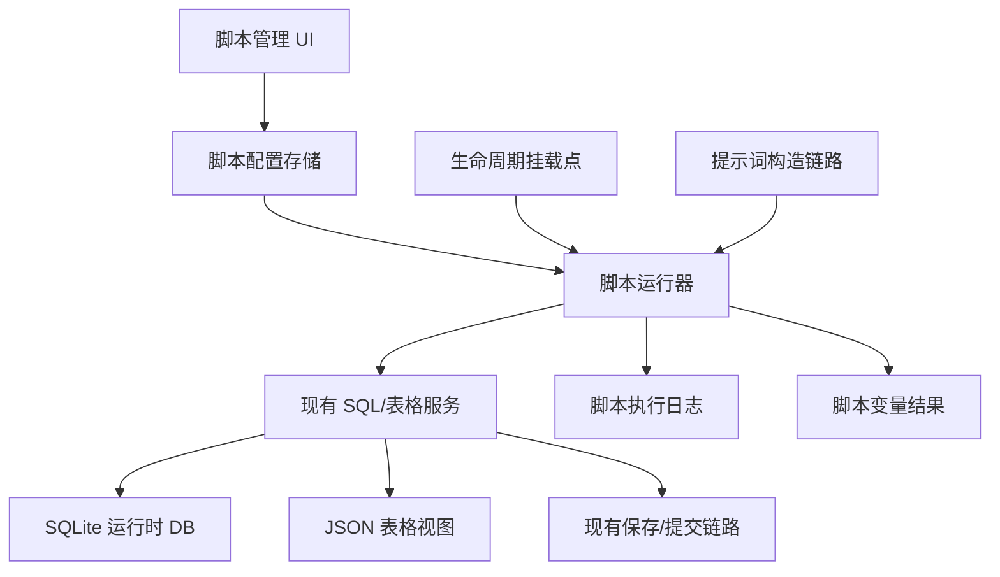

# 脚本执行模块设计草案

## 结论

脚本模块的核心不是“另起一套数据库 API”或“另起一套并发机制”，而是在现有系统链路上增加一个可编排的用户逻辑层。

脚本模块应采用统一脚本模型，不按“数据脚本 / 提示词脚本 / 生命周期脚本”强制拆分。

同一个脚本在一次执行中可以同时完成：

- 接收输入，通常是 JSON。
- 读取数据库。
- 执行业务计算。
- 写回数据库。
- 产出文本内容，由用户通过脚本变量放到任意提示词位置。

挂载点只决定脚本什么时候运行。脚本输出插入哪里不由脚本绑定决定，而由用户在酒馆世界书、预设、剧情推进、填表提示词等文本中放置脚本变量决定。

设计原则：

- 复用现有公共 SQL API、标准 mutation commit、`applyEditsBatch()`、快照 SQL 应用、模板变量替换和统一保存链路。
- 脚本模块只做执行编排、上下文构造、结果收集、日志记录、导入导出和 UI 管理。
- 不在脚本模块里重新实现数据库锁、事务、同步、checkpoint、WAL 或保存机制。
- 脚本不能直接拿到底层 `sql.js` engine，也不能绕过现有服务直接改运行时状态。
- 全局脚本和角色卡绑定脚本都属于同一个脚本系统，只是作用域不同。
- 导入脚本必须作为配置导入，不应导入后自动执行。

## 一、需求范围

### 1.1 背景

当前系统已经有表格数据、SQLite 运行时数据库、严格 JSON 填表、世界书注入、SQL 查询模板和剧情推进能力，但缺少用户自定义逻辑层。

现有缺口：

- 有数据，但用户不能稳定地写脚本做派生计算、统计、修正和清洗。
- 有 SQL 能力，但缺少把 SQL/计算逻辑挂到生命周期事件上的机制。
- 有提示词构造链路，但缺少“脚本输入 JSON，输出内容，再通过变量插入用户指定文本位置”的能力。
- 复杂规则仍然依赖 AI 自觉执行，确定性不足。

### 1.2 脚本能做什么

脚本模块需要支持：

- 从数据库读取数据。
- 对数据进行计算、清洗、派生、校验。
- 将结果写回数据库。
- 接收事件输入，例如 AI 回复文本、填表结果、推进结果、用户提供的 JSON 参数。
- 输出内容到脚本变量所在的文本位置。
- 按挂载点自动执行。
- 按全局或角色卡作用域生效。
- 通过管理界面新增、修改、导入、导出、删除、启用、禁用、排序和查看日志。

## 二、总体架构



脚本模块的边界：

- `ScriptRunner` 负责筛选脚本、排序、构造上下文、执行脚本、收集返回值、记录日志。
- `ctx.api` 直接指向现有前端公共 API 对象，例如 `AutoCardUpdaterAPI`，脚本不再自建数据库门面。
- `ScriptVariableResolver` 负责在现有变量替换链路中识别脚本变量、执行脚本并替换为脚本输出。
- `ScriptStore` 负责脚本定义的保存、导入、导出和迁移。

## 业务流与数据流

脚本模块必须嵌入现有业务流，而不是凭空定义“事件”。每个挂载点都来自一个真实链路中的稳定时刻。

核心规则：

- 事件载荷只传最小元信息，不传聊天记录、prompt 草稿、AI 返回全文这类大对象。脚本需要非数据库数据时，通过封装后的酒馆/宿主接口显式读取。
- 脚本输出不是直接塞进 prompt 的，而是先由 `ScriptRunner` 保存为返回值或命名输出。
- prompt 里真正消费脚本输出的是变量替换链路：`{[script ...]}` 即时执行，`{[script_output ...]}` 读取挂载点输出。
- 写数据库不是脚本模块直接改内存对象，而是脚本调用现有公共 API，例如 `ctx.api.executeSqlMutation(...)` / `ctx.api.executeSqlBatch(...)`。
- 挂载点脚本必须和当前业务流程同步串行：业务链路调用 `ScriptRunner.runHook(...)` 后必须等待该挂载点下所有脚本执行完成，再进入下一步。前置挂载点脚本没跑完，不能继续构造 prompt 或发送 AI 请求；提交后挂载点脚本没跑完，不能把该挂载点视为处理完成。

### 填表请求前

现有链路：

```text
update-orchestrator.ts
→ collectGroupFillResponse_ACU(...)
→ prepareAIInput_ACU(...)
→ callCustomOpenAI_ACU(dynamicContent, ...)
→ replaceDbSqlVariables(...)
→ AI API
```

数据从哪里来：

- `messagesForContext`：由填表任务组装的聊天上下文。
- `currentJsonTableData_ACU` 或 SQLite provider 的 `getCurrentData()`：当前表格数据。
- `getCombinedWorldbookContent_ACU(...)`：填表 prompt 用的世界书内容。
- `manualExtraHint_ACU`：用户手动补充提示。
- `targetSheetKeys` / `updateMode`：本次填表目标和模式。

谁构造事件：

- `collectGroupFillResponse_ACU(...)` 在 `prepareAIInput_ACU(...)` 得到 `dynamicContent` 后、`callCustomOpenAI_ACU(...)` 渲染 prompt 前，构造 `table_fill.before_request` 事件。

事件载荷示例：

```ts
{
  hook: 'table_fill.before_request',
  timestamp,
  requestId,
  targetSheetKeys,
  updateMode,
}
```

谁执行脚本：

```text
collectGroupFillResponse_ACU
→ await ScriptRunner.runHook('table_fill.before_request', eventPayload)
```

谁输出：

- 脚本通过 `return value` 输出。
- 如果脚本绑定配置了 `outputKey`，`ScriptRunner` 把返回值写入 `ScriptOutputContext.request[outputKey]`。

谁消费输出：

- `callCustomOpenAI_ACU(...)` 渲染填表 prompt segments。
- 渲染过程中调用现有变量替换链路。
- 变量替换链路遇到 `{[script_output "xxx"]}` 时，由 `ScriptVariableResolver` 从 `ScriptOutputContext.request` 取值并替换。
- 变量替换链路遇到 `{[script "xxx" {...}]}` 时，直接调用 `ScriptRunner.runVariable(...)` 即时执行脚本并替换。

完整数据流：

```text
聊天上下文/表格数据/世界书/填表配置
→ prepareAIInput_ACU 形成 dynamicContent
→ table_fill.before_request eventPayload
→ await ScriptRunner 自动运行挂载点脚本
→ ScriptOutputContext 保存 outputKey
→ callCustomOpenAI_ACU 渲染用户填表提示词
→ ScriptVariableResolver 替换 {[script_output ...]}
→ AI API
```

### 填表提交后

现有链路：

```text
AI 返回
→ collectGroupFillResponse_ACU(...)
→ parseAndApplyTableEditsToData_ACU(...) 或 SqlTableService.applyEditsBatch(...)
→ runTableUpdateCommit_ACU(...)
→ persistTablesToChatMessage_ACU(...)
→ currentJsonTableData_ACU
→ updateReadableLorebookEntry_ACU(...)
```

数据从哪里来：

- AI 返回的 `<tableEdit>` 或严格 JSON `sql`。
- 解析/提交结果中的 `modifiedKeys`、`appliedEdits`、`tableData`。
- 提交成功后的最新表格快照。

谁构造事件：

- `executeCardUpdateCore_ACU(...)` 或 `applyUnifiedGroupFillResponses_ACU(...)` 在 `runTableUpdateCommit_ACU(...)` 成功后构造 `table_fill.after_commit` 事件。

事件载荷示例：

```ts
{
  hook: 'table_fill.after_commit',
  timestamp,
  requestId,
  changedSheets: commitResult.modifiedKeys,
  appliedEdits: commitResult.appliedEdits,
  success: true,
}
```

谁输出：

- 这个挂载点通常用于二次校验、派生字段、额外写库。
- 如果脚本返回值配置了 `outputKey`，也可以保存到 `ScriptOutputContext.chat` 或 `session`，供后续请求变量读取。
- 默认不参与当前已经结束的填表 prompt，因为 prompt 已经发出并提交完成。

### 正文请求前

现有链路：

```text
SillyTavern GENERATION_AFTER_COMMANDS
→ init.ts
→ plot-orchestrator.ts
→ runOptimizationLogic_ACU(...)
→ runPlotTasksRuntime_ACU(...)
→ buildFinalPlotInjectionMessage_ACU(...)
→ params.prompt / 输入框 / 用户消息
→ 酒馆正文生成
```

当前项目里正文请求前主要被剧情推进链路改写：剧情推进先生成 `finalMessage`，再写回 `params.prompt` 或输入框，让酒馆继续正文生成。

数据从哪里来：

- 用户输入：最新用户消息或输入框文本。
- 聊天上下文：`getChatArray_ACU()`。
- 角色和用户设定：`getCharDescription_ACU()` / `getPersonaDescription_ACU()`。
- 上轮剧情规划：`getPlotFromHistory_ACU(...)`。
- 世界书：`getWorldbookContentForPlot_ACU(...)`。
- 数据库变量：`replaceDbSqlVariables(...)` 在剧情推进 prompt 渲染中执行。

谁构造事件：

- 如果没有开启剧情推进，正文请求前挂载点应在 `init.ts` 的 `GENERATION_AFTER_COMMANDS` 拦截处构造。
- 如果开启剧情推进，`plot-task-engine.ts` 在最终 `finalMessage` 生成前后都可以构造事件，但必须明确是“推进请求前”还是“正文请求前”。

建议拆开：

- `plot.before_task_request`：单个剧情推进任务 API 请求前。
- `main_reply.before_generation`：最终要交给酒馆正文生成的 `params.prompt` 就绪前。

正文请求前事件载荷只传最小元信息：

```ts
{
  hook: 'main_reply.before_generation',
  timestamp,
  requestId,
  phase: 'before_generation',
  source: plotEnabled ? 'plot_rewritten' : 'normal',
}
```

脚本如果需要具体内容，显式调用宿主接口获取：

```js
const originalUserInput = ctx.tavern.getCurrentUserInput({ kind: 'original' });
const effectiveUserInput = ctx.tavern.getCurrentUserInput({ kind: 'effective' });
const recentMessages = ctx.tavern.getRecentMessages({ count: 10 });
const promptDraft = ctx.tavern.getPromptDraft();

return `本轮实际输入：${effectiveUserInput}`;
```

含义：

- `original`：用户原始输入。
- `effective`：经过剧情推进、正文替换等流程后，实际将交给正文 AI 的输入。
- `getRecentMessages({ count })`：按需读取最近 N 层，不默认全量传入。
- `getPromptDraft()`：只在当前链路已经构造出 prompt 草稿时可用。

谁消费输出：

- 如果用户在酒馆预设、世界书、正文相关模板中写了 `{[script_output ...]}`，必须保证这些文本在发给 AI 前会经过 `ScriptVariableResolver`。
- 当前项目已经在多处调用 `replaceDbSqlVariables(...)`，脚本变量应接入同一层统一变量替换函数，避免只在某一条 prompt 链路生效。

### 剧情推进请求前和响应后

现有链路：

```text
init.ts
→ orchestrateAfterCommandsStrategy*_ACU(...)
→ runOptimizationLogic_ACU(...)
→ runPlotTasksRuntime_ACU(...)
→ executeSinglePlotTask_ACU(...)
→ renderPlotTaskMessages_ACU(...)
→ callApiWithPlotPreset_ACU(...)
→ extractPlotTagsFromResponse_ACU(...)
→ buildFinalPlotInjectionMessage_ACU(...)
```

剧情推进请求前数据从哪里来：

- `plotSettings.tasks[]`：推进任务定义。
- `userMessage`：本轮用户输入。
- `sharedContext`：`$5`、`$6`、`$7`、`$8`、`$U`、`$C` 等替换上下文。
- 任务级世界书内容：`getWorldbookContentForPlot_ACU(...)`。

谁构造事件：

- `executeSinglePlotTask_ACU(...)` 在 `renderPlotTaskMessages_ACU(...)` 前构造 `plot.before_task_request`。

事件载荷示例，只传最小元信息：

```ts
{
  hook: 'plot.before_task_request',
  timestamp,
  requestId,
  taskId,
  phase: 'before_request',
}
```

脚本需要推进相关文本时显式获取：

```js
const originalUserInput = ctx.tavern.getCurrentUserInput({ kind: 'original' });
const plotEffectiveInput = ctx.tavern.getCurrentUserInput({ kind: 'plot_effective' });
const plotPromptDraft = ctx.tavern.getPromptDraft({ kind: 'plot_task', taskId: ctx.event.taskId });
```

谁消费输出：

- 用户在剧情推进任务 prompt 中写 `{[script_output "plotHint"]}`。
- `renderPlotTaskMessages_ACU(...)` 渲染 prompt 时，统一变量替换链路读取 `ScriptOutputContext.request.plotHint`。

剧情推进响应后数据从哪里来：

- `callApiWithPlotPreset_ACU(...)` 返回的任务响应。
- `extractPlotTagsFromResponse_ACU(...)` 抽取出的 tags。
- `successfulResults` 和聚合后的最终推进内容。

谁构造事件：

- `executeSinglePlotTask_ACU(...)` 在单任务响应解析后构造任务级 `plot.after_task_response`。
- `runPlotTasksRuntime_ACU(...)` 在所有任务结束、`buildFinalPlotInjectionMessage_ACU(...)` 前后可构造总结果事件。

事件载荷示例：

```ts
{
  hook: 'plot.after_task_response',
  timestamp,
  requestId,
  taskId,
  success: true,
}
```

脚本需要推进响应内容时显式获取：

```js
const plotResponse = ctx.tavern.getPlotResponse({ taskId: ctx.event.taskId });
const extractedTags = ctx.tavern.getPlotExtractedTags({ taskId: ctx.event.taskId });
```

### 世界书变量替换

现有链路：

```text
getCombinedWorldbookContent_ACU(...) 或 getWorldbookContentForPlot_ACU(...)
→ buildCombinedWorldbookContentByStrategy_ACU(...)
→ 世界书条目 content 拼接
→ replaceDbSqlVariables(...)
→ prompt 的 $4 或剧情推进 $1
```

数据从哪里来：

- 世界书条目来自角色绑定世界书或手动选择世界书。
- 扫描文本来自最近对话、本轮用户输入、任务 tag 内容或填表 messagesText。
- 条目 content 是用户可编辑文本。

谁消费脚本输出：

- 用户在世界书条目 content 中写 `{[script ...]}` 或 `{[script_output ...]}`。
- 世界书内容拼接完成后，在进入 prompt 前统一走变量替换链路。
- `ScriptVariableResolver` 替换脚本变量。

关键点：

- 世界书链路不是脚本主动“插入世界书”。
- 世界书条目文本中变量所在的位置，就是脚本输出进入 prompt 的位置。

### SQL 查询和写入数据流

脚本读数据库：

```text
ctx.api.querySql({ sql, params })
→ AutoCardUpdaterAPI.querySql
→ getStorageProvider().executeQuery(sql, params)
→ SqliteEngine.query(sql, params)
→ rowsToObjects(columns, values)
→ 脚本拿到对象数组
```

脚本写数据库：

```text
ctx.api.executeSqlMutation({ sql, params })
→ AutoCardUpdaterAPI.executeSqlMutation
→ runSqliteRuntimeMutationCommit_ACU(...)
→ 内部调用 SqlTableService.executeMutation(sql, params)
→ _syncToJson()
→ runTableUpdateCommit_ACU / persistTablesToChatMessage_ACU
→ currentJsonTableData_ACU
→ 聊天消息持久化
```

因此：

- 脚本拿到的数据来自当前 SQLite runtime provider。
- 脚本写出的数据进入现有表格提交链路。
- 脚本输出的文本进入 `ScriptOutputContext` 或变量替换结果。
- 最终谁把文本发给 AI，是现有 prompt 构造链路：填表 `callCustomOpenAI_ACU`、剧情推进 `callApiWithPlotPreset_ACU`、正文酒馆生成参数 `params.prompt`。

## 三、统一脚本模型

### 3.1 一个脚本，一条执行链

脚本不是按用途拆成不同类型，而是一个统一的 `run(ctx)` 执行单元。

它可以根据当前挂载点和输入自行决定做什么：

- 只查库并输出提示词。
- 只查库并写库。
- 先接收输入，再查库，再计算，再写库，最后输出可被变量替换链路使用的文本。
- 根据 `ctx.hook` 在不同挂载点执行不同逻辑。

完整示例：

```js
const input = ctx.input || {};
const hpThreshold = Number(input.hpThreshold ?? 0);
const eventLimit = Number(input.eventLimit ?? 5);

const statusResult = ctx.api.querySql({
  sql:
  'SELECT name, hp, status FROM character_status WHERE hp <= ?',
  params: [hpThreshold]
});
const statusRows = statusResult?.rows || [];

for (const row of statusRows) {
  if (row.status !== '昏迷') {
    await ctx.api.executeSqlMutation({
      sql:
      'UPDATE character_status SET status = ? WHERE name = ?',
      params: ['昏迷', row.name]
    });
  }
}

const eventResult = ctx.api.querySql({
  sql:
  'SELECT event_time, content FROM chronicle ORDER BY row_id DESC LIMIT ?',
  params: [eventLimit]
});
const events = eventResult?.rows || [];

return [
  statusRows.length > 0 ? `状态修正：${statusRows.map(row => row.name).join('、')} 已进入昏迷。` : '',
  '最近事件：',
  ...events.map(row => `- ${row.event_time}: ${row.content}`),
].filter(Boolean).join('\n');
```

这个示例同时完成了输入读取、数据库查询、业务计算、数据库写回和文本输出。系统不要求用户把它拆成多个脚本。

### 3.2 用户怎么给脚本参数

不能把每轮会变化的数据写死在绑定配置里。自动挂载脚本的动态数据应该来自当前事件 `ctx.event` 和数据库查询，用户配置只放稳定的参数。

下面直接按“用户怎么设置、系统怎么传、脚本怎么读”说明。

#### 例子 A：用户想把本轮用户输入传给自动挂载脚本

用户设置脚本绑定：

```json
{
  "hook": "main_reply.before_generation",
  "enabled": true,
  "config": {
    "maxChars": 200
  },
  "outputKey": "userInputSummary",
  "outputTtl": "request"
}
```

业务链路传入数据，不是用户手填：

```ts
// init.ts / 正文生成前拦截处
await scriptRunner.runHook('main_reply.before_generation', {
  eventPayload: {
    hook: 'main_reply.before_generation',
    timestamp: Date.now(),
    requestId,
    phase: 'before_generation',
    source: plotEnabled ? 'plot_rewritten' : 'normal',
  },
});
```

脚本收到的上下文等价于：

```js
ctx.config = {
  maxChars: 200
};

ctx.event = {
  hook: 'main_reply.before_generation',
  timestamp: 1780000000000,
  requestId: 'req_xxx',
  phase: 'before_generation',
  source: 'plot_rewritten'
};

ctx.input = {}; // 自动挂载脚本没有额外用户参数时为空

ctx.callType = 'hook';
ctx.source = {}; // 自动挂载脚本没有文本来源时为空
```

脚本这样读：

```js
const maxChars = Number(ctx.config.maxChars || 200);
const userInput = ctx.tavern.getCurrentUserInput({ kind: 'effective' });

return userInput.length > maxChars
  ? userInput.slice(0, maxChars) + '...'
  : userInput;
```

用户在预设或世界书里取自动运行结果：

```text
本轮用户输入摘要：
{[script_output "userInputSummary"]}
```

这个例子里，事件只告诉脚本“现在处于正文请求前”。真正的大文本不是传进 `ctx.event`，而是脚本通过 `ctx.tavern.getCurrentUserInput({ kind: 'effective' })` 显式获取。用户只配置了 `maxChars` 这种稳定参数。

#### 例子 B：用户想把变量里的参数传给即时脚本

用户在世界书、预设、推进提示词或填表提示词里写：

```text
{[script "最近事件摘要" {"limit":3,"table":"chronicle"}]}
```

变量解析器传入数据：

```ts
// ScriptVariableResolver 解析变量后
await scriptRunner.runVariable({
  raw: '{[script "最近事件摘要" {"limit":3,"table":"chronicle"}]}',
  kind: 'execute',
  scriptName: '最近事件摘要',
  input: {
    limit: 3,
    table: 'chronicle',
  },
}, {
  sourceContext: {
    promptType: 'worldbook',
    sourceType: 'lorebook_entry',
  },
});
```

脚本收到的上下文等价于：

```js
ctx.variable = {
  raw: '{[script "最近事件摘要" {"limit":3,"table":"chronicle"}]}',
  kind: 'execute',
  scriptName: '最近事件摘要',
  input: {
    limit: 3,
    table: 'chronicle'
  }
};

ctx.input = {
  limit: 3,
  table: 'chronicle'
};

ctx.source = {
  promptType: 'worldbook',
  sourceType: 'lorebook_entry'
};
```

脚本这样读：

```js
const limit = Number(ctx.input.limit || 5);
const table = String(ctx.input.table || 'chronicle');

const result = ctx.api.querySql({
  sql: `SELECT content FROM ${table} ORDER BY row_id DESC LIMIT ?`,
  params: [limit],
});
const rows = result?.rows || [];

return rows.map(row => `- ${row.content}`).join('\n');
```

这个例子里，真正传进脚本的用户参数是 `{[script ...]}` 里的 JSON。

#### 例子 C：用户想把填表结果传给提交后脚本

用户设置脚本绑定：

```json
{
  "hook": "table_fill.after_commit",
  "enabled": true,
  "config": {
    "recalculateRelation": true
  }
}
```

填表提交链路传入数据：

```ts
// executeCardUpdateCore_ACU / applyUnifiedGroupFillResponses_ACU 提交成功后
await scriptRunner.runHook('table_fill.after_commit', {
  eventPayload: {
    hook: 'table_fill.after_commit',
    timestamp: Date.now(),
    requestId,
    changedSheets: commitResult.modifiedKeys,
    appliedEdits: commitResult.appliedEdits,
    success: true,
  },
});
```

脚本收到的上下文等价于：

```js
ctx.config = {
  recalculateRelation: true
};

ctx.event = {
  hook: 'table_fill.after_commit',
  timestamp: 1780000000000,
  requestId: 'req_xxx',
  changedSheets: ['sheet_important_characters'],
  appliedEdits: 4,
  success: true
};
```

脚本这样读：

```js
if (!ctx.config.recalculateRelation) return;
if (!ctx.event.changedSheets.includes('sheet_important_characters')) return;

await ctx.api.executeSqlBatch(`
  UPDATE relationship
  SET updated_at = datetime('now')
  WHERE character_name IN (SELECT name FROM important_characters);
`);
```

这个例子里，真正传进脚本的动态数据是提交链路产生的 `commitResult.modifiedKeys`、`commitResult.appliedEdits`、`commitResult.tableData`。

脚本可用数据分三类：

| 类型 | 谁提供 | 脚本怎么读 | 适合放什么 |
|---|---|---|---|
| 静态配置 | 用户在脚本绑定里配置 | `ctx.config.xxx` | 开关、阈值、默认数量、格式选项 |
| 事件数据 | 当前业务链路自动传入 | `ctx.event.xxx` | 本轮用户输入、AI 回复文本、目标表、修改结果、prompt 草稿 |
| 变量参数 | `{[script ...]}` 变量里传入 | `ctx.input.xxx` | 这一次变量调用专用的参数 |

#### 自动挂载脚本

自动挂载脚本不要把 `city: "青石城"` 这种动态业务值写死在配置里。它应该从事件或数据库里拿。

用户在脚本管理 UI 中只配置稳定参数：

```json
{
  "hook": "main_reply.before_generation",
  "enabled": true,
  "config": {
    "limit": 5,
    "format": "summary"
  },
  "outputKey": "beforeMainSummary",
  "outputTtl": "request"
}
```

脚本里这样读取：

```js
const limit = Number(ctx.config.limit || 5);
const format = String(ctx.config.format || 'summary');

// 动态值从当前事件拿，比如本轮用户输入。
const userInput = String(ctx.event.userInput || '');

// 动态值也可以从数据库拿，比如当前地点。
const stateResult = ctx.api.querySql('SELECT current_location FROM global_state LIMIT 1');
const state = stateResult?.rows || [];
const currentLocation = state[0]?.current_location || '';

const eventResult = ctx.api.querySql({
  sql: 'SELECT content FROM city_events WHERE city = ? ORDER BY row_id DESC LIMIT ?',
  params: [currentLocation, limit],
});
const rows = eventResult?.rows || [];

if (format === 'json') return rows;
return [`当前地点：${currentLocation}`, `本轮输入：${userInput}`, ...rows.map(row => `- ${row.content}`)].join('\n');
```

如果用户想把这个自动运行结果放进提示词，就在任意文本位置写：

```text
{[script_output "beforeMainSummary"]}
```

这时：

- `limit/format` 来自用户配置的 `ctx.config`。
- `userInput` 来自业务链路传入的 `ctx.event`。
- `currentLocation` 来自脚本自己查数据库。
- 脚本在 `main_reply.before_generation` 自动运行。
- 返回值保存成 `beforeMainSummary`。
- `{[script_output "beforeMainSummary"]}` 只读取结果，不重新执行脚本。

#### 即时变量脚本

如果用户就是想在变量位置临时传参数，可以写在 `{[script ...]}` 里：

```text
{[script "最近事件摘要" {"limit":3,"format":"summary"}]}
```

脚本里读取：

```js
const limit = Number(ctx.input.limit || 3);
const format = ctx.input.format || 'summary';

const result = ctx.api.querySql({
  sql: 'SELECT content FROM chronicle ORDER BY row_id DESC LIMIT ?',
  params: [limit],
});
const rows = result?.rows || [];

return format === 'json' ? rows : rows.map(row => `- ${row.content}`).join('\n');
```

这时：

- `limit/format` 来自 `{[script ...]}` 里的 JSON。
- 变量替换走到这里时才执行脚本。
- 脚本返回值直接替换变量本身。

关键规则：

```text
固定配置读 ctx.config。
当前事件读 ctx.event。
变量调用参数读 ctx.input。
动态业务数据优先从 ctx.event 或数据库拿，不要写死在绑定配置里。
```

### 3.3 脚本返回值处理

脚本返回值不要求固定格式。当脚本通过变量调用时，系统把返回值转成字符串并替换变量本身；当脚本通过事件挂载点调用时，返回值进入脚本运行结果；如果绑定配置了 `outputKey`，返回值会保存到脚本输出上下文，供 `{[script_output ...]}` 读取。

```ts
type ScriptPromptOutput = string | number | boolean | null | Record<string, unknown> | unknown[];

function stringifyPromptOutput(value: ScriptPromptOutput): string {
  if (value == null) return '';
  if (typeof value === 'string') return value;
  if (typeof value === 'number' || typeof value === 'boolean') return String(value);
  return JSON.stringify(value);
}
```

脚本输出进入 prompt 时主要给 AI 消费。对象或数组默认转成紧凑 JSON，减少无意义空白；如果脚本作者需要更自然的提示词格式，应在脚本里自己拼好字符串并返回字符串。

### 3.4 变量决定输出位置

同一份脚本源码可以同时被事件挂载点调用，也可以被脚本变量调用。

示例：

- 在正文预设中写 `{[script "最近事件摘要" {"limit":5}]}`：输出插入正文 prompt 的当前位置。
- 在世界书条目中写 `{[script "动态世界状态"]}`：输出插入该世界书条目的当前位置。
- 在剧情推进提示词中写 `{[script "推进前状态" {"mode":"plot"}]}`：输出插入剧情推进提示词的当前位置。
- 在填表提示词中写 `{[script "填表约束" {"target":"inventory"}]}`：输出插入填表提示词的当前位置。
- 绑定到 `table_fill.after_commit`：执行后主要用于二次校验和写库，不依赖返回值插入提示词。

因此，脚本什么时候自动执行由挂载点决定；脚本输出放在哪里由用户写变量的位置决定。二者互不强绑。

## 四、脚本实体模型

```ts
interface UserScriptDefinition {
  id: string;
  name: string;
  description?: string;
  enabled: boolean;
  version: number;
  language: 'javascript';
  source: string;
  bindings: ScriptBinding[];
  scope: ScriptScope;
  order: number;
  timeoutMs: number;
  createdAt: number;
  updatedAt: number;
  lastRunAt?: number;
  lastError?: string;
}

interface ScriptBinding {
  hook: ScriptHookName;
  enabled: boolean;
  order?: number;
  config?: unknown;
  outputKey?: string;
  outputTtl?: 'request' | 'chat' | 'session';
  filter?: ScriptHookFilter;
  failurePolicy?: 'continue' | 'block';
}

interface ScriptScope {
  type: 'global' | 'character';
  characterIds?: string[];
}

```

说明：

- `bindings` 表示脚本会在哪些生命周期事件中自动执行。
- `source` 保存用户在编辑器中填写的脚本函数体，不包含固定外壳。系统运行时自动包成 `async function run(ctx) { ... }` 并执行。
- `config` 是用户给脚本的静态配置，只适合放开关、阈值、默认值，不应该放每轮会变化的业务数据。
- `outputKey` 表示挂载点自动运行后把返回值保存成哪个命名输出，供后续变量读取。
- `outputTtl` 表示命名输出的生命周期，默认 `request`，即只在当前 AI 请求构造流程中有效。
- `failurePolicy` 表示该绑定脚本失败时是否阻断当前流程。默认 `continue`，只记录错误并继续；用户明确配置为 `block` 时，前置挂载点脚本失败可以中断对应业务流程。
- `timeoutMs` 是运行器级保护，避免脚本卡住主流程。

## 五、挂载点设计

### 5.1 生命周期挂载点

| 内部名 | 中文名 | 精确定义 | 典型用途 | 是否由变量控制输出位置 |
|---|---|---|---|---|
| `chat.loaded` | 聊天加载后 | 当前聊天切换完成，聊天元数据可读后 | 初始化、检查数据 | 否 |
| `db.loaded` | 数据库加载后 | 运行时表格服务就绪，可查询当前数据库后 | 补数据、校验数据 | 否 |
| `plot.before_task_request` | 推进任务请求前 | 单个剧情推进任务的 prompt 已经准备发送给 AI 前 | 写入推进前状态、准备变量可读取的数据 | 是，用户在推进提示词中放变量 |
| `plot.after_task_response` | 推进任务响应后 | 单个剧情推进任务拿到响应并完成现有落地动作后 | 根据推进结果写库 | 否 |
| `main_reply.before_generation` | 正文生成前 | 酒馆正文生成即将开始前，插件可在 `GENERATION_AFTER_COMMANDS` 阶段改写最终用户输入 | 修正状态、准备变量可读取的数据 | 是，用户在预设/正文提示词中放变量 |
| `main_reply.after_response` | 正文响应后 | 正文 AI 回复写入聊天或可被读取后 | 根据正文内容写库 | 否 |
| `table_fill.before_request` | 填表请求前 | 本轮填表 AI 请求尚未发送、填表 prompt 即将渲染前 | 生成填表约束、预处理数据 | 是，用户在填表提示词中放变量 |
| `table_fill.after_commit` | 填表完成后 | 本轮所有填表结果已经通过现有链路成功写入数据库后 | 派生字段、二次校验 | 否 |
| `plot_worldbook.before_render` | 推进世界书渲染前 | 剧情推进链路读取并渲染任务世界书前 | 准备剧情推进用动态世界书内容 | 是，用户在剧情推进世界书文本中放变量 |
| `table_fill_worldbook.before_render` | 填表世界书渲染前 | 填表链路读取并渲染填表世界书前 | 准备填表用动态世界书内容 | 是，用户在填表世界书文本中放变量 |
| `manual_table_save.after_commit` | 手动保存表格后 | 用户手动编辑表格并完成保存后 | 派生计算、校验 | 否 |

命名强调请求前、响应后、提交后，避免“前/后”语义模糊。这里的世界书挂载点只指插件自己控制的剧情推进世界书和填表世界书，不承诺覆盖酒馆原生世界书注入流程。

### 5.2 脚本变量

脚本变量是脚本输出进入 prompt 的唯一推荐方式。用户在任意支持变量替换的文本里放置脚本变量，变量所在位置就是输出插入位置。

脚本变量有两种读取模式：

- 即时执行：变量出现时执行脚本，并把本次返回值替换到变量位置。
- 读取挂载点输出：脚本已经在某个挂载点自动执行过，变量只读取该次自动运行保存的命名输出，不重复执行脚本。

变量语法建议与现有 `{[sql ...]}` / `{[db ...]}` 保持同一风格：

```text
{[script "脚本名称"]}
{[script "脚本名称" {"limit":5,"mode":"summary"}]}
{[script id="script_abc123" input={"limit":5}]}
{[script_output "beforeMainSummary"]}
{[script_output script="script_abc123" key="summary"]}
```

可使用位置：

- 酒馆世界书条目正文。
- 酒馆预设中用户可编辑的提示词片段。
- 正文 AI 请求相关模板。
- 剧情推进提示词。
- 填表提示词。
- 表注入内容模板。
- 任何已经接入通用变量替换链路的文本位置。

设计含义：

- 脚本只生成输出内容。
- 用户通过变量放置位置控制输出进入哪里。
- 系统不维护预设插入位置清单。
- 不需要为正文、推进、填表、世界书分别设计硬编码插入点。
- 当前代码里变量替换分散在多条链路中，后续应收口为通用变量替换入口。某个文本位置还没有接入时，应接入通用变量替换，而不是为脚本单独开硬编码插入点。

### 5.3 挂载点输出上下文

挂载点自动运行脚本时，如果脚本绑定配置了 `outputKey`，系统会把脚本返回值保存到当前作用域的“脚本输出上下文”。后续变量可以通过输出 key 读取它。

`outputKey` 必须在同一个作用域内唯一。保存脚本配置时应校验重复 key；如果同一作用域内出现重复 `outputKey`，应拒绝保存或要求用户改名，而不是运行时互相覆盖。

示例配置：

```json
{
  "hook": "main_reply.before_generation",
  "enabled": true,
  "config": { "limit": 5 },
  "outputKey": "beforeMainSummary",
  "outputTtl": "request",
  "order": 100
}
```

正文预设中引用：

```text
本轮动态摘要：
{[script_output "beforeMainSummary"]}
```

执行顺序：

```text
1. 进入正文生成前流程。
2. 触发 `main_reply.before_generation` 挂载点。
3. 自动运行绑定脚本。
4. 脚本返回值保存为 `beforeMainSummary`。
5. prompt 构造链路处理用户预设文本。
6. 变量替换链路遇到 `{[script_output "beforeMainSummary"]}`。
7. 读取第 4 步保存的结果，替换到变量位置。
```

这样可以同时满足：

- 挂载点脚本自动运行。
- 自动运行脚本可以查库、计算、写库。
- 自动运行脚本的输出仍然由用户通过变量决定插入位置。
- 变量读取自动运行结果时不会重复执行脚本。

输出上下文结构建议：

```ts
interface ScriptOutputContext {
  request: Map<string, ScriptStoredOutput>;
  chat: Map<string, ScriptStoredOutput>;
  session: Map<string, ScriptStoredOutput>;
}

interface ScriptStoredOutput {
  key: string;
  scriptId: string;
  scriptName: string;
  hook: ScriptHookName;
  value: unknown;
  createdAt: number;
  scope: {
    chatId?: string;
    characterId?: string;
  };
}
```

生命周期：

- `request`：只在当前请求构造流程有效，适合正文、推进、填表前动态输出。
- `chat`：当前聊天内有效，切换聊天后清除，适合聊天级缓存。
- `session`：当前浏览器会话有效，刷新或重启后清除。

默认使用 `request`，避免旧输出污染后续请求。

这里的 `request` 可以按“每个 AI 楼的一次发送周期”理解：用户点击发送后，到当前楼相关的正文生成、剧情推进、填表、变量替换等流程处理完为止，都读写同一份本轮脚本输出缓存。用户下一次点击发送前，清空上一轮 `request` 缓存。`{[script_output ...]}` 读取的就是本轮前置挂载点已经保存的输出。

`chat` 和 `session` 按需求实现生命周期：`chat` 跟随当前聊天，切换聊天时清空；`session` 跟随当前浏览器页面会话，刷新或重启后清空。

### 5.4 变量调用规则

脚本变量解析时执行对应脚本，并将返回值转成字符串替换变量本身。

规则：

- 通过脚本名称查找时，名称必须唯一；重名时报错并输出空字符串或错误占位。
- 推荐支持通过脚本 ID 调用，避免改名影响变量。
- 第二个参数是输入 JSON，作为 `variableInput` 放入 `ctx.input`。
- `{[script ...]}` 默认即时执行脚本。
- `{[script_output ...]}` 只读取挂载点已经保存的命名输出，不执行脚本。
- 如果 `{[script_output ...]}` 找不到输出，替换为空字符串或可配置错误占位。
- 返回 `null` / `undefined` 时替换为空字符串。
- 返回字符串时原样插入。
- 返回对象或数组时默认 `JSON.stringify(value)`，转成紧凑 JSON 文本。
- 脚本执行错误时记录日志，变量替换为空字符串或可配置错误占位。

即时变量 `{[script ...]}` 是变量替换阶段的脚本调用，主要用于构建提示词：查库、计算、拼接文本并立即返回。它不建议用于写库；需要写库、派生字段、二次校验或记录状态时，应使用挂载点脚本，例如 `table_fill.after_commit`、`main_reply.after_response` 等，再通过 `{[script_output ...]}` 在提示词里读取挂载点输出。

因此 `{[script ...]}` 不需要“同一轮、同名、同参数只执行一次”的缓存规则。变量出现在哪里，就按变量替换流程即时执行并返回；如果用户不希望重复执行，应改用挂载点输出变量 `{[script_output ...]}`。

示例：

```text
当前世界状态：
{[script "世界状态摘要" {"detail":"short"}]}

最近重要事件：
{[script id="script_recent_events" input={"limit":3}]}

挂载点预计算结果：
{[script_output "beforeMainSummary"]}
```

### 5.5 输入来源

脚本输入不是脚本自己去全局变量里猜，也不是脚本模块凭空生成。脚本永远由 `ScriptRunner` 调用，输入数据由调用 `ScriptRunner` 的那一方提供。

一句话：谁触发脚本，谁负责把当时手里已有的数据组装成输入交给 `ScriptRunner`。

| 脚本触发方式 | 谁调用 `ScriptRunner` | 谁给输入数据 | 数据进入哪里 | 典型数据 |
|---|---|---|---|---|
| 挂载点自动运行 | 对应业务链路代码 | 对应业务链路代码 | `ctx.event` | AI 回复文本、填表结果、推进任务内容、当前 prompt 草稿 |
| `{[script ...]}` 即时变量 | `ScriptVariableResolver` | 变量解析器 + 变量里的 JSON + 当前变量替换上下文 | `ctx.variable` + `ctx.input` + `ctx.source` | `{ "limit": 5 }`、当前 prompt 类型、当前聊天/角色信息 |
| `{[script_output ...]}` 读取输出 | `ScriptVariableResolver` | 不给脚本输入，因为不执行脚本，只读取 `ScriptOutputContext` | 不创建新的脚本执行上下文 | 挂载点之前保存的 `outputKey` |
| 手动运行 | 脚本管理 UI | 用户在测试面板填写的 JSON + UI 当前上下文 | `ctx.input` + 可选 `ctx.event` | 测试 JSON、选择的模拟挂载点 |

因此，给脚本输入数据的不是一个固定对象，而是三类调用方：

- 业务链路代码：负责挂载点自动运行的输入。
- `ScriptVariableResolver`：负责 `{[script ...]}` 变量即时执行的输入。
- 脚本管理 UI：负责手动测试运行的输入。

业务链路调用示例：

```ts
// collectGroupFillResponse_ACU 里，准备发填表请求前
const eventPayload = {
  hook: 'table_fill.before_request',
  timestamp: Date.now(),
  requestId,
  targetSheetKeys: job.targetSheetKeys,
  updateMode: job.updateMode,
};

await scriptRunner.runHook('table_fill.before_request', {
  eventPayload,
  sourceContext: {
    promptType: 'table_fill',
  },
});
```

变量调用示例：

```ts
// ScriptVariableResolver 解析到：{[script "最近事件" {"limit":3}]}
await scriptRunner.runVariable({
  raw: '{[script "最近事件" {"limit":3}]}',
  kind: 'execute',
  scriptName: '最近事件',
  input: { limit: 3 },
}, {
  sourceContext: {
    promptType: 'main_reply',
    sourceType: 'worldbook',
  },
});
```

脚本最终收到：

```ts
ctx.event // 业务链路传入的 eventPayload；变量即时执行时通常是基础事件对象
ctx.config // 脚本绑定里的静态配置
ctx.input // 用户显式传入的参数：变量 JSON、手动运行输入，或调用方额外 input；不复制 ctx.event
ctx.callType // 脚本调用类型：hook / variable / manual
ctx.source // 脚本调用来源，如 promptType、sourceType；没有则为空对象
ctx.variable // 只有 {[script ...]} 即时变量调用时存在
```

输入分三层：

```ts
interface ScriptInputEnvelope {
  config?: unknown;
  eventPayload?: ScriptEventPayload;
  sourceContext?: unknown;
  variableInput?: unknown;
  manualInput?: unknown;
}
```

来源说明：

- `config`：脚本绑定中配置的静态 JSON，例如 `{ "limit": 5 }`，进入 `ctx.config`，不参与动态输入合并。
- `eventPayload`：挂载点触发方构造的标准事件载荷，例如正文 AI 回复文本、填表修改表名、推进任务 ID。
- `sourceContext`：变量替换链路或挂载点调用方补充的调用来源说明，例如当前 prompt 类型、变量来自世界书还是预设；进入 `ctx.source`。
- `variableInput`：`{[script ...]}` 变量调用里的 JSON 参数，只在即时变量执行时存在。
- `manualInput`：脚本管理 UI 手动运行时用户填写的测试 JSON，进入 `ctx.input`。

脚本中有四个读取入口：

- `ctx.event`：原始事件载荷，只包含当前挂载点事实数据，不混入用户配置。
- `ctx.config`：用户在脚本绑定里填的静态配置。
- `ctx.input`：用户显式传入的参数，只来自 `{[script ...]}` 变量 JSON、手动运行 JSON 或调用方额外 input，不复制 `ctx.event`。
- `ctx.source`：脚本调用来源说明，例如 `promptType`、`sourceType`；没有就为空对象。

规则：`ctx.event`、`ctx.config`、`ctx.input`、`ctx.source` 不互相合并，避免同一字段在多个入口重复出现。脚本作者需要事件事实就读 `ctx.event`，需要用户参数就读 `ctx.input`，需要静态配置就读 `ctx.config`。`ctx.source` 只用于知道这次脚本是从哪里被调用的，通常不用读。

`ctx.source` 的具体意思：它不是业务参数，只是“这次变量替换发生在哪种文本里”。

同一个变量：

```text
{[script "最近事件摘要" {"limit":3}]}
```

如果写在世界书条目里，脚本收到：

```js
ctx.input = { limit: 3 };
ctx.source = {
  promptType: 'main_reply',
  sourceType: 'lorebook_entry'
};
```

如果写在填表提示词里，脚本收到：

```js
ctx.input = { limit: 3 };
ctx.source = {
  promptType: 'table_fill',
  sourceType: 'table_fill_prompt'
};
```

如果写在剧情推进任务提示词里，脚本收到：

```js
ctx.input = { limit: 3 };
ctx.source = {
  promptType: 'plot',
  sourceType: 'plot_task_prompt',
  taskId: 'task_xxx'
};
```

大多数脚本不需要读 `ctx.source`。只有同一个脚本想根据“我是在世界书里被调用，还是在填表提示词里被调用”做不同输出时，才读它。

### 5.6 事件载荷规范

每个挂载点都必须定义自己传给脚本的 `eventPayload`。触发挂载点的现有业务链路负责构造该对象，然后调用 `ScriptRunner.runHook(hook, eventPayload)`。

事件载荷原则：

- 只传最小元信息，例如 hook、时间、requestId、taskId、成功状态、变更表 key。
- 不默认传聊天记录、最近 N 层消息、prompt 草稿、AI 返回全文、世界书全文。
- 这些大对象或宿主状态通过 `ctx.tavern` 显式获取。
- 用户显式传参只进入 `ctx.input`，不塞进 `ctx.event`。

通用字段：

```ts
interface BaseScriptEventPayload {
  hook: ScriptHookName;
  timestamp: number;
  chatId?: string;
  characterId?: string;
  characterName?: string;
  requestId?: string;
}
```

建议事件载荷：

```ts
interface MainReplyBeforeGenerationEvent extends BaseScriptEventPayload {
  hook: 'main_reply.before_generation';
  phase: 'before_generation';
  source: 'normal' | 'plot_rewritten' | 'manual';
}

interface MainReplyAfterResponseEvent extends BaseScriptEventPayload {
  hook: 'main_reply.after_response';
  messageId?: string;
  isRegeneration?: boolean;
}

interface TableFillBeforeRequestEvent extends BaseScriptEventPayload {
  hook: 'table_fill.before_request';
  targetSheetKeys?: string[];
  updateMode?: string;
}

interface TableFillAfterCommitEvent extends BaseScriptEventPayload {
  hook: 'table_fill.after_commit';
  changedSheets: string[];
  appliedEdits: number;
  success: boolean;
}

interface PlotBeforeRequestEvent extends BaseScriptEventPayload {
  hook: 'plot.before_task_request';
  taskId?: string;
  phase: 'before_request';
}

interface PlotAfterResponseEvent extends BaseScriptEventPayload {
  hook: 'plot.after_task_response';
  taskId?: string;
  success: boolean;
}

interface DbLoadedEvent extends BaseScriptEventPayload {
  hook: 'db.loaded';
  tableNames: string[];
  storageMode: 'sqlite' | 'native';
}
```

脚本读取示例：

```js
if (ctx.hook === 'main_reply.after_response') {
  const text = ctx.tavern.getCurrentAiResponse({ messageId: ctx.event.messageId });
  await ctx.api.executeSqlMutation({
    sql: 'INSERT INTO reply_log (row_id, content) VALUES ((SELECT COALESCE(MAX(row_id), 0) + 1 FROM reply_log), ?)',
    params: [text],
  });
}

const limit = Number(ctx.input.limit || 5);
const result = ctx.api.querySql({
  sql: 'SELECT content FROM reply_log ORDER BY row_id DESC LIMIT ?',
  params: [limit],
});
const rows = result?.rows || [];
return rows.map(row => `- ${row.content}`).join('\n');
```

这里：

- `ctx.event.messageId` 来自 `main_reply.after_response` 挂载点的瘦事件载荷。
- `ctx.tavern.getCurrentAiResponse(...)` 显式读取本楼完整正文 AI 原始返回文本。具体从哪个酒馆事件或回调取得，由实现时查看酒馆接口决定；目标是拿到完整正文，而不是中间流式片段。
- `ctx.config.limit` 来自脚本绑定的静态配置；`ctx.input.xxx` 来自 `{[script ...]}` 变量、手动运行输入或调用方额外 input；事件事实只从 `ctx.event` 读取。
- 脚本不需要自己去全局聊天对象里猜“当前事件是什么”。

## 六、运行上下文

```ts
interface ScriptContext {
  apiVersion: 1;
  hook?: ScriptHookName;
  callType: 'hook' | 'variable' | 'manual';
  variable?: ScriptVariableCall;
  config: unknown;
  input: unknown;
  event: ScriptEventPayload;
  source: Record<string, unknown>;
  scope: {
    chatId?: string;
    characterId?: string;
    characterName?: string;
  };
  api: typeof AutoCardUpdaterAPI;
  tavern: ScriptTavernFacade;
  log: ScriptLogger;
  signal: AbortSignal;
}

type ScriptEventPayload =
  | MainReplyBeforeGenerationEvent
  | MainReplyAfterResponseEvent
  | TableFillBeforeRequestEvent
  | TableFillAfterCommitEvent
  | PlotBeforeRequestEvent
  | PlotAfterResponseEvent
  | DbLoadedEvent
  | BaseScriptEventPayload;

interface ScriptVariableCall {
  raw: string;
  kind: 'execute' | 'read_output';
  scriptId?: string;
  scriptName?: string;
  outputKey?: string;
  input?: unknown;
  format?: 'text' | 'json';
}

interface ScriptTavernFacade {
  getCurrentUserInput(options?: {
    kind?: 'original' | 'effective' | 'plot_effective';
  }): string;

  getRecentMessages(options?: {
    count?: number;
    includeSystem?: boolean;
  }): Array<{
    role: 'user' | 'assistant' | 'system';
    content: string;
    messageId?: string;
  }>;

  getPromptDraft(options?: {
    kind?: 'main_reply' | 'table_fill' | 'plot_task';
    taskId?: string;
  }): string | null;

  getCurrentAiResponse(options?: {
    messageId?: string;
  }): string | null;

  getPlotResponse(options?: {
    taskId?: string;
  }): string | null;

  getPlotExtractedTags(options?: {
    taskId?: string;
  }): Record<string, string[] | string> | null;
}

type SqlParam = string | number | null;
```

脚本通过 `return value` 产出内容。变量即时执行时返回值会替换变量；挂载点调用时返回值可以按 `outputKey` 保存到脚本输出上下文；变量读取输出时直接读取已保存结果。

执行等待规则：

- 现有公共查询 API 如 `querySql()` / `queryTableRows()` 是同步返回，脚本直接调用。
- `ctx.tavern` 读取当前宿主状态也按同步接口设计；如果对应流程还没有生成某类草稿或响应，应返回 `null` 或空值，而不是让脚本猜全局状态。
- 现有公共写入 API 如 `executeSqlMutation()` / `executeSqlBatch()` 是异步提交，脚本需要 `await`。
- 脚本函数可以返回普通值，也可以返回 Promise；但对业务流程来说，挂载点脚本必须被 `await` 到完成。这里的“异步”只是实现层面的 Promise 机制，不代表脚本可以脱离当前流程后台继续跑。
- `{[script ...]}` 变量脚本也必须在变量替换阶段等待完成后再返回替换文本。变量替换没完成，prompt 不能进入下一步。

## 七、数据库链路设计

### 7.1 复用现有服务

脚本数据库访问不新增底层数据库能力，只复用现有公共 SQL API / 标准提交流程：

- 查询：复用现有公共 SQL 查询能力，例如 `querySql` / `queryTableRows` 对应的内部实现。
- 写入：复用现有公共 SQL mutation 能力，例如 `executeSqlMutation` 对应的 `runSqliteRuntimeMutationCommit_ACU(...)`。
- 多条 SQL：复用已有 `applyEditsBatch()` / `applyEdits()` 所在的标准填表 SQL 批处理链路。
- 快照级变更：在 unified commit 场景复用 `applyParameterizedSqlMutationToTableDataSnapshot_ACU()` 或 `applySqlEditsToTableDataSnapshot_ACU()`。
- prompt 中读取 SQL 结果：复用已有 `{[sql ...]}` / `{[db ...]}` 变量替换链路。

脚本模块不负责：

- 初始化 SQLite engine。
- 维护 JSON 视图。
- 保存聊天消息。
- 处理 checkpoint/WAL。
- 设计新的并发锁。
- 解析和提交表格差异。

这些已经属于表格服务、SQL 运行时和保存链路的职责。

### 7.2 脚本直接使用公共 API

脚本上下文直接暴露当前已经提供给前端调用的公共 API：

```ts
ctx.api === AutoCardUpdaterAPI
```

因此脚本不需要新的 `ctx.db.query()` / `ctx.db.commit()` 包装。

示例：

```js
const result = ctx.api.querySql({
  sql: 'SELECT content FROM chronicle ORDER BY row_id DESC LIMIT ?',
  params: [3],
});

const rows = result?.rows || [];

await ctx.api.executeSqlMutation({
  sql: 'UPDATE global_state SET value = ? WHERE key = ?',
  params: ['夜晚', 'time_of_day'],
});
```

这和前端/外部调用同一套 API，不新增数据库抽象。

### 7.3 SQL 调用语义

脚本层不重新实现完整 SQL 安全审计，只沿用现有公共 API 的调用语义。

建议：

- `querySql()` / `executeSqlQuery()` 只接受查询语句。
- `executeSqlMutation()` 走现有标准 mutation commit。
- `executeSqlBatch()` 用于多条 SQL，走现有批处理提交流程；当前公共 API 不支持 batch params，多条参数化写入不能写成一个带 params 的 batch。
- 是否允许 DDL 由现有 SQL 服务能力和业务设置决定，脚本文档不承诺可用。

这里说的是函数语义：查询函数只查询，写入函数走现有提交链路，不是新建一套数据库安全层。

## 八、宿主接口设计

数据库能查到的数据走现有公共 API，也就是 `ctx.api.querySql(...)` / `ctx.api.queryTableRows(...)`。数据库查不到、但酒馆或当前业务流程知道的数据，走 `ctx.tavern`。

这类数据包括：

- 用户原始输入。
- 被剧情推进或正文替换改写后的有效用户输入。
- 最近 N 层聊天消息。
- 当前 prompt 草稿。
- 本楼正文 AI 返回结果。
- 剧情推进任务响应。
- 剧情推进抽取出的标签。

设计原则：

- 不把这些大对象默认塞进 `ctx.event`。
- 脚本需要什么，就显式调用什么接口。
- 接口内部封装酒馆原生 API 和当前插件已有 gateway/helper。
- 接口内部处理宿主差异、数量参数和错误兜底。
- 脚本作者不直接访问 `window`、`SillyTavern_API_ACU`、聊天全局数组等宿主对象。

示例：

```js
const input = ctx.tavern.getCurrentUserInput({ kind: 'effective' });
const messages = ctx.tavern.getRecentMessages({ count: 6 });
const aiText = ctx.tavern.getCurrentAiResponse();

return [
  `本轮有效输入：${input}`,
  `最近消息数：${messages.length}`,
  `本楼 AI 回复长度：${aiText?.length || 0}`,
].join('\n');
```

这就是非数据库数据的获取方式：不是自动传入，而是脚本显式调用 `ctx.tavern`。

## 九、脚本变量替换链路

### 9.1 ScriptVariableResolver

脚本输出进入 prompt 的方式应接入现有变量替换体系，新增 `ScriptVariableResolver`，与 `{[sql ...]}` / `{[db ...]}` 同级。

`ScriptVariableResolver` 同时支持两类变量：

- `{[script ...]}`：即时执行脚本，把本次返回值替换到当前位置。
- `{[script_output ...]}`：读取挂载点自动运行脚本保存的命名输出，把已保存结果替换到当前位置。

流程：

```text
1. 对应流程先触发前置挂载点，例如 `main_reply.before_generation`。
2. 挂载点脚本自动运行，并把带 `outputKey` 的返回值保存到脚本输出上下文。
3. prompt/worldbook/推进/填表模板文本进入变量替换链路。
4. 变量替换链路识别 `{[script ...]}` 或 `{[script_output ...]}`。
5. `{[script ...]}` 解析脚本名称或 ID 和输入 JSON，并即时执行脚本。
6. `{[script_output ...]}` 解析输出 key，并读取第 2 步保存的命名输出。
7. 返回值或保存值按统一规则转字符串。
8. 字符串替换原变量位置。
```

伪代码：

```ts
async function replaceScriptVariables(text: string, sourceContext: Record<string, unknown>) {
  return replaceAsync(text, SCRIPT_VAR_RE, async (raw) => {
    const call = parseScriptVariable(raw);
    if (call.kind === 'read_output') {
      const stored = scriptOutputContext.get(call.outputKey, sourceContext);
      return stringifyScriptOutput(stored?.value);
    }
    const result = await scriptRunner.runVariable(call, { sourceContext });
    return stringifyScriptOutput(result.value);
  });
}
```

这个函数是异步实现，但调用方必须 `await` 它。也就是说，变量替换阶段会等待 `{[script ...]}` 执行完成，再把完整文本交给后续 prompt 流程。

### 9.2 插入方式

脚本输出不由系统指定位置。用户在哪里写变量，输出就替换到哪里。

示例：

```text
<世界书条目>
当前城市状态：
{[script "城市状态摘要" {"city":"青石城"}]}

<正文预设>
以下是根据数据库计算得到的本轮约束：
{[script "正文约束生成" {"level":"strict"}]}

以下是请求前自动脚本已经计算好的摘要：
{[script_output "beforeMainSummary"]}

<填表提示词>
填表前请遵守这些动态规则：
{[script "填表动态规则" {"target":"全部"}]}
```

这种方式比系统预设固定插入点更符合用户预期：

- 酒馆世界书哪里能写变量，脚本输出就能放哪里。
- 预设哪里能写变量，脚本输出就能放哪里。
- 推进和填表提示词哪里能编辑，脚本输出就能放哪里。
- 不需要系统猜用户想把输出放在表格前、表格后、系统提示还是用户消息。

### 9.3 与现有 SQL 模板变量关系

现有 `{[sql ...]}` / `{[db ...]}` 变量适合“模板中直接查询数据库”。`{[script ...]}` 适合“在变量位置即时执行 JS 逻辑，再输出文本片段”。`{[script_output ...]}` 适合“读取挂载点自动运行脚本的结果”。三者不是替代关系。

推荐使用方式：

- 简单 SQL 查询展示：继续用 `{[sql ...]}`。
- 多步计算、条件分支、循环、跨查询拼接：用 `{[script ...]}`。
- 需要挂载点先自动运行、再由用户决定插入位置：用挂载点 `outputKey` + `{[script_output ...]}`。
- 脚本输出中如果包含 `{[sql ...]}`，是否再次经过变量替换需要明确。建议默认不二次替换，避免递归和不可预测行为。

## 十、执行顺序

同一挂载点下，执行顺序为：

```text
1. 全局脚本，按 binding.order 或 script.order 从小到大。
2. 当前角色卡绑定脚本，按 binding.order 或 script.order 从小到大。
3. 如果排序相同，按脚本 name、id 稳定排序。
```

失败策略：

- 默认某个脚本失败，不阻断主流程，也不阻断其他脚本。
- 变量调用失败时，该变量不产生输出，并记录错误。
- 已经通过现有 SQL 链路成功写入的数据不由脚本运行器私自回滚。
- 如果用户在绑定配置中把 `failurePolicy` 设为 `block`，该脚本失败时可以阻断对应业务流程。这个选项应由用户在设计脚本绑定时明确填写，不作为默认行为。

写库脚本的执行边界：

- 脚本写库必须调用现有公共 API，例如 `ctx.api.executeSqlMutation(...)` 或 `ctx.api.executeSqlBatch(...)`。
- `after_commit` 类挂载点必须在现有提交链路完整成功返回后再执行，不应在 `runTableUpdateCommit_ACU` 的事务或 commit lock 内执行脚本。
- 如果 `after_commit` 脚本继续写库，它会发起一轮新的标准提交；脚本运行器不把这次派生写入塞回原提交事务里。

## 十一、脚本管理机制

### 11.1 列表页

列表页展示：

- 名称。
- 启用状态。
- 作用域：全局/角色卡。
- 绑定挂载点。
- 变量调用名或脚本 ID。
- 挂载点输出 key。
- 最近执行时间。
- 最近错误。
- 排序。

支持操作：

- 新增。
- 修改。
- 删除。
- 启用/禁用。
- 复制。
- 导入。
- 导出。
- 调整排序。
- 查看执行日志。
- 手动运行。

### 11.2 编辑页

编辑页分区：

- 基础信息：名称、说明、启用状态。
- 作用域：全局或绑定角色卡。
- 变量调用：脚本 ID、变量调用示例、默认输入 JSON。
- 事件绑定：挂载点、排序、输入 JSON、输出 key、输出生命周期、过滤条件。
- 代码编辑：脚本源码。
- 运行测试：必须先保存当前脚本配置和源码，再运行已保存版本；可选择挂载点和输入 JSON，查看输出与日志。

### 11.3 导入导出

导出格式使用 JSON，携带脚本配置、绑定、输入 JSON 和源码。

示例：

```json
{
  "format": "acu_user_script_v1",
  "scripts": [
    {
      "name": "最近事件摘要",
      "description": "读取纪要表并输出最近事件文本",
      "enabled": false,
      "language": "javascript",
      "source": "const rows = ctx.api.querySql('SELECT content FROM chronicle LIMIT 3')?.rows || [];\nreturn rows.map(row => row.content).join('\\n');",
      "scope": { "type": "character", "characterIds": [] },
      "bindings": [
        {
          "hook": "main_reply.before_generation",
          "enabled": true,
          "config": { "limit": 5 },
          "outputKey": "beforeMainSummary",
          "outputTtl": "request",
          "order": 100
        }
      ],
      "defaultVariableInput": { "limit": 5 },
      "timeoutMs": 1000,
      "order": 100
    }
  ]
}
```

导入规则：

- 导入时生成新的本地 `id`。
- 导入只是把脚本配置导入本地，不在导入动作中运行脚本。
- 导入文件里的 `enabled` 表示脚本导入后的启用状态，应按导入文件保留。`enabled: true` 的意义是导入完成后该脚本处于启用状态，但仍然不会在“导入动作本身”中立即执行。
- 名称重复时自动追加后缀。
- 导入页面展示变量调用示例、绑定挂载点、输出 key 和源码摘要。
- 不做来源不明脚本的自动执行。

### 11.4 存储位置

脚本定义建议存插件全局设置，执行日志可进入现有日志系统或独立日志存储。

原因：

- 全局脚本天然属于插件级配置。
- 角色卡绑定脚本需要跨聊天复用。
- 不把脚本混入聊天消息，避免聊天导入导出时误传播可执行逻辑。
- 角色卡脚本如需分享，应通过显式脚本包导入导出完成。

## 十二、对当前方案的审核

### 12.1 已成立的点

- 需要脚本模块，这是当前“有数据但不能编程使用”的关键缺口。
- 脚本必须能读数据库和写数据库。
- 脚本必须有挂载点，否则只能手动运行，价值不足。
- 脚本必须有管理机制，否则会变成不可维护的代码片段集合。
- 全局脚本和角色卡绑定脚本都必须支持。
- 需要支持脚本输入和脚本变量输出，否则脚本只能改数据，不能参与 AI 请求构造。

### 12.2 需要补强的点

#### 挂载点语义必须精确

“推进前”“正文回复前”“填表后”这类中文名容易误解。内部必须使用精确事件名，例如：

- `before_request`：请求构造或发送前。
- `after_response`：AI 响应可读后。
- `after_commit`：数据已经通过现有提交链路落地后。

#### 脚本输出到提示词必须走变量

不能由系统预设几个插入点让用户选。输出位置应由用户在文本中放置 `{[script ...]}` 变量决定，和现有数据库变量的使用方式一致。

需要明确：

- 变量语法。
- 脚本名称/ID 查找规则。
- 输入 JSON 解析规则。
- 即时执行变量 `{[script ...]}` 和读取挂载点输出变量 `{[script_output ...]}` 的区别。
- 挂载点输出 key 和生命周期。
- 返回值转字符串规则。
- 错误时的占位策略。
- `{[script ...]}` 不做写库场景设计；写库逻辑应放在挂载点脚本中。

#### 数据库链路必须复用现有服务

脚本模块不承担锁、事务、保存流程职责。正确做法是调用现有公共 SQL API 和标准提交流程：

- 查询走现有 `querySql` / `queryTableRows` 能力。
- 变更走现有 `executeSqlMutation`，内部使用 `runSqliteRuntimeMutationCommit_ACU(...)`。
- 多语句走 `applyEdits()` / `applyEditsBatch()`。
- 快照提交场景走已有 snapshot SQL apply 函数。

脚本模块只做适配和编排。

#### 输入和事件要分清

脚本既要能读取用户配置输入，也要能读取当前事件事实数据。两者不能混成一团。

建议：

- `ctx.event` 永远表示挂载点触发方传入的原始事件载荷。
- `ctx.config` 表示用户在脚本绑定中填的静态配置。
- `ctx.input` 表示用户显式传入的动态参数，只来自变量输入、手动运行输入或调用方额外 input，不复制 `ctx.event`。
- 脚本需要判断当前是什么事件时读 `ctx.hook` 或 `ctx.event.hook`。
- 脚本需要读用户配置参数时读 `ctx.config`；需要读本轮动态数据时读 `ctx.event` 或 `ctx.input`。

#### 错误策略要稳定

默认策略应是记录错误并跳过该脚本输出，不影响主流程。需要阻断主流程的脚本通过绑定配置里的 `failurePolicy: 'block'` 明确声明，由用户在设计脚本绑定时决定。

#### 日志要有保留上限

脚本日志用于排查问题，不应无限增长。实现时应设置日志保留条数和单条日志最大长度，超过后保留最近记录或截断单条日志。脚本返回内容本身属于用户脚本行为，不在这里额外规定输出长度上限。

#### 角色卡绑定要有稳定标识

角色卡绑定不能只靠显示名。实现前需要确认当前宿主环境中可稳定获取的角色标识，避免改名后绑定丢失。

## 十三、技术选型对比

### 13.1 脚本语言

| 方案 | 优点 | 缺点 | 结论 |
|---|---|---|---|
| JavaScript | 浏览器原生支持；与当前 TypeScript/前端项目一致；不需要额外语言运行时；适合调用现有服务和 Promise API | 需要控制执行边界；用户写错容易运行时报错 | 推荐 |
| TypeScript 运行时编译 | 类型体验好 | 需要引入编译器或转译链路，体积和错误处理复杂 | 不推荐作为运行语言 |
| JSON 规则 | 安全、可视化 | 表达力不足，不满足“写脚本”目标 | 可作为另一套规则功能，不替代脚本 |
| Lua/Python | 可嵌入、表达力强 | 要引入额外 VM，体积、兼容和学习成本都不合适 | 不推荐 |

结论：运行语言使用 JavaScript；可以提供 TypeScript 类型声明帮助用户写脚本，但保存和执行的源码仍是 JavaScript。

### 13.2 执行方式

| 方案 | 优点 | 缺点 | 结论 |
|---|---|---|---|
| ESM Blob 动态导入 | 保留原生 ESM 执行语义；运行器只生成固定入口外壳；用户只写函数体；调试语义清楚 | 不是强沙箱；超时主要约束 Promise 等待，不能可靠中断同步死循环；需要管理 blob URL 生命周期 | 推荐 |
| `new Function` 包装执行 | 实现简单；容易接入现有服务和 Promise API | 和 ESM 语义不一致；后续如果支持 import/export 会变复杂；用户函数体仍需要额外包装 | 不采用 |
| Web Worker | 可终止；不直接访问 DOM | 和主线程现有 provider 通信复杂，DB 服务调用要 RPC 化 | 只有在强隔离需求明确时再考虑 |
| sandboxed iframe | 隔离更强 | 通信和兼容性复杂 | 不作为当前设计默认方案 |

结论：采用 ESM Blob 动态导入执行模型，脚本通过 `ctx` 使用系统能力；不要把 Worker/iframe 作为当前设计前提，否则会先把现有服务调用复杂化。`timeoutMs` 用于约束正常 Promise 等待，不承诺能强行打断同步死循环。

用户在编辑器中只写脚本函数体，不需要反复写固定外壳：

```js
const rows = ctx.api.querySql('SELECT * FROM chronicle LIMIT 3')?.rows || [];
return rows.map(row => row.content).join('\n');
```

运行器负责把用户函数体包成固定入口，再作为 ESM 模块加载。这里的包装是系统固定外壳，不要求用户手写，也不改变用户函数体语义：

```ts
const moduleSource = `export default async function run(ctx) {\n${source}\n}`;
const blob = new Blob([moduleSource], { type: 'text/javascript' });
const url = URL.createObjectURL(blob);
try {
  const mod = await import(url);
  const run = mod.default;
  const result = await run(ctx);
} finally {
  URL.revokeObjectURL(url);
}
```

文档和 UI 示例统一展示函数体。固定外壳由运行器生成，用户不需要手写 `export default async function run(ctx) { ... }`。

### 13.3 数据访问方式

| 方案 | 优点 | 缺点 | 结论 |
|---|---|---|---|
| 直接暴露 `sql.js` engine | 能力完整 | 绕过现有同步和保存链路，风险最高 | 不采用 |
| 封装一套全新 DB API | 表面整洁 | 重复造轮子，容易和现有服务分裂 | 不采用 |
| 现有 SQL 服务薄适配 | 复用当前已验证链路；一致性最好；实现边界清楚 | 需要把返回值转成脚本友好格式 | 推荐 |
| 仅模板变量 `{[sql]}` | 简单 | 不能写库，不能做复杂逻辑 | 作为补充，不替代脚本 DB 能力 |

结论：使用现有 SQL 服务薄适配。

### 13.4 脚本输出方式

| 方案 | 优点 | 缺点 | 结论 |
|---|---|---|---|
| Prompt builder 固定插入点 | 结构清楚 | 用户只能在系统给定位置插入，无法覆盖酒馆世界书、预设、推进、填表提示词中的任意位置 | 不采用 |
| 脚本变量 `{[script ...]}` | 用户完全控制位置；与现有 `{[sql]}` / `{[db]}` 心智一致；可用于世界书、预设、推进、填表等所有文本 | 即时执行，不适合承载写库副作用 | 推荐，用于查询、计算和即时文本生成 |
| 挂载点输出变量 `{[script_output ...]}` | 自动运行脚本和用户自定义位置可以衔接；不会重复执行重逻辑 | 需要维护请求级输出上下文和执行顺序 | 推荐，用于自动运行结果 |
| 世界书条目承载所有输出 | 可复用世界书 | 只能解决世界书位置，不能解决预设/推进/填表任意位置 | 不采用作为主方案 |

结论：脚本输出到提示词时走脚本变量和挂载点输出变量，不走系统预设固定插入点。

### 13.5 编辑体验

编辑器不是脚本模块的核心架构问题。脚本系统的核心是运行链路、挂载点、输入输出、复用现有数据库服务和管理机制。

代码编辑区只需要满足源码编辑、保存、导入导出和错误定位。是否提供语法高亮属于 UI 体验问题，不影响本设计的主链路。

## 十四、实现清单

完整设计应包含以下工作项：

- 新增脚本配置模型和迁移逻辑。
- 新增脚本管理 UI：列表、编辑、导入、导出、日志、手动运行。
- 新增 `ScriptRunner`：筛选、排序、执行、超时、日志、错误收集。
- 新增 ESM Blob 动态导入执行：用户源码只保存函数体，运行器自动包成 `export default async function run(ctx) { ... }`，再加载默认导出函数并调用。
- 在脚本上下文中暴露现有 `AutoCardUpdaterAPI` 为 `ctx.api`，不新增数据库 facade。
- 新增 `ScriptVariableResolver`：解析 `{[script ...]}`，执行脚本并返回替换文本。
- 新增 `ScriptOutputContext`：保存挂载点自动运行脚本的命名输出，支持 `{[script_output ...]}` 读取。
- 将 `ScriptVariableResolver` 接入现有 `{[sql ...]}` / `{[db ...]}` 变量替换链路。
- 确认酒馆世界书、预设、剧情推进、填表提示词、表注入模板等文本位置都走通用变量替换链路。
- 在填表请求前、填表完成后、正文生成前、正文响应后、推进任务请求前、推进任务响应后、数据库加载后触发对应挂载点脚本。
- 确保所有挂载点脚本都被 `await` 到完成后才进入下一业务步骤；请求前挂载点必须先于对应 prompt 变量替换执行，以便 `{[script_output ...]}` 能读取本轮输出。
- 新增执行日志记录和最近错误展示。
- 新增导入导出格式校验。
- 新增脚本示例和内置模板。

## 十五、验收标准

功能验收：

- 可以创建全局脚本并绑定到 `table_fill.after_commit`。
- 可以创建角色卡绑定脚本，并且只在目标角色卡生效。
- 脚本可以通过 `ctx.api.querySql()` / `ctx.api.queryTableRows()` 读取 SQLite 数据。
- 脚本可以通过 `ctx.api.executeSqlMutation()` / `ctx.api.executeSqlBatch()` 写入数据，且写入后 UI 和持久化状态与现有链路保持一致。
- 脚本可以接收配置 JSON 输入。
- 用户脚本源码只写函数体，不需要手写固定外壳，并能被运行器正确执行。
- 用户可以在世界书、预设、剧情推进、填表提示词中写 `{[script ...]}`。
- `{[script ...]}` 会执行脚本并在变量所在位置替换为脚本返回内容，推荐用于查询、计算和即时文本生成。
- 挂载点自动运行脚本可以通过 `outputKey` 保存返回值。
- 用户可以写 `{[script_output "beforeMainSummary"]}` 读取挂载点自动运行结果，并在变量所在位置替换为该结果。
- 挂载点脚本执行完成前，当前业务流程不会进入下一步。
- 手动运行必须先保存脚本配置和源码，并运行已保存版本。
- 脚本运行错误会记录日志，不导致整个页面崩溃。
- 导入脚本时不会自动执行；导入后的启用状态按导入文件里的 `enabled` 保留。
- 导出脚本后再导入，绑定、输入 JSON、作用域和源码保持一致。

一致性验收：

- 脚本写库不直接访问底层 `sql.js` engine。
- 脚本写库不绕过现有表格服务和保存链路。
- 脚本模块不新增独立数据库状态。
- 脚本变量输出默认不做隐式二次 `{[sql]}` / `{[script]}` / `{[script_output]}` 替换。

## 十六、已定结论和实现核查项

### 16.1 已定结论

- 正文响应后脚本读取原始 AI 返回文本，而不是写入聊天后的消息对象。
- `table_fill.after_commit` 固定在现有提交链路成功后触发。
- 手动运行脚本允许真实写库，仍然走现有公共 SQL API 和标准保存链路。
- 手动运行必须先保存当前脚本配置和源码，再运行已保存版本，不运行未保存草稿。
- `{[script_output ...]}` 找不到 key 时替换为空字符串。
- 脚本返回对象或数组时，默认用 `JSON.stringify(value)` 转成紧凑 JSON 文本。意思是：如果脚本返回 `{ a: 1 }` 或 `[1, 2]` 这种不是字符串的结果，系统会自动转成可插入 prompt 的 JSON 文本；如果脚本返回字符串，就原样插入。脚本作者需要自然语言或特定排版时，应自己返回字符串。

### 16.2 脚本日志定义

脚本日志是平台侧能力，不是提示词输出，也不是用户脚本返回值。它用于脚本管理 UI 中排查问题，例如脚本执行了哪些步骤、哪里报错、最近一次运行结果是什么。

日志来源包括：

- 脚本运行器自动记录的开始、结束、耗时、错误。
- 用户脚本通过 `ctx.log.info(...)` / `ctx.log.warn(...)` / `ctx.log.error(...)` 主动写入的调试信息。

日志不进入 prompt，不参与 `{[script ...]}` 或 `{[script_output ...]}` 替换。因为它是平台侧诊断数据，所以需要平台控制保留规模：实现时设置日志保留条数、单条日志最大长度和展示入口，避免日志无限增长拖慢管理界面。

### 16.3 实现阶段代码核查项

- 角色卡稳定 ID 使用哪个宿主字段，应在实现时查看酒馆接口和当前项目已有角色信息读取代码后确定，不由设计文档凭空指定。
- 哪些文本位置已经接入 `{[sql]}` / `{[db]}` 变量替换链路，哪些还需要补接到通用变量替换入口，应在实现时按源码逐个核查并改造。

## 十七、开发任务计划

### 17.1 阶段一：脚本基础模型和存储

- [ ] 新增脚本定义类型 `UserScriptDefinition`、`ScriptBinding`、`ScriptScope`、`ScriptHookName`、`ScriptOutputContext`、`ScriptStoredOutput`。
- [ ] 新增脚本配置存储 `ScriptStore`，支持读取、保存、迁移、导入、导出。
- [ ] 脚本源码字段只保存用户填写的函数体，不保存固定外壳。
- [ ] 导入脚本时生成新的本地 `id`。
- [ ] 导入脚本时保留导入文件里的 `enabled` 状态。
- [ ] 导入动作本身不执行脚本。
- [ ] 同一作用域内校验 `outputKey` 唯一，重复时拒绝保存或提示用户改名。
- [ ] 脚本名称调用时要求名称唯一，重名时变量替换输出空字符串并记录日志。
- [ ] 支持通过脚本 ID 调用，避免改名影响变量。

### 17.2 阶段二：脚本运行器

- [ ] 新增 `ScriptRunner`。
- [ ] 实现脚本筛选：按启用状态、作用域、绑定挂载点过滤脚本。
- [ ] 实现执行排序：全局脚本先执行，角色卡脚本后执行；同级按 binding order、script order、name、id 稳定排序。
- [ ] 实现 ESM Blob 动态导入执行。
- [ ] 运行器自动把用户函数体包成 `export default async function run(ctx) { ... }`。
- [ ] 执行后释放 `URL.createObjectURL(...)` 生成的 blob URL。
- [ ] 运行器构造 `ctx.api`，直接指向现有 `AutoCardUpdaterAPI`。
- [ ] 运行器构造 `ctx.event`、`ctx.config`、`ctx.input`、`ctx.source`、`ctx.variable`、`ctx.scope`。
- [ ] 实现 `ctx.log.info(...)`、`ctx.log.warn(...)`、`ctx.log.error(...)`。
- [ ] 运行器自动记录开始、结束、耗时、错误。
- [ ] 脚本日志不进入 prompt，不参与变量替换。
- [ ] 设置日志保留条数。
- [ ] 设置单条日志最大长度，超出时截断。
- [ ] 脚本返回字符串时原样返回。
- [ ] 脚本返回 `null` / `undefined` 时转为空字符串。
- [ ] 脚本返回数字或布尔值时转成 `String(value)`。
- [ ] 脚本返回对象或数组时用 `JSON.stringify(value)` 转成紧凑 JSON 文本。
- [ ] `failurePolicy: 'continue'` 时脚本失败只记录日志并继续流程。
- [ ] `failurePolicy: 'block'` 时脚本失败阻断对应业务流程。
- [ ] 挂载点脚本必须被 `await` 到完成后，业务流程才能继续下一步。
- [ ] `{[script ...]}` 变量脚本必须在变量替换阶段等待完成后再返回替换文本。
- [ ] 脚本运行器不私自回滚已经通过现有 SQL 链路成功写入的数据。

### 17.3 阶段三：脚本输出上下文

- [ ] 实现 `ScriptOutputContext.request`。
- [ ] `request` 缓存按每个 AI 楼的一次发送周期生效。
- [ ] 用户下一次点击发送前清空上一轮 `request` 缓存。
- [ ] 挂载点脚本配置了 `outputKey` 时，将返回值保存到当前 `request` 输出上下文。
- [ ] `{[script_output ...]}` 从当前 `request` 输出上下文读取结果。
- [ ] `{[script_output ...]}` 找不到 key 时替换为空字符串。
- [ ] 实现 `ScriptOutputContext.chat`，切换聊天时清空。
- [ ] 实现 `ScriptOutputContext.session`，刷新或重启页面后清空。
- [ ] 保证并发流程不会读到其他 AI 楼或其他发送周期的 `request` 输出。

### 17.4 阶段四：通用变量替换入口

- [ ] 新增通用变量替换入口，例如 `replaceAcuTemplateVariables(...)`。
- [ ] 通用变量替换入口支持 async，调用方必须 `await`。
- [ ] 通用变量替换入口保留现有 `{[sql ...]}` / `{[db ...]}` 能力。
- [ ] 新增 `ScriptVariableResolver`。
- [ ] 支持 `{[script "脚本名称"]}`。
- [ ] 支持 `{[script "脚本名称" {"limit":5}]}`。
- [ ] 支持 `{[script id="script_xxx" input={"limit":5}]}`。
- [ ] 支持 `{[script_output "outputKey"]}`。
- [ ] 支持 `{[script_output script="script_xxx" key="summary"]}`。
- [ ] `{[script ...]}` 只作为提示词构建用即时脚本，推荐用于查询、计算和文本生成。
- [ ] `{[script ...]}` 不做写库场景设计，写库逻辑放到挂载点脚本。
- [ ] 脚本变量输出默认不做二次 `{[sql]}` / `{[script]}` / `{[script_output]}` 替换。
- [ ] 脚本变量执行错误时记录日志，并替换为空字符串或配置的错误占位。

### 17.5 阶段五：填表链路接入

- [ ] 在 `collectGroupFillResponse_ACU(...)` 中接入 `table_fill.before_request`。
- [ ] `table_fill.before_request` 在 `prepareAIInput_ACU(...)` 得到 `dynamicContent` 后、`callCustomOpenAI_ACU(...)` 渲染 prompt 前触发。
- [ ] `table_fill.before_request` 必须 `await ScriptRunner.runHook(...)` 完成后才能继续渲染填表 prompt。
- [ ] `table_fill.before_request` 事件载荷包含 `hook`、`timestamp`、`requestId`、`targetSheetKeys`、`updateMode`。
- [ ] 填表 prompt 渲染链路接入通用变量替换入口。
- [ ] 填表 prompt 中 `{[script_output ...]}` 可以读取本轮 `table_fill.before_request` 保存的输出。
- [ ] 填表 prompt 中 `{[script ...]}` 可以即时执行查询/计算脚本并替换文本。
- [ ] 在 `applyUnifiedGroupFillResponses_ACU(...)` 或等价提交成功点接入 `table_fill.after_commit`。
- [ ] `table_fill.after_commit` 固定在现有提交链路成功后触发。
- [ ] `table_fill.after_commit` 不在 `runTableUpdateCommit_ACU` 的事务或 commit lock 内执行。
- [ ] `table_fill.after_commit` 事件载荷包含 `hook`、`timestamp`、`requestId`、`changedSheets`、`appliedEdits`、`success`。
- [ ] `table_fill.after_commit` 脚本继续写库时，发起新的标准提交。

### 17.6 阶段六：剧情推进链路接入

- [ ] 在单个剧情推进任务 API 请求前接入 `plot.before_task_request`。
- [ ] `plot.before_task_request` 必须在对应任务 prompt 变量替换前完成。
- [ ] `plot.before_task_request` 事件载荷包含 `hook`、`timestamp`、`requestId`、`taskId`、`phase`。
- [ ] 剧情推进任务 prompt 接入通用变量替换入口。
- [ ] 剧情推进任务世界书文本接入通用变量替换入口。
- [ ] 在单个剧情推进任务响应解析后接入 `plot.after_task_response`。
- [ ] `plot.after_task_response` 事件载荷包含 `hook`、`timestamp`、`requestId`、`taskId`、`success`。
- [ ] `ctx.tavern.getPlotResponse({ taskId })` 返回对应任务响应文本或 `null`。
- [ ] `ctx.tavern.getPlotExtractedTags({ taskId })` 返回对应任务抽取标签或 `null`。

### 17.7 阶段七：正文生成链路接入

- [ ] 在正文生成前接入 `main_reply.before_generation`。
- [ ] `main_reply.before_generation` 在酒馆正文生成即将开始前触发。
- [ ] `main_reply.before_generation` 必须完成后才能继续正文生成。
- [ ] `main_reply.before_generation` 事件载荷包含 `hook`、`timestamp`、`requestId`、`phase`、`source`。
- [ ] 正文相关模板、预设或插件可控文本接入通用变量替换入口。
- [ ] 在正文响应后接入 `main_reply.after_response`。
- [ ] `main_reply.after_response` 读取原始 AI 返回文本，不读取写入聊天后的消息对象。
- [ ] `ctx.tavern.getCurrentAiResponse(...)` 目标是完整正文 AI 原始返回文本，不是中间流式片段。
- [ ] `ctx.tavern.getCurrentAiResponse(...)` 无可用正文时返回 `null`。

### 17.8 阶段八：世界书和宿主接口

- [ ] 实现 `ctx.tavern.getCurrentUserInput({ kind: 'original' })`。
- [ ] 实现 `ctx.tavern.getCurrentUserInput({ kind: 'effective' })`。
- [ ] 实现 `ctx.tavern.getCurrentUserInput({ kind: 'plot_effective' })`。
- [ ] 实现 `ctx.tavern.getRecentMessages({ count, includeSystem })`。
- [ ] 实现 `ctx.tavern.getPromptDraft({ kind, taskId })`，无草稿时返回 `null`。
- [ ] 通过酒馆接口和当前项目代码确定角色卡稳定 ID 字段。
- [ ] 角色卡作用域按稳定 ID 生效，不依赖显示名。
- [ ] `plot_worldbook.before_render` 只覆盖插件控制的剧情推进世界书。
- [ ] `table_fill_worldbook.before_render` 只覆盖插件控制的填表世界书。
- [ ] 不承诺覆盖酒馆原生世界书注入流程。

### 17.9 阶段九：加载和手动保存挂载点

- [ ] 在聊天切换完成、聊天元数据可读后接入 `chat.loaded`。
- [ ] `chat.loaded` 事件载荷包含 `hook`、`timestamp`、`chatId`、`characterId`、`characterName`。
- [ ] 在运行时表格服务就绪、当前数据库可查询后接入 `db.loaded`。
- [ ] `db.loaded` 事件载荷包含 `hook`、`timestamp`、`tableNames`、`storageMode`。
- [ ] 在用户手动编辑表格并完成保存后接入 `manual_table_save.after_commit`。
- [ ] `manual_table_save.after_commit` 固定在现有手动保存提交链路成功后触发。
- [ ] `manual_table_save.after_commit` 不在原提交事务或 commit lock 内执行。
- [ ] `manual_table_save.after_commit` 事件载荷包含 `hook`、`timestamp`、`requestId`、`changedSheets`、`success`。

### 17.10 阶段十：脚本管理 UI

- [ ] 新增脚本列表页。
- [ ] 列表展示名称、启用状态、作用域、绑定挂载点、变量调用名或脚本 ID、输出 key、最近执行时间、最近错误、排序。
- [ ] 支持新增脚本。
- [ ] 支持修改脚本。
- [ ] 支持删除脚本。
- [ ] 支持启用 / 禁用脚本。
- [ ] 支持复制脚本。
- [ ] 支持调整排序。
- [ ] 支持查看执行日志。
- [ ] 新增脚本编辑页。
- [ ] 编辑页支持基础信息编辑。
- [ ] 编辑页支持全局 / 角色卡作用域设置。
- [ ] 编辑页支持函数体源码编辑，不要求用户写固定外壳。
- [ ] 编辑页展示变量调用示例。
- [ ] 编辑页支持绑定挂载点、排序、配置 JSON、输出 key、输出生命周期、过滤条件。
- [ ] 手动运行前必须先保存脚本配置和源码。
- [ ] 手动运行执行已保存版本，不执行未保存草稿。
- [ ] 手动运行允许真实写库。
- [ ] 手动运行结果展示返回值和日志。

### 17.11 阶段十一：导入导出

- [ ] 导出格式使用 `acu_user_script_v1`。
- [ ] 导出内容包含脚本配置、绑定、输入 JSON 和函数体源码。
- [ ] 导入时校验格式版本。
- [ ] 导入时生成新的本地 `id`。
- [ ] 导入时保留导入文件里的 `enabled` 状态。
- [ ] 导入动作本身不执行脚本。
- [ ] 名称重复时自动追加后缀。
- [ ] 导入页面展示变量调用示例、绑定挂载点、输出 key 和源码摘要。
- [ ] 导出后再导入，绑定、输入 JSON、作用域和源码保持一致。

## 十八、逐项验收清单

### 18.1 基础运行验收

- [ ] 用户只写函数体 `return 'hello';`，手动运行可以得到 `hello`。
- [ ] 用户不需要写 `export default async function run(ctx) { ... }`。
- [ ] 脚本运行器实际通过 ESM Blob 加载包装后的模块。
- [ ] 脚本运行后释放 blob URL。
- [ ] 脚本抛错时记录日志，页面不崩溃。
- [ ] 脚本返回字符串时原样输出。
- [ ] 脚本返回对象时输出紧凑 JSON。
- [ ] 脚本返回数组时输出紧凑 JSON。
- [ ] 脚本返回 `null` 或 `undefined` 时输出空字符串。

### 18.2 数据库能力验收

- [ ] 脚本可以通过 `ctx.api.querySql()` 读取 SQLite 数据。
- [ ] 脚本可以通过 `ctx.api.queryTableRows()` 读取表数据。
- [ ] 脚本可以通过 `ctx.api.executeSqlMutation()` 写入数据。
- [ ] 脚本可以通过 `ctx.api.executeSqlBatch()` 执行多语句写入。
- [ ] 脚本写库后 UI 和持久化状态与现有链路保持一致。
- [ ] 脚本写库不直接访问底层 `sql.js` engine。
- [ ] 脚本写库不绕过现有表格服务和保存链路。

### 18.3 变量替换验收

- [ ] 世界书或 prompt 中 `{[script "脚本名"]}` 可以执行脚本并替换文本。
- [ ] `{[script "脚本名" {"limit":3}]}` 可以把 JSON 参数传入 `ctx.input`。
- [ ] `{[script id="script_xxx" input={"limit":3}]}` 可以通过 ID 调用脚本。
- [ ] `{[script_output "key"]}` 可以读取本轮挂载点输出。
- [ ] `{[script_output ...]}` 找不到 key 时输出空字符串。
- [ ] `{[script ...]}` 执行错误时记录日志并输出空字符串或配置的错误占位。
- [ ] 脚本变量输出默认不做二次 `{[sql]}` / `{[script]}` / `{[script_output]}` 替换。
- [ ] 变量替换调用方会 `await` 通用变量替换入口完成。

### 18.4 挂载点同步验收

- [ ] `table_fill.before_request` 脚本未执行完成前，不会调用填表 AI API。
- [ ] `plot.before_task_request` 脚本未执行完成前，不会调用剧情推进任务 AI API。
- [ ] `main_reply.before_generation` 脚本未执行完成前，不会继续正文生成。
- [ ] `table_fill.after_commit` 在现有提交链路成功后触发。
- [ ] `table_fill.after_commit` 不在原提交事务或 commit lock 内执行。
- [ ] `after_commit` 脚本写库会发起新的标准提交。
- [ ] `failurePolicy: 'continue'` 的脚本失败不会阻断主流程。
- [ ] `failurePolicy: 'block'` 的脚本失败会阻断对应业务流程。

### 18.5 填表链路验收

- [ ] `table_fill.before_request` 事件包含 `targetSheetKeys` 和 `updateMode`。
- [ ] `table_fill.before_request` 脚本配置 `outputKey` 后，填表 prompt 可用 `{[script_output ...]}` 读取。
- [ ] 填表 prompt 中 `{[script ...]}` 可以即时生成填表约束文本。
- [ ] `table_fill.after_commit` 事件包含 `changedSheets`、`appliedEdits`、`success`。
- [ ] `table_fill.after_commit` 脚本可以根据 `changedSheets` 决定是否派生写库。

### 18.6 剧情和正文链路验收

- [ ] 剧情推进任务 prompt 支持 `{[script ...]}`。
- [ ] 剧情推进任务 prompt 支持 `{[script_output ...]}`。
- [ ] 剧情推进任务世界书文本支持脚本变量。
- [ ] `plot.after_task_response` 后可以通过 `ctx.tavern.getPlotResponse({ taskId })` 读取任务响应。
- [ ] `main_reply.after_response` 后可以通过 `ctx.tavern.getCurrentAiResponse(...)` 读取完整正文 AI 原始返回文本。
- [ ] `ctx.tavern.getCurrentAiResponse(...)` 不返回中间流式片段。

### 18.7 加载和手动保存挂载点验收

- [ ] 切换聊天并完成元数据加载后会触发 `chat.loaded`。
- [ ] `chat.loaded` 脚本可以读取当前聊天和角色基础信息。
- [ ] 运行时表格服务就绪后会触发 `db.loaded`。
- [ ] `db.loaded` 脚本可以通过 `ctx.api.querySql()` 查询当前数据库。
- [ ] 用户手动保存表格成功后会触发 `manual_table_save.after_commit`。
- [ ] `manual_table_save.after_commit` 不在原提交事务或 commit lock 内执行。
- [ ] `manual_table_save.after_commit` 脚本可以继续通过现有公共 API 写库，并发起新的标准提交。

### 18.8 作用域和缓存验收

- [ ] 全局脚本对所有角色生效。
- [ ] 角色卡脚本只对绑定角色卡生效。
- [ ] 角色卡绑定使用稳定 ID，不使用显示名。
- [ ] `request` 输出缓存只在当前 AI 楼发送周期内有效。
- [ ] 用户下一次点击发送前清空上一轮 `request` 缓存。
- [ ] 切换聊天时清空 `chat` 输出缓存。
- [ ] 刷新或重启页面后清空 `session` 输出缓存。
- [ ] 并发流程不会读到其他 AI 楼或其他发送周期的 `request` 输出。

### 18.9 管理 UI 验收

- [ ] 可以新增脚本。
- [ ] 可以编辑脚本。
- [ ] 可以删除脚本。
- [ ] 可以启用 / 禁用脚本。
- [ ] 可以复制脚本。
- [ ] 可以调整脚本排序。
- [ ] 可以查看最近执行时间。
- [ ] 可以查看最近错误。
- [ ] 可以查看脚本执行日志。
- [ ] 日志有保留条数上限。
- [ ] 单条日志有最大长度限制。
- [ ] 手动运行前必须保存。
- [ ] 手动运行执行已保存版本。
- [ ] 手动运行允许真实写库。

### 18.10 导入导出验收

- [ ] 可以导出脚本包。
- [ ] 可以导入脚本包。
- [ ] 导入动作本身不执行脚本。
- [ ] 导入后启用状态按导入文件里的 `enabled` 保留。
- [ ] 导入时生成新的本地 `id`。
- [ ] 名称重复时自动追加后缀。
- [ ] 导出后再导入，绑定保持一致。
- [ ] 导出后再导入，配置 JSON 保持一致。
- [ ] 导出后再导入，作用域保持一致。
- [ ] 导出后再导入，函数体源码保持一致。
